# Referência Técnica para Escolha de Distribuições Linux

> **Escolha por requisitos, não por hype.** Modelos de release, lifecycle, segurança, proveniência de software, desktop, infraestrutura e método de decisão — em português do Brasil.

[](#idioma-e-convencoes)
[](#historico-desta-edicao)
[](#17-recorte-temporal-e-versionamento)
[](#17-recorte-temporal-e-versionamento)
[](#status-editorial)
[](./LICENSE)
[](./LICENSE)

**Atalhos:** [🌐 Página do projeto](https://diego-ch4m4x.github.io/Linux_Distro_Advisor/) · [🧭 Abrir o quiz](https://diego-ch4m4x.github.io/Linux_Distro_Advisor/quiz.html) · [📚 Como usar este guia](#como-usar-este-projeto) · [🧪 Método de decisão](#15-metodo-de-decisao-auditavel)

---

<a id="indice"></a>

## Índice

- [Resumo executivo](#resumo-executivo)
- [Status editorial](#status-editorial)
  - [Escopo](#status-escopo)
  - [Fora de escopo](#status-fora-de-escopo)
- [Como usar este projeto](#como-usar-este-projeto)
  - [Trilhas de leitura por perfil](#como-usar-trilhas)
- [00. Conceitos fundamentais antes da escolha](#00-conceitos-fundamentais)
- [01. Modelo mental: a classificação é multidimensional](#01-modelo-mental)
- [02. Modelo de release e cadência](#02-modelo-de-release-e-cadencia)
  - [2.0 Seis dimensões de release e atualização](#02-00-seis-dimensoes)
  - [2.1 Tabela-mestre — modelo de evolução dos 96 candidatos](#02-01-tabela-mestre)
  - [2.2 Famílias e genealogia](#02-02-familias-genealogia)
  - [2.3 Fixed Release](#02-02-fixed-release)
  - [2.4 Rolling Release](#02-03-rolling-release)
  - [2.5 Semi-Rolling, Curated Rolling, Slow Rolling e modelos híbridos](#02-04-semi-rolling-curated-hibridos)
  - [2.6 Point Release e Minor Release](#02-05-point-minor-release)
  - [2.7 Branches e canais: Debian Testing/Sid, Fedora Rawhide e outros casos](#02-06-branches-e-canais)
  - [2.8 Fixed/Rolling não é Atomic/Transactional](#02-07-fixed-rolling-nao-e-atomic-transactional)
  - [2.9 Leading edge e bleeding edge](#02-08-leading-edge-e-bleeding-edge)
- [03. Lifecycle, LTS e suporte empresarial](#03-lifecycle-lts-e-suporte-empresarial)
  - [Suporte comercial e certificação são requisitos diferentes](#03-suporte-certificacao)
  - [Perguntas para produção](#03-perguntas-para-producao)
- [04. Stable não significa uma única coisa](#04-stable-nao-significa-uma-unica-coisa)
- [05. Backports, erratas e leitura de vulnerabilidades](#05-backports-erratas-e-leitura-de-vulnerabilidades)
  - [Regra operacional](#05-regra-operacional)
- [06. API, ABI e kABI](#06-api-abi-e-kabi)
  - [API](#06-api)
  - [ABI](#06-abi)
  - [kABI](#06-kabi)
- [07. Pacote, formato, gerenciador, repositório e origem](#07-pacote-formato-gerenciador-repositorio-e-origem)
  - [Fontes suplementares](#07-fontes-suplementares)
  - [Práticas seguras](#07-praticas-seguras)
- [08. Tradicional, imutável, atômico, image-based e declarativo](#08-tradicional-imutavel-atomico-image-based-e-declarativo)
  - [8.1 Sistema tradicional baseado em pacotes](#08-01-sistema-tradicional-baseado-em-pacotes)
  - [8.2 Imutável ou com base read-only](#08-02-imutavel-ou-com-base-read-only)
  - [8.3 Atualização atômica ou transacional](#08-03-atualizacao-atomica-ou-transacional)
  - [8.4 Image-based](#08-04-image-based)
  - [8.5 Declarativo](#08-05-declarativo)
  - [8.6 Rollback não é backup](#08-06-rollback-nao-e-backup)
- [09. Desktop e pilha gráfica](#09-desktop-e-pilha-grafica)
  - [Camadas da interface gráfica](#09-camadas-interface)
  - [Hyprland, stacks sem DE e o modelo do Advisor](#09-hyprland)
- [10. Hardware, firmware e software não livre](#10-hardware-firmware-e-software-nao-livre)
  - [Arquiteturas de CPU e plataforma](#10-arquiteturas-cpu-plataforma)
  - [Firmware, microcode e drivers](#10-firmware-microcode-drivers)
  - [Não livre não é um único critério](#10-nao-livre-nao-e-um-unico-criterio)
  - [Perfis de política para software e firmware](#10-politicas-software-firmware)
  - [Checklist mínimo](#10-checklist-minimo)
- [11. Segurança, hardening, compliance e certificação](#11-seguranca-hardening-compliance-e-certificacao)
  - [SELinux e AppArmor](#11-selinux-e-apparmor)
  - [Secure Boot e measured boot](#11-secure-boot-e-measured-boot)
  - [FIPS, CIS, STIG e Common Criteria](#11-fips-cis-stig-e-common-criteria)
  - [Live patching](#11-live-patching)
- [12. Storage, criptografia, recuperação e backup](#12-storage-criptografia-recuperacao-e-backup)
- [13. Virtualização, containers e cloud-native](#13-virtualizacao-containers-e-cloud-native)
  - [Desenvolvimento moderno, containers e IA/agentes](#13-desenvolvimento-ia)
- [14. Rede, identidade, frota, observabilidade e continuidade](#14-rede-identidade-frota-observabilidade-e-continuidade)
  - [Rede e dataplane](#14-rede-e-dataplane)
  - [Identidade](#14-identidade)
  - [Provisionamento e frota](#14-provisionamento-e-frota)
  - [Observabilidade](#14-observabilidade)
  - [Continuidade](#14-continuidade)
- [15. Método de decisão auditável](#15-metodo-de-decisao-auditavel)
  - [Etapa 1 — descreva o workload](#15-etapa-1-descreva-o-workload)
  - [Etapa 2 — separe requisitos](#15-etapa-2-separe-requisitos)
  - [Etapa 3 — elimine incompatíveis](#15-etapa-3-elimine-incompativeis)
  - [Etapa 4 — pontue preferências](#15-etapa-4-pontue-preferencias)
  - [Etapa 5 — leia pontos de atenção e alternativas](#15-etapa-5-leia-trade-offs-e-alternativas)
  - [Etapa 6 — valide em camadas](#15-etapa-6-valide-em-camadas)
  - [Etapa 7 — produza um registro de decisão](#15-etapa-7-produza-um-registro-de-decisao)
- [16. Perfis de referência](#16-perfis-de-referencia)
  - [Como interpretar as distribuições desktop destacadas](#16-como-interpretar-as-distribuicoes-desktop-destacadas)
  - [“Gratuito” não significa “RHEL idêntico e com o mesmo serviço”](#16-gratuito-nao-significa-rhel-identico-e-com-o-mesmo-servico)
  - [Casos que não devem ser generalizados](#16-casos-que-nao-devem-ser-generalizados)
- [17. Recorte temporal e versionamento](#17-recorte-temporal-e-versionamento)
  - [Política de versionamento da série 0](#17-politica-de-versionamento-da-serie-0)
  - [Snapshot factual-base preservado](#17-snapshot-base)
  - [Correções temporais e estados de maturidade importantes](#17-duas-correcoes-temporais-importantes)
  - [Política de leitura](#17-politica-de-leitura)
- [18. Operações básicas de atualização](#18-operacoes-basicas-de-atualizacao)
  - [Debian, Ubuntu e derivados](#18-debian-ubuntu-e-derivados)
  - [Fedora e RHEL](#18-fedora-e-rhel)
  - [openSUSE](#18-opensuse)
  - [Arch Linux](#18-arch-linux)
  - [Omarchy](#18-omarchy)
  - [Fedora Atomic Desktops e derivados](#18-fedora-atomic-desktops)
  - [SUSE Linux Micro e openSUSE MicroOS](#18-suse-linux-micro-opensuse-microos)
  - [NixOS com channels](#18-nixos-com-channels)
  - [NixOS com flakes](#18-nixos-com-flakes)
- [19. Metodologia do Linux Distro Advisor](#19-metodologia-do-linux-distro-advisor)
  - [O que o catálogo contém](#19-o-que-o-catalogo-contem)
  - [Modos](#19-modos)
  - [IA/agentes na 0.3.0](#19-ia-agentes)
  - [Pipeline](#19-pipeline)
  - [Interpretação do resultado](#19-interpretacao-do-resultado)
  - [Privacidade e execução](#19-privacidade-e-execucao)
  - [Limitações conhecidas](#19-limitacoes-conhecidas)
- [20. Checklist de homologação](#20-checklist-de-homologacao)
  - [Antes do laboratório](#20-antes-do-laboratorio)
  - [No laboratório](#20-no-laboratorio)
  - [Antes de produção](#20-antes-de-producao)
- [21. Erros conceituais comuns](#21-erros-conceituais-comuns)
- [22. Governança editorial, publicação e licenciamento](#22-governanca-editorial-publicacao-e-licenciamento)
  - [Estrutura canônica](#22-estrutura-canonica)
  - [Publicação](#22-publicacao)
  - [SEO técnico do GitHub Pages](#22-seo)
  - [Política de Mermaid no README](#22-mermaid)
  - [Checklist de release](#22-checklist-release)
  - [Idioma e convenções](#idioma-e-convencoes)
  - [Licenciamento](#22-licenciamento)
  - [Contribuições](#22-contribuicoes)
- [23. Glossário](#23-glossario)
- [24. Referências primárias e complementares](#24-referencias-primarias)
  - [Omarchy — atualização pontual 0.3.0](#24-omarchy)
  - [Bluefin — atualização pontual 0.3.0](#24-bluefin)
  - [Nitrux e KaOS — pilhas de interface revalidadas em 0.3.0](#24-nitrux-kaos)
  - [Hyprland — compositor, compatibilidade e suporte](#24-hyprland)
  - [Release e lifecycle](#24-release-e-lifecycle)
  - [Arquitetura e operação](#24-arquitetura-e-operacao)
  - [Segurança e conformidade](#24-seguranca-e-conformidade)
  - [Gráficos, rede e terminologia](#24-graficos-rede-e-terminologia)
  - [Catálogos, mapas e comparadores](#24-catalogos-mapas-e-comparadores)
  - [Linha do tempo das distribuições Linux](#24-linha-do-tempo-das-distribuicoes-linux)
  - [Artigos, blogs e vídeos para leitura complementar](#24-artigos-blogs-e-videos-para-leitura-complementar)
- [Histórico desta edição](#historico-desta-edicao)
  - [0.3.0 — 2026-09-11](#historico-0-3-0)
  - [0.2.1 — 2026-09-11](#historico-0-2-1)
  - [0.2.0 — 2026-09-11](#historico-0-2-0)
  - [0.1.8 — 2026-09-10](#historico-0-1-8)
  - [0.1.7 — 2026-08-22](#historico-0-1-7)
  - [0.1.6 — 2026-08-21](#historico-0-1-6)
  - [0.1.5 — 2026-08-21](#historico-0-1-5)
  - [0.1.4 — 2026-08-21](#historico-0-1-4)
  - [0.1.3 — 2026-08-21](#historico-0-1-3)
  - [0.1.2 — 2026-08-21](#historico-0-1-2)
  - [0.1.1 — 2026-08-21](#historico-0-1-1)
  - [0.1.0 — 2026-08-15](#historico-0-1-0)

---

<a id="resumo-executivo"></a>

## Resumo executivo

Não existe uma distribuição Linux universalmente “melhor”. Existe uma opção **mais adequada a requisitos explícitos**, em determinado momento, para um workload, uma equipe e um contexto operacional específicos.

Uma decisão tecnicamente defensável começa por:

1. workload e ambiente de execução;
2. requisitos eliminatórios;
3. lifecycle e política de segurança;
4. compatibilidade de hardware e software;
5. modelo operacional da equipe;
6. evidências de laboratório e piloto;
7. plano de atualização, recuperação e saída.

O **quiz Linux Distro Advisor 0.3.0** aplica uma heurística documentada e versionada ao mesmo modelo conceitual deste guia. O catálogo possui **96 candidatos** — distribuições, edições, canais e appliances — e agora inclui **Omarchy**. O candidato **Bluefin** foi atualizado para refletir suas capacidades atuais de Developer Mode, IA/agentes e suas variantes Stable/LTS/GDX.

> **IA não é a 11ª dimensão nem um pré-requisito para o Omarchy.** Na edição 0.3.0, a integração com agentes de IA é uma **preferência contextual do cenário de desenvolvimento**. Ela pode aumentar a aderência quando o usuário a valoriza, mas Omarchy também pode ser recomendado sem IA quando Arch/pacman, rolling, Hyprland/Wayland, workflow keyboard-first/tiling e perfil técnico se alinham. Requisitos eliminatórios sempre prevalecem sobre esse bônus.

> **Snapshot factual:** a base ampla do catálogo permanece ancorada em **15 de agosto de 2026**. Alterações materiais diretamente relacionadas a **Omarchy e Bluefin**, além das pilhas de interface atuais de **Nitrux e KaOS**, foram revalidadas pontualmente em documentação oficial até **11 de setembro de 2026**. Isso não equivale a afirmar que os 96 candidatos foram integralmente revalidados nessa data.

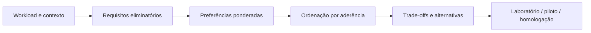

[Voltar ao índice](#indice)

---

<a id="status-editorial"></a>

## Status editorial

Este é um material técnico independente. “Referência” significa, aqui, conteúdo versionado, auditável e sustentado prioritariamente por fontes primárias. Não significa documentação oficial de Debian, Fedora, Red Hat, SUSE, Canonical, Omarchy, Bluefin ou de qualquer outro projeto citado.

Documentação oficial é somente a publicada e mantida pelos respectivos projetos e fornecedores. Quando uma informação volátil é relevante, este guia aponta a fonte primária e declara a data de verificação aplicável.

A edição **0.3.0** amplia o modelo de interface gráfica sem reduzir a profundidade consolidada nas versões anteriores. **Omarchy não depende de IA para concorrer**; a preferência por IA/agentes é apenas um fator contextual de aderência em desenvolvimento. O catálogo possui **96 candidatos**, e a suíte de cobertura confirma que todos podem ser a recomendação principal em pelo menos um cenário válido, sem que preferências sobreponham requisitos eliminatórios. As **dez dimensões conceituais permanecem inalteradas**.

O projeto permanece em **pré-1.0**: enquanto estiver em `0.x`, catálogo, perguntas, matrizes, dados factuais e heurística ainda podem evoluir entre edições. Toda mudança deve ser registrada no histórico e acompanhada das fontes e validações aplicáveis.

<a id="status-escopo"></a>

### Escopo

Este volume cobre:

- classificação de distribuições, edições, canais e appliances;
- release, lifecycle, backports e compatibilidade;
- pacote, formato, repositório e proveniência;
- sistemas tradicionais, image-based, imutáveis, atômicos e declarativos;
- desktop, compositor e pilha gráfica;
- hardware, firmware e software não livre;
- segurança, hardening, compliance e certificação;
- storage, criptografia, recuperação e backup;
- virtualização, containers, Kubernetes, cloud, rede e observabilidade;
- identidade, gestão de frota e continuidade operacional;
- desenvolvimento moderno, containers e integração com IA/agentes quando pertinente ao workload;
- processo auditável para seleção e homologação;
- contrato funcional e limitações do quiz.

<a id="status-fora-de-escopo"></a>

### Fora de escopo

Shell scripting, administração Linux por comandos, preparação completa para LPIC/RHCSA/RHCE/RHCA e catálogos de ferramentas merecem materiais próprios. Aqui aparecem somente os comandos necessários para explicar atualização, inspeção, lifecycle e recuperação.

[Voltar ao índice](#indice)

---

<a id="como-usar-este-projeto"></a>

## Como usar este projeto

| Se você precisa... | Comece por... |
|---|---|
| Entender os conceitos | [Conceitos fundamentais](#00-conceitos-fundamentais) → [Modelo mental](#01-modelo-mental) |
| Comparar Fixed, Rolling, Stream e LTS | [Release e cadência](#02-modelo-de-release-e-cadencia) → [Lifecycle](#03-lifecycle-lts-e-suporte-empresarial) |
| Avaliar segurança de uma versão aparentemente antiga | [Backports e advisories](#05-backports-erratas-e-leitura-de-vulnerabilidades) |
| Entender compatibilidade binária e módulos externos | [API, ABI e kABI](#06-api-abi-e-kabi) |
| Escolher para produção | [Método de decisão](#15-metodo-de-decisao-auditavel) → [Checklist de homologação](#20-checklist-de-homologacao) |
| Fazer uma triagem interativa | [Abrir o Linux Distro Advisor](https://diego-ch4m4x.github.io/Linux_Distro_Advisor/quiz.html) |
| Auditar o quiz | [Metodologia do recomendador](#19-metodologia-do-linux-distro-advisor) |
| Publicar ou contribuir | [Governança editorial](#22-governanca-editorial-publicacao-e-licenciamento) |
| Consultar termos | [Glossário](#23-glossario) |
| Reutilizar conteúdo ou código | [Consultar as licenças](./LICENSE) |

### Fluxo recomendado

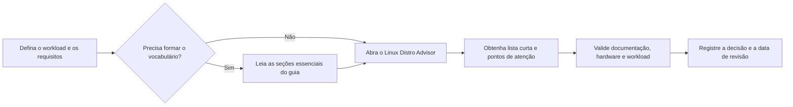

O diagrama é um **mapa de navegação**, não uma simplificação do método: para produção, as etapas de evidência, laboratório, piloto e homologação continuam obrigatórias quando aplicáveis.

<a id="como-usar-trilhas"></a>

### Trilhas de leitura por perfil

O guia pode ser lido do início ao fim, mas não exige leitura linear. Use a trilha que melhor corresponde ao seu objetivo:

| Perfil | Ordem sugerida | Objetivo |
|---|---|---|
| **Iniciante absoluto** | Resumo → **0** → 1 → 2.0–2.4 → 3 → 4 → 15 → 16 → 21 → Glossário | formar primeiro os conceitos fundamentais e depois o vocabulário de decisão |
| **Profissional técnico** | Índice → seção do workload → 2.1 → 3/5/6 → 15 → 17 → 20 → 24 | consultar critérios, riscos e fontes sem reler fundamentos já dominados |
| **Homologação, arquitetura ou segurança** | 3 → 5 → 6 → 10 → 11 → 12–14 → 15 → 17 → 20 → 24 | produzir decisão rastreável, testar suporte e registrar evidências |
| **Auditoria do Linux Distro Advisor** | 1 → 2 → 15 → 17 → 19 → 20 → 24 | entender o modelo conceitual, o snapshot e os limites do recomendador |

> **Regra de navegação:** quando uma sigla ou conceito técnico necessário à compreensão aparecer pela primeira vez no **corpo editorial** de uma seção especializada, essa ocorrência deve expandir ou explicar o termo. Índice, histórico de versões, nomes oficiais de produto/comando e referências bibliográficas não contam como primeira ocorrência pedagógica. O [Glossário](#23-glossario) funciona como referência rápida, não como pré-requisito de leitura.

[Voltar ao índice](#indice)

---

<a id="00-conceitos-fundamentais"></a>

## 0. Conceitos fundamentais antes da escolha

Esta seção estabelece o vocabulário mínimo para quem está começando. Leitores experientes podem usá-la como referência rápida e seguir diretamente para o [modelo mental](#01-modelo-mental).

> **Essencial:** **Linux não é uma distribuição.** Linux é o **kernel**. Uma distribuição combina esse kernel com componentes de espaço de usuário, ferramentas, repositórios, políticas de manutenção e integração própria.

| Conceito | Definição objetiva | Exemplo |
|---|---|---|
| **Kernel Linux** | núcleo do sistema que gerencia CPU, memória, processos, dispositivos, isolamento e interfaces fundamentais | kernel Linux usado por Debian, Fedora, Arch etc. |
| **Distribuição Linux** | projeto/produto que integra kernel Linux, bibliotecas, ferramentas, gerenciador de pacotes ou imagens, repositórios, políticas de atualização e documentação | Debian, Fedora, Arch Linux, openSUSE |
| **Edição** | variante publicada pelo mesmo projeto para um uso, desktop ou fluxo operacional específico | Fedora Workstation, Fedora Server, Fedora Kinoite |
| **Release** | estado publicado e identificável de um produto/projeto | Fedora 44, Ubuntu 26.04 LTS |
| **Branch** | linha nomeada de desenvolvimento, manutenção ou promoção | Debian `testing`, Fedora Rawhide |
| **Canal** | linha de entrega que o usuário escolhe consumir | `stable`, `testing`, `rc`, `edge`, `dev` |
| **Imagem de instalação/deployment** | artefato usado para instalar, inicializar ou compor um sistema | ISO, imagem de disco, OCI/bootc |
| **Repositório** | fonte organizada de pacotes, metadados ou imagens consumida pelas ferramentas de instalação/atualização | Debian Stable, Fedora Updates |
| **Desktop Environment (DE)** | ambiente gráfico integrado com sessão, shell/painel, configurações e aplicações | GNOME, KDE Plasma, Cinnamon |
| **Window manager (X11)** | gerencia posicionamento, foco e comportamento das janelas dentro de uma sessão X11 | i3, Openbox, bspwm |
| **Compositor Wayland** | implementa o servidor/compositor da sessão Wayland e também gerencia superfícies/janelas | Hyprland, Sway, Niri, KWin, Mutter |
| **Shell/camada de interface** | fornece elementos como barra, launcher, notificações, OSD e controles sobre a sessão | GNOME Shell, Plasma Shell, Omarchy Shell |
| **Aplicação** | software executado sobre o sistema operacional para cumprir uma função do usuário ou serviço | navegador, IDE, banco de dados |

### Mapa mental mínimo

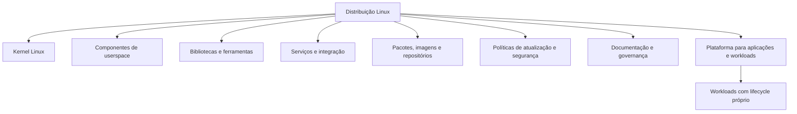

> **Essencial:** a distribuição fornece uma **plataforma**. Aplicações, containers, drivers, firmware e repositórios externos podem seguir ciclos independentes e precisam ser avaliados separadamente.

### O que realmente está sendo escolhido

A unidade real de decisão não é apenas o nome da distribuição. Para uma escolha tecnicamente verificável, identifique no mínimo:

1. **produto/distribuição**;
2. **edição**, quando existir;
3. **release, branch ou canal**;
4. **arquitetura de CPU**;
5. **origem da imagem e dos repositórios**;
6. **modalidade de suporte**, quando relevante;
7. **workload** e ambiente onde o sistema será usado.

Exemplo:

~~~text
Descrição insuficiente:
"usar Fedora"

Descrição verificável:
Fedora Workstation 44
├── arquitetura: x86_64
├── origem: imagem e repositórios oficiais do Fedora
├── finalidade: estação de trabalho de desenvolvimento
└── suporte/operação: lifecycle da release Fedora + gestão da equipe local
~~~

> **Não confunda:** uma ISO com número ou data não prova que a distribuição seja Fixed Release. Em sistemas rolling, a ISO costuma ser apenas um snapshot de instalação; a instalação continua evoluindo pelo fluxo rolling.

### Instalar, atualizar e fazer upgrade não são a mesma coisa

- **Instalar** cria uma instalação ou deployment do sistema a partir de uma mídia, imagem ou processo de provisionamento.
- **Atualizar (*update*)** aplica correções e novas versões permitidas pelo canal/release atual.
- **Upgrade de release** muda explicitamente para outra geração ou referência quando o modelo exige essa transição, como Fedora 44 → 45.
- **Rebase** troca a referência/base usada para compor o sistema quando o projeto emprega esse conceito.
- **Deployment** é um estado instalável ou bootável preparado pelo mecanismo correspondente.
- **Rollback** seleciona um estado anterior ainda disponível dentro do escopo do mecanismo.
- **Restore** recupera dados/estado a partir de uma cópia ou backup.
- **Rebuild** reconstrói o estado a partir de uma especificação, configuração ou conjunto de entradas.

> **Não confunda:** *update*, *upgrade*, *rebase*, *deployment*, *rollback*, *restore* e *rebuild* descrevem operações diferentes. O procedimento correto depende do produto e da arquitetura usada.

[Voltar ao índice](#indice)

---

<a id="01-modelo-mental"></a>

## 1. Modelo mental: a classificação é multidimensional

Termos como **Rolling Release**, **LTS**, **Stable**, **bleeding edge**, **imutável**, **atômico** e **declarativo** não pertencem todos ao mesmo eixo. Compará-los como se fossem categorias concorrentes produz conclusões falsas.

> **Essencial:** não tente definir uma distribuição com uma única etiqueta. **Release, lifecycle, atualidade, compatibilidade, mutabilidade e operação são perguntas diferentes** e podem combinar-se de maneiras distintas.

Neste guia, uma distribuição, edição, canal ou appliance é analisado por **dez dimensões independentes**. **Esta é uma taxonomia editorial deste projeto**, criada para organizar a comparação; não é uma classificação normativa ou universal adotada por todo o ecossistema Linux. “Host” significa a máquina ou instância do sistema Linux que está sendo avaliada; pode ser um computador físico, uma máquina virtual ou uma instância em cloud.

| Dimensão | Pergunta correta | Exemplos |
|---|---|---|
| **Release** | Como a instalação evolui entre gerações ou ao longo do tempo? | Fixed, Rolling, Semi-Rolling, Stream |
| **Cadência** | Com que frequência releases, pacotes, snapshots ou imagens são promovidos? | diária, semanal, em lotes, ~6 meses |
| **Atualidade** | Quão próximas as versões empacotadas ficam dos projetos upstream? | conservadora, equilibrada, leading edge |
| **Lifecycle** | Por quanto tempo há manutenção e em qual escopo? | curto, LTS, enterprise, suporte estendido |
| **Compatibilidade** | Que contratos técnicos precisam ser preservados? | API, ABI, kABI, formatos de configuração |
| **Mutabilidade** | Quais partes do sistema podem ser alteradas diretamente no host? | tradicional, controlado, read-only |
| **Transação** | Como uma mudança é preparada, ativada e revertida? | pacote a pacote, deployment, snapshot, generation |
| **Declaração** | O operador descreve ações ou o estado desejado? | imperativo, declarativo |
| **Proveniência** | Quem construiu, assinou, distribuiu e mantém o software? | repositório oficial, terceiro, upstream |
| **Operação** | Como o ambiente é provisionado, atualizado, observado e governado? | host manual, imagem, gestão de frota, GitOps |

#### Visão visual das dez dimensões

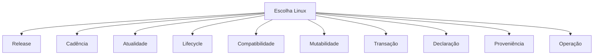

> O diagrama mostra **dez perguntas independentes**. As arestas não indicam hierarquia, dependência causal nem peso no quiz.

Essas dimensões coexistem. Uma distribuição pode ser, ao mesmo tempo, **Fixed Release**, **leading edge**, ter **lifecycle curto**, usar **deployment atômico** e privilegiar aplicações em Flatpak. Nenhuma dessas propriedades anula as demais.

Exemplo:

~~~text
Fedora Silverblue 44
├── release: fixa, seguindo a geração Fedora 44
├── cadência: atualizações frequentes dentro dessa geração
├── atualidade: alta / leading edge
├── lifecycle: aproximadamente 13 meses para a geração Fedora
├── mutabilidade: conteúdo do SO controlado por deployment; /usr não é alterado ad hoc
├── transação: novo deployment preparado e ativado no boot
└── aplicações gráficas: preferencialmente desacopladas do host por Flatpak
~~~

Outro exemplo:

~~~text
Ubuntu 26.04 LTS
├── release: fixa
├── lifecycle: LTS, com escopos de manutenção definidos pela Canonical
├── manutenção: atualizações controladas e backports quando aplicável
├── mutabilidade: instalação tradicional baseada em pacotes
└── ferramentas: APT sobre pacotes deb/dpkg
~~~

> **IA/agentes não é a 11ª dimensão.** Na edição 0.3.0, essa preferência aparece apenas quando o contexto é desenvolvimento. Ela pode aumentar a aderência de candidatos comprovadamente preparados para esse fluxo, mas não substitui release, compatibilidade, operação nem qualquer requisito eliminatório. Omarchy pode ser recomendado sem IA quando suas demais características se alinham ao perfil.

> **Como ler o restante do guia:** a seção 2 aprofunda principalmente as dimensões ligadas a release e atualização. Compatibilidade é aprofundada na seção 6; declaração, na seção 8.5; proveniência, na seção 7; operação, principalmente na seção 14.

Pergunte **“como esta opção se comporta em cada dimensão relevante?”**, não apenas **“qual é o tipo dela?”**.

[Voltar ao índice](#indice)

---

<a id="02-modelo-de-release-e-cadencia"></a>

## 2. Modelo de release e cadência

<a id="02-00-seis-dimensoes"></a>

### 2.0 Seis dimensões de release e atualização

Das dez dimensões, seis aparecem diretamente ao discutir como o sistema evolui: release, cadência, atualidade, lifecycle, mutabilidade e transação.

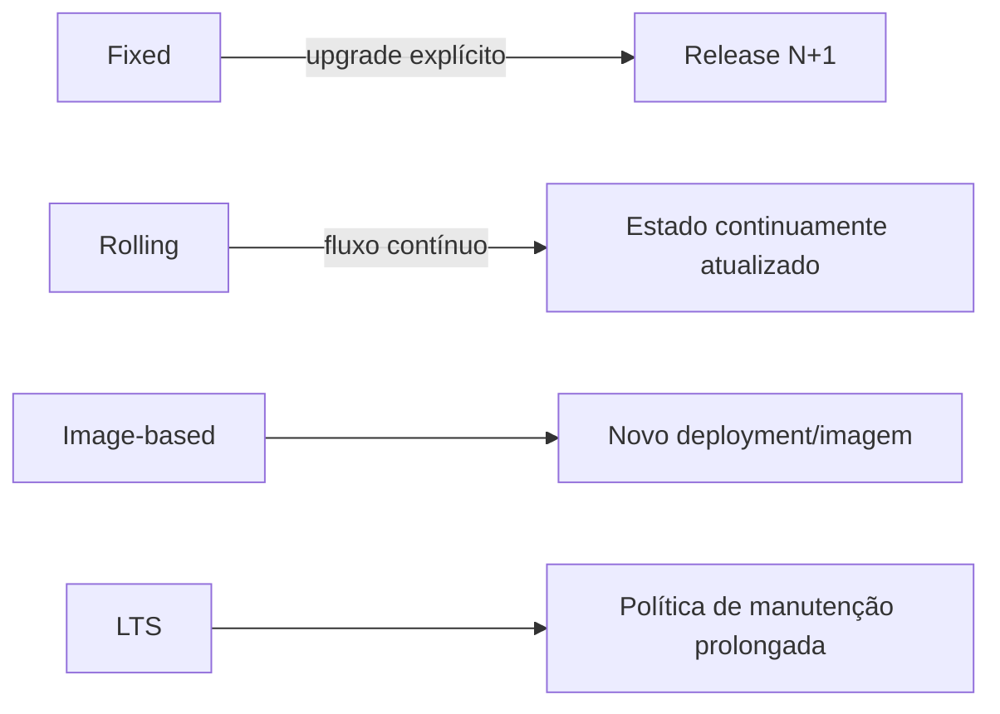

<a id="02-01-tabela-mestre"></a>

### 2.1 Tabela-mestre — modelo de evolução dos 96 candidatos

A tabela abaixo é sincronizada com o catálogo operacional do `quiz.html` 0.3.0. **96 candidatos não significam 96 distribuições generalistas**: há edições, canais, appliances e sistemas especializados.

| Candidato | Versão/canal do snapshot | Modelo | Ecossistema | Contexto/observação |
|---|---|---|---|---|
| **Ubuntu / Ubuntu Flavors** | 26.04 LTS | Fixed Release + LTS | APT / dpkg + Flatpak opcional | Generalista / LTS |
| **Linux Mint** | 22.3 “Zena” | Fixed Release / base Ubuntu LTS | APT / dpkg + Flatpak | Desktop / iniciante |
| **Debian** | 13.6 / Debian 13 “trixie” Stable | Fixed Release | APT / dpkg + Flatpak opcional | Generalista / servidor |
| **Fedora Linux** | 44 | Fixed Release, ciclo rápido | DNF / RPM + Flatpak | Generalista / ciclo rápido |
| **Fedora Atomic Desktops** | 44 | Fixed Release + Atomic Desktop | rpm-ostree + Flatpak + containers | Desktop atômico |
| **openSUSE Leap** | 16.0 | Fixed Release | Zypper / RPM | Generalista / estável |
| **openSUSE Tumbleweed** | Rolling | Rolling Release por snapshots | Zypper / RPM + Flatpak | Rolling generalista |
| **Arch Linux** | Rolling — ISO 2026.08.01 apenas como mídia | Rolling Release | pacman + AUR | Rolling hands-on |
| **NixOS** | 26.05 “Yarara” / nixos-unstable quando exigido | Fixed releases + canal unstable + modelo declarativo | Nix / Nixpkgs | Declarativo; orientado à reprodutibilidade |
| **Red Hat Enterprise Linux** | 10.2 | Enterprise Fixed Release | DNF / RPM | Enterprise |
| **Kali Linux** | 2026.2 — Kali Rolling | Rolling Release especializado | APT / dpkg + toolset de segurança | Segurança ofensiva |
| **KDE neon User Edition** | User Edition — base Ubuntu 24.04 LTS informada pelo KDE | Base LTS fixa + KDE atualizado continuamente | APT + Flatpak + KDE Discover | Desktop KDE especializado |
| **Pop!_OS** | 24.04 LTS | Base LTS + COSMIC com atualização contínua | APT / dpkg + Flatpak | Desktop / COSMIC |
| **Solus** | Rolling — atualizações curadas semanais | Curated Rolling Release | eopkg + Flatpak | Desktop Rolling curado |
| **Zorin OS** | 18.1 | Fixed Release / base Ubuntu 24.04 LTS | APT / dpkg + Flatpak | Desktop / iniciante |
| **MX Linux** | 25.2 | Fixed Release / base Debian | APT / dpkg + Flatpak | Desktop / estável |
| **elementary OS** | 8.1.1 | Fixed Release / base Ubuntu LTS | APT / Flatpak / AppCenter | Desktop / iniciante |
| **Linux Lite** | 8.0 | Fixed Release / base Ubuntu 26.04 LTS | APT / dpkg | Desktop leve / iniciante |
| **Q4OS** | 6.8 “Andromeda” LTS | Fixed Release / base Debian | APT / dpkg | Desktop leve / iniciante |
| **deepin** | 25.2.1 | Fixed Release | APT / dpkg + ecossistema Deepin | Desktop / DDE |
| **TUXEDO OS** | Stable Ubuntu-based • open beta Debian anunciada para 16/08/2026 | Fixed/curado no canal estável • Continuous Debian no canal beta anunciado | APT / Flatpak | Desktop KDE / vendor |
| **Endless OS** | 6.0.11 | Image-based / OSTree | Flatpak + sistema image-based | Educação / desktop |
| **Vanilla OS** | 2 “Orchid” • v3 em desenvolvimento | Image-based / imutável | ABRoot/APX + Flatpak/containers | Desktop imutável |
| **Manjaro** | 26.1 “Bian-May” • Rolling | Rolling Release com curadoria própria | pacman + AUR/Flatpak | Rolling / desktop |
| **CachyOS** | Rolling • ISO 2026-08 | Rolling Release / Arch-based | pacman + AUR + repositórios CachyOS | Rolling / performance |
| **Garuda Linux** | Rolling | Rolling Release / Arch-based | pacman + AUR + Flatpak | Rolling / gaming |
| **EndeavourOS** | Rolling • Titan Neo (ISO 2026) | Rolling Release / Arch-based | pacman + AUR | Rolling / Arch acessível |
| **Mageia** | 10 | Fixed Release | RPM / DNF/urpmi | Desktop / generalista |
| **OpenMandriva Lx** | ROME Rolling / Rock 6.0 | Rolling (ROME) + Fixed (Rock) | DNF / RPM | Rolling + Fixed |
| **Devuan GNU+Linux** | 6 “Excalibur” | Fixed Release / Debian sem systemd | APT / dpkg | systemd-free |
| **Void Linux** | Rolling | Rolling Release independente | XBPS + runit | Rolling / avançado |
| **Gentoo Linux** | Rolling | Rolling / source-based | Portage / emerge | Rolling / source-based |
| **Slackware Linux** | 15.0 Stable / -current | Fixed Stable + development branch -current | pkgtools / slackpkg | Tradicional / avançado |
| **Alpine Linux** | 3.24.1 | Fixed branches de ciclo curto | apk / musl / BusyBox | Minimalista / cloud |
| **GNU Guix System** | 1.5.0 | Declarativo / transacional | Guix | Declarativo / avançado |
| **antiX** | 26 | Fixed Release / Debian Stable sem systemd | APT / dpkg | Ultraleve / systemd-free |
| **Puppy Linux** | Família Woof-CE • builds atuais | Live/frugal, múltiplas bases | Woof-CE / pacotes conforme o Puppy | Ultraleve / live |
| **Peppermint OS** | Debian Trixie / Devuan Excalibur builds | Fixed Release | APT / dpkg | Desktop leve |
| **Bodhi Linux** | 7.0.0 | Fixed Release / Ubuntu-based | APT / dpkg | Desktop leve / Moksha |
| **openSUSE Aeon** | Rolling | Immutable/transactional desktop baseado em Tumbleweed | transactional-update / Flatpak / containers | Desktop imutável |
| **Parrot OS** | 7.3 | Rolling/curado especializado | APT / dpkg + toolset Parrot | Segurança ofensiva |
| **BlackArch Linux** | Rolling | Rolling / repositório de pentest Arch-based | pacman + BlackArch repo | Segurança ofensiva |
| **BackBox Linux** | 9 “Noble Numbat” | Fixed / Ubuntu 24.04 LTS + repos de segurança | APT / dpkg | Segurança ofensiva |
| **Pentoo** | 2026.0_p20260813 / Rolling Gentoo | Rolling / Live security Gentoo-based | Portage + toolset Pentoo | Segurança ofensiva |
| **Athena OS** | Rolling • Arch ou Nix base | Rolling / security-focused | pacman ou Nix conforme edição | Segurança ofensiva |
| **CAINE** | 14.0 “Lightstream” | Fixed / Ubuntu 24.04-based live/installable | APT + forensic toolkit | DFIR |
| **Tsurugi Linux** | 26.03 | Fixed / Ubuntu LTS-based DFIR | APT + DFIR toolkit | DFIR |
| **REMnux** | Current • Ubuntu 24.04-based | Toolkit/distribuição especializada atualizada por instalador | Ubuntu + Salt + ferramentas REMnux | Malware analysis |
| **Security Onion** | 3 | Plataforma Linux especializada | Suricata / Zeek / Elastic e pilha própria | SOC / Blue Team |
| **Qubes OS** | 4.3.1 | Security-by-compartmentalization / Xen | Qubes + Fedora/Debian templates | Segurança / privacidade |
| **Tails** | 7.x • atualizações contínuas de segurança | Live amnésico / Debian-based | APT interno + Tor | Privacidade / live |
| **Whonix** | 18.2.1.9 | Gateway + Workstation virtualizados | Debian-based + Tor | Privacidade / virtualização |
| **Bazzite** | Current Fedora Atomic image | Fedora Atomic-derived / image-based | rpm-ostree/bootc + Flatpak + containers | Gaming / Atomic |
| **Nobara Linux** | Current • semi-rolling Fedora-based | Fedora-based / semi-rolling customizado | DNF/RPM + Flatpak | Gaming / desktop |
| **ChimeraOS** | Rolling appliance | Image/appliance gaming | Steam/Game Mode + immutable host | Gaming appliance |
| **Batocera.linux** | 43.x | Appliance de retrogaming | EmulationStation + emuladores | Retrogaming appliance |
| **SteamOS** | 3.x • Arch-based | Gaming appliance / image-based | Steam / pacman internamente | Gaming appliance |
| **Rocky Linux** | 10.2 | Enterprise Fixed Release | DNF / RPM | Enterprise / servidor |
| **AlmaLinux** | 10.2 | Enterprise Fixed Release | DNF / RPM | Enterprise / servidor |
| **Oracle Linux** | 10.2 | Enterprise Fixed Release | DNF / RPM + UEK/RHCK | Enterprise / servidor |
| **CentOS Stream** | 10 | Continuous delivery entre Fedora e RHEL | DNF / RPM | Enterprise upstream |
| **SUSE Linux Enterprise Server** | 16.0 | Enterprise Fixed Release | Zypper / RPM | Enterprise / servidor |
| **SUSE Linux Enterprise Desktop** | 15 SP7 | Enterprise Fixed Release | Zypper / RPM | Enterprise / desktop |
| **Fedora CoreOS** | Stable stream • 2026 | Automatic-update / image-based | rpm-ostree/OSTree + Ignition + containers | Cloud-native / container host |
| **openSUSE MicroOS** | Rolling | Transactional Rolling / read-only root | transactional-update + Podman/containers | Cloud-native / container host |
| **Flatcar Container Linux** | Stable channel • 2026 | Immutable / automatic updates | systemd + containers + update engine | Cloud-native / container host |
| **Talos Linux** | 1.13.x | Immutable / declarative / API-managed | Talos API + Kubernetes | Kubernetes OS |
| **Bottlerocket** | 1.x • current AWS channel | Immutable container host | AWS/EKS/ECS + API/settings | Cloud-native / AWS |
| **Ubuntu Core** | 26 | Immutable / transactional LTS | snapd / snaps + image model | IoT / edge |
| **Proxmox VE** | 9.2 | Virtualization appliance / Debian-based | APT + KVM/QEMU + LXC + ZFS/Ceph | Virtualização |
| **OpenWrt** | 25.12.5 | Fixed release + snapshots de desenvolvimento | opkg/apk conforme geração + LuCI | Networking appliance |
| **BigLinux** | Rolling • ISO 2026-08-08 | Rolling curado / base Manjaro | pacman + AUR + Flatpak | Desktop brasileiro / Rolling |
| **Regata OS** | 25.0.5 • linha 25 | Fixed/curado • base openSUSE | Zypper / RPM + Regata OS Store | Desktop brasileiro / gaming |
| **Artix Linux** | Rolling • ISO 2026.04 | Rolling Release sem systemd | pacman + repositórios Artix | Rolling / systemd-free |
| **Rhino Linux** | 2026.1 snapshot • Rolling | Ubuntu-based Rolling Release | APT + Pacstall + Flatpak | Rolling / desktop |
| **Nitrux** | 6.1.0 | Estação de trabalho técnica imutável/idempotente | Base Debian + ferramentas NX / AppHub | Estação de trabalho especializada |
| **PCLinuxOS** | Rolling • mídia corrente em 2026 | Rolling Release desktop | RPM + APT/Synaptic | Desktop Rolling |
| **KaOS** | Dinit 2026.06 • Rolling | Rolling independente focado em Qt | pacman + repositórios próprios | Qt / experimental direction |
| **Omarchy** | Stable channel • Arch-based | Estação de trabalho rolling com curadoria Omarchy | pacman + repositório/mirror Omarchy + AUR opcional | Base Arch; Hyprland + Omarchy Shell construído com Quickshell; canais stable/RC/edge/dev; IA/agentes como parte explícita da proposta de desenvolvimento. |
| **Bluefin** | Stable • Fedora-based / LTS • CentOS Stream 10-based | Estação de trabalho image-based / bootc | imagem bootc/OCI + Flatpak + Homebrew + containers/devcontainers | Stable baseada em Fedora; LTS em CentOS Stream 10; Developer Mode; GDX para NVIDIA/CUDA. |
| **Aurora** | Stable • Fedora 44-based | Estação de trabalho image-based / Universal Blue | imagem bootc/OCI + Flatpak + Homebrew + containers | Estação de trabalho image-based |
| **Raspberry Pi OS** | 6.2 • Debian 13 “trixie” | Fixed Release otimizada para Raspberry Pi | APT / dpkg + ferramentas Raspberry Pi | Hardware específico / SBC |
| **Fedora Asahi Remix** | 44 | Fedora Remix para Apple Silicon | DNF / RPM + Flatpak | Hardware específico / Apple Silicon |
| **Trisquel GNU/Linux** | 12.0 LTS “Ecne” | Fixed Release / Ubuntu LTS-derived • 100% software livre | APT / dpkg | Software livre / desktop |
| **PureOS** | Crimson • release 2026 | Fixed/curado • Debian-derived • software livre | APT / dpkg + PureOS Store | Software livre / privacidade |
| **TrueNAS Community Edition** | 25.10.6 • stable recomendado em 15/08/2026 | Appliance Linux de armazenamento • OpenZFS | OpenZFS + interface web + containers/VMs | Appliance de armazenamento / NAS |
| **Unraid OS** | 7.3.2 • stable | Storage/virtualization appliance Linux | Unraid array + XFS/Btrfs/ZFS + Docker/VMs | Storage appliance / NAS |
| **Harvester HCI** | 1.8.2 | Cloud-native HCI appliance • Kubernetes/KubeVirt | Kubernetes + KubeVirt + Longhorn + Rancher integration | Virtualização / HCI cloud-native |
| **Container-Optimized OS from Google** | Milestone 129 LTS • milestone 133 em beta no snapshot | Image-based container host + automatic updates | Google Compute Engine/GKE + Docker/containerd + toolbox | Cloud-native / container host |
| **Amazon Linux 2023** | 2023.12.20260803 | Fixed major generation + versioned repositories | DNF / RPM + AWS images | Cloud / servidor |
| **Azure Linux Container Host** | 3.0 • produção (AKS) | Fixed major + node images/package updates | DNF / RPM + AKS/Azure | Cloud-native / container host |
| **Azure Container Linux** | ACL • image stream AKS 2026 | Immutable image-based container OS | Image-based + systemd extensions + AKS/Azure | Cloud-native / immutable Kubernetes host |
| **VyOS** | 1.5.0 LTS | Network OS LTS + rolling/stream development | Debian base + FRRouting + nftables + WireGuard/IPsec/OpenVPN + VPP | Network OS / routing |
| **IPFire** | 2.29 • Core Update 203 | Appliance Linux de firewall + Core Updates | Pakfire + interface web + firewall/VPN/IPS | Firewall / appliance de rede |
| **SONiC** | 202605 release branch | Disaggregated switch NOS / Debian-based | SAI + Redis/ConfigDB + FRR + containers + gNMI/REST/OpenConfig | Datacenter switch NOS |
| **NVIDIA Cumulus Linux** | 5.18 | Commercial Linux switch NOS | NVUE + FRRouting + Linux networking + NVIDIA Spectrum ASICs | Datacenter switch NOS |

<a id="02-02-familias-genealogia"></a>

### 2.2 Famílias e genealogia

**Família Linux não é sinônimo de gerenciador de pacotes.** Genealogia ajuda a entender herança, mas não substitui release, lifecycle, arquitetura operacional ou governança.

| Família/linhagem | Exemplos no Advisor | Leitura correta | Instalação: facilidade × liberdade |
|---|---|---|---|
| **Debian/Ubuntu** | Debian, Ubuntu, Mint, Zorin, MX, Kali, Tails | mesma linhagem não significa mesma política de release, suporte ou finalidade | costuma oferecer instaladores guiados; Debian também permite escolhas mais minimalistas |
| **Fedora/Red Hat** | Fedora, Fedora Atomic, RHEL, CentOS Stream, Rocky, Alma, Bluefin | RPM/DNF não define sozinho a família; Universal Blue acrescenta arquitetura image-based | Fedora/RHEL usam instaladores guiados; variantes image-based deslocam parte da escolha para a imagem |
| **Arch** | Arch, Manjaro, EndeavourOS, CachyOS, Garuda, Omarchy | derivar de Arch não significa repetir o mesmo grau de curadoria | Arch privilegia composição manual; derivados podem oferecer instalação muito mais guiada |
| **openSUSE/SUSE** | Leap, Tumbleweed, Aeon, SLES, SLED, MicroOS | Fixed, Rolling e transacional coexistem na mesma linhagem | YaST/instaladores guiados convivem com opções avançadas |
| **Nix/Guix** | NixOS, GNU Guix System | declaratividade e generations são eixos próprios, não sinônimos de Rolling | curva conceitual maior; liberdade vem da especificação declarativa, não de um instalador “difícil” |
| **Independentes** | Void, Solus, Alpine, PCLinuxOS, KaOS | políticas próprias exigem documentação do projeto | varia amplamente; “independente” não é nota de dificuldade |
| **Gentoo/source-based** | Gentoo, Pentoo | composição e compilação são parte relevante do modelo | alta liberdade e alto custo operacional para iniciantes |
| **Appliances/hosts especializados** | OpenWrt, Proxmox, TrueNAS, Talos, Bottlerocket, SONiC | não devem ser comparados como desktop generalista | instalação é orientada ao appliance e ao workload |
| **Image-based / Universal Blue** | Bluefin, Aurora, Bazzite | arquitetura de entrega não cria uma nova “família Linux” universal | seleção da imagem reduz decisões no host e aumenta padronização |

> **Facilidade de instalação ≠ liberdade de instalação.** Um instalador guiado pode oferecer muitas escolhas; um processo manual pode oferecer liberdade alta, mas não é automaticamente “melhor”. Avalie fricção e controle separadamente.

<a id="02-02-fixed-release"></a>

### 2.3 Fixed Release

Uma **Fixed Release** publica gerações identificáveis. Durante o lifecycle, a geração recebe correções e atualizações segundo a política do projeto; a passagem para a próxima geração continua sendo um evento lógico identificável, mesmo quando a ferramenta automatiza parte do processo.

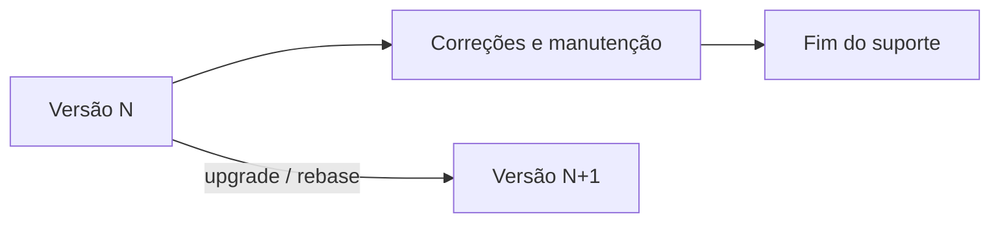

Exemplos claros incluem Debian Stable, Ubuntu, Fedora estável, RHEL, Linux Mint, Zorin OS, Pop!_OS, openSUSE Leap, Rocky Linux, AlmaLinux e Oracle Linux.

Vantagens comuns:

- janela de suporte e escopo de homologação mais fáceis de associar a uma versão;
- mudanças estruturais podem ser agrupadas entre gerações;
- documentação, certificações e caminhos de upgrade podem ser vinculados a uma release concreta.

Custos comuns:

- migrações periódicas entre gerações;
- determinados componentes podem permanecer numa major version por bastante tempo;
- o lifecycle do host não prolonga automaticamente aplicações, runtimes ou repositórios externos.

**Fixed não significa conservadora, antiga ou LTS.** Fedora e RHEL são Fixed Release, mas têm objetivos, atualidade e lifecycles muito diferentes.

<a id="02-03-rolling-release"></a>

### 2.4 Rolling Release

Uma **Rolling Release** mantém a instalação evoluindo continuamente pelo fluxo de pacotes ou snapshots, sem exigir uma sucessão periódica de upgrades completos `N → N+1` como condição normal para permanecer na linha atual.

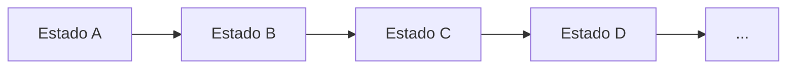

Exemplos clássicos: Arch Linux, CachyOS, EndeavourOS, Void Linux, PCLinuxOS e openSUSE Tumbleweed.

No Arch, por exemplo, uma ISO datada é uma **mídia/snapshot de instalação**, não uma release fixa para a qual o sistema instalado precise migrar. Depois de instalada, a máquina acompanha o fluxo rolling.

Vantagens comuns:

- acesso mais rápido a kernels, Mesa, desktops, toolchains e bibliotecas novas;
- reduz a necessidade de grandes saltos periódicos de geração;
- pode ser interessante para hardware e stacks que evoluem rapidamente.

Custos comuns:

- mudanças chegam com maior frequência;
- ficar muitos meses sem atualizar pode aumentar a distância para o estado atual e complicar a manutenção;
- avisos do projeto e práticas de recuperação tornam-se especialmente importantes.

Rolling não é sinônimo de `testing`, `unstable` ou `bleeding edge`. O termo descreve **evolução contínua da instalação**, não qualidade.

<a id="02-04-semi-rolling-curated-hibridos"></a>

### 2.5 Semi-Rolling, Curated Rolling, Slow Rolling e modelos híbridos

Nem todo projeto cabe perfeitamente em Fixed ou Rolling.

**Curated Rolling** continua sendo rolling, mas o projeto segura, agrupa ou promove mudanças por etapas. Manjaro é um bom exemplo: pacotes percorrem branches próprias antes de chegar ao usuário de `stable`.

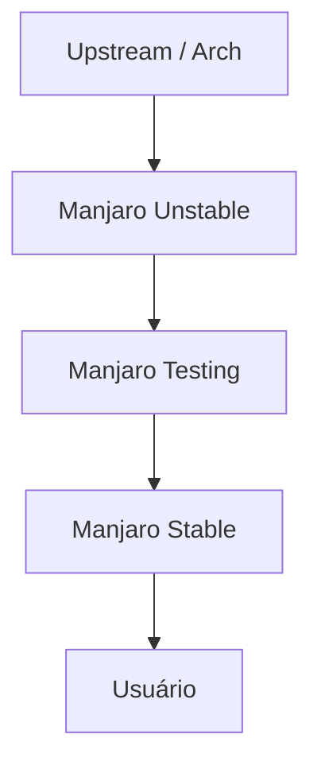

`Stable` nesse desenho é **nome de branch/canal de promoção**, não prova de Fixed Release.

O **openSUSE Slowroll** deriva do Tumbleweed e desacelera mudanças maiores, preservando um fluxo contínuo para correções importantes. O estado de maturidade do canal precisa ser confirmado na documentação vigente antes de uma decisão de produção.

O **Nobara** é um caso híbrido importante: o próprio projeto passou a descrevê-lo como **semi-rolling**. Ainda existem versões/ISOs numeradas, mas a atualização normal pode conduzir o sistema aos pacotes da geração seguinte quando eles ficam prontos; por isso, descreva a combinação concreta em vez de assumir o comportamento apenas pelo número da ISO.

O **Parrot OS** também exige leitura por camadas: a documentação o descreve como baseado em Debian Stable e, simultaneamente, mantém ferramentas de segurança em fluxo mais contínuo. Classificá-lo apenas como “Debian Fixed” ou “Arch-like Rolling” perde essa combinação.

O **CentOS Stream** é outro caso que merece linguagem própria: há um fluxo contínuo de integração dentro de uma geração Enterprise Linux. É mais preciso descrevê-lo como **stream contínuo versionado** do que como rolling de desktop no sentido de Arch.

<a id="02-05-point-minor-release"></a>

### 2.6 Point Release e Minor Release

Point release não é uma terceira alternativa a Fixed e Rolling. Ela identifica um **estado/revisão dentro de uma família**.

~~~text
Debian 13.0 ─► 13.1 ─► 13.2 ─► ...
~~~

No Debian, uma point release consolida correções e atualiza a mídia; uma instalação que já recebeu as atualizações correspondentes não precisa ser tratada como se estivesse migrando para uma nova geração.

No Ubuntu LTS, point releases também atualizam mídias e podem incorporar habilitação de hardware adequada à política da série. Linux Mint e Zorin usam numeração intermediária própria dentro de suas famílias.

No RHEL, a terminologia oficial relevante é **minor release** (`10.0`, `10.1`, `10.2`...). A função operacional se sobrepõe parcialmente ao que muita gente chama genericamente de point release, mas o guia preserva o vocabulário do fornecedor.

Distribuições rolling também podem publicar imagens numeradas. Kali 2026.x ou uma ISO mensal do Arch não provam Fixed Release: é necessário distinguir **versão da mídia** de **modelo da instalação**.

<a id="02-06-branches-e-canais"></a>

### 2.7 Branches e canais: Debian Testing/Sid, Fedora Rawhide e outros casos

Uma **branch** é uma linha nomeada de desenvolvimento, manutenção ou promoção. `stable`, `testing`, `unstable`, `Rawhide`, `edge`, `-current` e nomes semelhantes têm significado definido por cada projeto; não existe uma semântica universal.

#### Debian Stable, Testing e Unstable

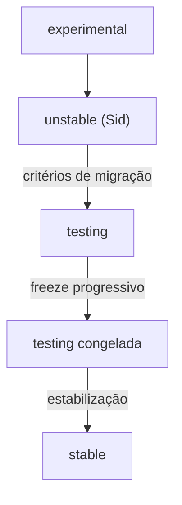

**Debian Stable** é Fixed Release.

**Debian Testing** é a branch de desenvolvimento da próxima Stable. Ela recebe continuamente pacotes vindos de `unstable` quando cumprem critérios de migração. Quando alguém acompanha permanentemente o alias `testing`, o comportamento cotidiano pode parecer rolling; estruturalmente, porém, essa branch existe para congelar, estabilizar e formar a próxima Stable. Por isso, a descrição preferida neste guia é **development branch / rolling-like**, e não “Rolling Release clássica”.

A escolha entre acompanhar o alias `testing` e o codename também importa: quando um codename promove para Stable, quem segue o codename permanece naquela geração; quem segue `testing` passa a acompanhar a próxima Testing.

**Debian Unstable/Sid** é a linha de desenvolvimento ativo onde novos pacotes entram. A descrição mais rigorosa é **Rolling Development**, não uma equivalência automática com Arch.

#### Fedora estável e Rawhide

As edições estáveis do Fedora — Workstation, Server e Atomic Desktops — são **Fixed Release**. O Fedora **Rawhide**, por outro lado, é a árvore de desenvolvimento em constante evolução da qual futuras releases são derivadas.

| Canal/produto | Classificação |
|---|---|
| Fedora Workstation 44 | Fixed Release |
| Fedora Silverblue/Kinoite 44 | Fixed Release + Atomic/Image-based |
| Fedora Rawhide | Rolling Development / development branch |

Dizer apenas “Fedora é rolling” seria errado; dizer que “Fedora não possui nenhum fluxo contínuo de desenvolvimento” também esconderia Rawhide.

#### Outros exemplos de branches/canais

- Manjaro: `unstable` → `testing` → `stable`, todos dentro da operação de uma rolling;
- Alpine: releases `stable` coexistem com a branch de desenvolvimento `edge`;
- Slackware: uma release estável coexistindo com `-current`, usado para preparar a próxima geração;
- Bazzite: `stable`, `testing` e `unstable` são canais de imagem, não equivalem automaticamente às branches homônimas de Debian ou Manjaro;
- Kali: `kali-rolling`, `kali-last-snapshot`, `kali-dev`, `kali-experimental` e `kali-bleeding-edge` têm funções diferentes;
- Omarchy: `stable`, `rc`, `edge` e `dev` representam canais próprios do projeto e não mudam o fato de a base ser Arch/rolling.

A regra operacional é: **sempre leia o significado da branch/canal no projeto específico**.

<a id="02-07-fixed-rolling-nao-e-atomic-transactional"></a>

### 2.8 Fixed/Rolling não é Atomic/Transactional

**Fixed/Rolling responde:** “como o sistema evolui entre releases ou ao longo do tempo?”  
**Atomic/Transactional responde:** “como uma mudança do conteúdo controlado do SO é preparada e ativada?”

Atomicidade busca a propriedade **all-or-nothing no ponto de ativação**: em vez de deixar o host num estado parcialmente atualizado, o mecanismo prepara um novo estado coerente e só então o torna o estado de boot/execução.

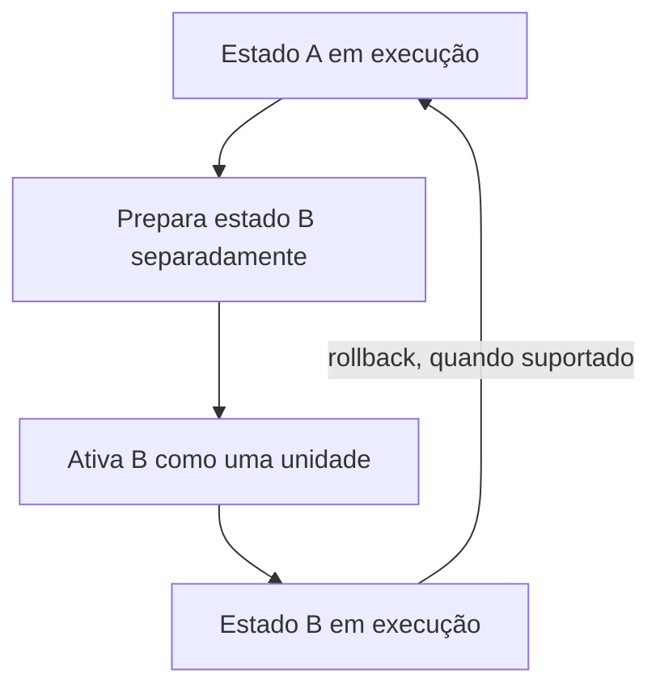

Isso **não significa que cada arquivo do computador esteja dentro da transação** e não significa que a aplicação funcionará automaticamente depois do boot.

Nos Fedora Atomic Desktops baseados em `rpm-ostree`, é útil separar conceitualmente:

~~~text
/
├── /usr  → conteúdo do SO gerenciado pelo deployment; somente leitura no host normal
├── /etc  → configuração local gravável; mudanças locais são reconciliadas no upgrade
└── /var  → estado mutável/persistente; não é substituído pelo deployment
~~~

Por isso, voltar para um deployment anterior **não significa automaticamente voltar banco de dados, logs, dados de usuário ou todo estado mutável ao passado**. Rollback de SO continua diferente de backup.

| Sistema | Release | Mecanismo de atualização do host |
|---|---|---|
| Fedora Workstation | Fixed | DNF/RPM tradicional |
| Fedora Atomic Desktops | **Fixed** | deployment atômico / image-based |
| Bluefin/Bazzite/Aurora | **Fixed-base** | imagens bootáveis/bootc + rollback conforme o projeto |
| Arch Linux | **Rolling** | pacotes tradicionais com pacman |
| openSUSE MicroOS | **Rolling** | snapshots transacionais |

`atomic`, `transactional`, `image-based`, `immutable` e `A/B` não devem ser usados como sinônimos automáticos. Eles podem cooperar para o mesmo objetivo operacional, mas descrevem propriedades ou implementações diferentes.

<a id="02-08-leading-edge-e-bleeding-edge"></a>

### 2.9 Leading edge e bleeding edge

Esses termos descrevem **atualidade e exposição a mudanças**, não modelo de release.

- **Leading edge:** adoção rápida de tecnologias novas, normalmente já integradas para uso regular. Fedora é frequentemente um exemplo útil: release fixa com software relativamente atual.
- **Bleeding edge:** proximidade ainda maior do desenvolvimento/upstream, aceitando maior probabilidade de regressões ou necessidade de intervenção. O rótulo é informal e deve ser contextualizado.

Um mesmo sistema pode ter kernel muito recente, biblioteca conservadora e aplicação atualizada por Flatpak quase imediatamente após o upstream. Por isso, atualidade deve ser avaliada **por componente, repositório ou canal**.

Não use as equivalências:

- rolling = bleeding edge;
- fixed = software antigo;
- stable = fixed;
- testing = rolling;
- atomic = rolling;
- image-based = immutable;
- LTS = fixed conservadora por definição.

[Voltar ao índice](#indice)

---

<a id="03-lifecycle-lts-e-suporte-empresarial"></a>

## 3. Lifecycle, LTS e suporte empresarial

**LTS (*Long-Term Support*)** significa política de manutenção prolongada para um **objeto específico**: por exemplo, uma release de distribuição, um kernel ou outro componente. O prazo e o escopo não são universais; sempre identifique **LTS de quê**, quem mantém esse objeto e quais arquiteturas/repositórios estão cobertos.

**Enterprise** não é apenas um lifecycle longo. Um produto/ecossistema enterprise normalmente combina parte ou todos estes elementos: lifecycle documentado, suporte comercial, SLA, políticas de compatibilidade, erratas, matrizes de hardware/software, certificações, ferramentas de gestão e condições contratuais. Nenhum desses termos define sozinho o modelo Fixed ou Rolling.

O lifecycle deve responder pelo menos a estas perguntas:

- quando a versão entrou e sai de suporte;
- quais arquiteturas recebem atualização;
- quais repositórios e pacotes estão cobertos;
- que severidades de vulnerabilidade são tratadas;
- em qual fase são aceitas correções funcionais;
- se o suporte exige assinatura ou contrato;
- como funciona a passagem para a próxima versão;
- por quanto tempo imagens de cloud e containers são mantidas.

> “Cinco anos de suporte” não implica cinco anos de manutenção idêntica para qualquer pacote instalado.

No Ubuntu, por exemplo, o escopo da manutenção padrão, o conteúdo de Main, a cobertura adicional por Ubuntu Pro/ESM e os pacotes de Universe precisam ser distinguidos. Em distribuições empresariais, add-ons e fases estendidas também possuem condições próprias.

Lifecycle do conteúdo do sistema operacional controlado não prolonga automaticamente:

- banco de dados instalado de repositório externo;
- runtime baixado do site do fornecedor;
- imagem de container de terceiro;
- plugin sem manutenção;
- firmware do equipamento;
- aplicação empacotada pelo próprio usuário.

<a id="03-suporte-certificacao"></a>

### Suporte comercial e certificação são requisitos diferentes

A edição 0.3.0 separa explicitamente dois constructs que não devem ser comprimidos numa única pergunta:

1. **Suporte comercial / SLA / contrato:** existe fornecedor responsável, prazo de atendimento, escalonamento e cobertura formal para o produto e a versão em uso?
2. **Certificação / homologação / matriz de compatibilidade:** o hardware, software, aplicação, hipervisor ou plataforma consta formalmente na matriz exigida para aquela combinação de produto, release, arquitetura e, quando aplicável, kernel?

Um ambiente pode exigir apenas suporte contratual, apenas certificação, ambos ou nenhum. Compatibilidade técnica observada em laboratório não transfere automaticamente certificação formal; certificação também não substitui um contrato de suporte quando o SLA é requisito organizacional.

<a id="03-perguntas-para-producao"></a>

### Perguntas para produção

1. A versão permanecerá suportada durante toda a vida prevista do serviço?
2. O repositório que contém cada pacote crítico está no escopo?
3. Há caminho testado para upgrade ou migração?
4. As aplicações e o hardware são certificados nessa combinação exata quando isso for obrigatório?
5. Existe contrato, comunidade ou equipe capaz de responder a incidentes no prazo necessário?
6. A arquitetura de CPU, o kernel, o hipervisor e a cloud estão dentro do escopo formal exigido?
7. Componentes externos — banco, runtime, imagens, plugins e firmware — possuem lifecycle independente documentado?

[Voltar ao índice](#indice)

---

<a id="04-stable-nao-significa-uma-unica-coisa"></a>

## 4. Stable não significa uma única coisa

“Stable” pode designar:

- uma branch promovida para produção;
- preservação de API ou ABI;
- baixo ritmo de mudança;
- software upstream que saiu de beta;
- comportamento operacional previsível.

Não significa “sem bugs”. Também não prova adequação ao seu workload. **Nunca interprete `stable` isoladamente**: confirme se é nome de branch/canal, estágio de promoção, promessa de compatibilidade, descrição operacional ou apenas rótulo informal.

Uma distribuição pode ser estável no contrato de plataforma e ainda atualizar determinados componentes. Outra pode manter versões antigas, mas não oferecer o lifecycle necessário. Em uma rolling, uma branch chamada `stable` pode continuar pertencendo a um fluxo rolling; no Manjaro, por exemplo, `stable` descreve a etapa de promoção, não uma Fixed Release.

[Voltar ao índice](#indice)

---

<a id="05-backports-erratas-e-leitura-de-vulnerabilidades"></a>

## 5. Backports, erratas e leitura de vulnerabilidades

**Backport** é a adaptação de uma correção desenvolvida para uma versão mais nova a uma versão anterior ainda mantida pela distribuição.

~~~text
upstream 5.1 com correção
          │
          └── adaptação downstream ─► pacote 5.0 + patch de segurança
~~~

Fornecedores também podem corrigir uma falha por rebase, patch próprio, desativação de recurso ou outra mitigação. “Backport” não é a única estratégia.

Um **CVE (*Common Vulnerabilities and Exposures*)** é um identificador público para uma vulnerabilidade conhecida. O CVE identifica o problema; ele não informa, sozinho, se a versão instalada continua vulnerável, se existe exploração prática, se o pacote está no escopo de suporte ou se o fornecedor já aplicou uma correção downstream.

**OVAL (*Open Vulnerability and Assessment Language*)** é uma linguagem padronizada para representar informações de configuração/estado do sistema, testar condições como vulnerabilidade ou patch instalado e reportar o resultado. Conteúdo OVAL pode ser usado por scanners que compreendem versões e estados específicos do fornecedor, reduzindo a dependência de comparação ingênua de números de versão.

<a id="05-regra-operacional"></a>

### Regra operacional

Não determine vulnerabilidade comparando apenas a versão upstream exibida por `--version`.

Consulte:

1. advisory ou errata oficial da distribuição;
2. tracker de CVEs do fornecedor;
3. changelog e release do pacote;
4. status do repositório e da arquitetura usada;
5. scanner que compreenda versões downstream e, quando disponível, conteúdo OVAL/SCAP adequado ao fornecedor.

Um scanner que compara somente versões upstream pode produzir **falso positivo** — marcar como vulnerável um pacote já corrigido por backport. Um pacote fora de suporte também pode produzir **falso negativo** se o scanner interpretar incorretamente um número de versão recente como sinônimo de manutenção ativa.

> **CVE não é sinônimo de prioridade operacional.** Além do advisory do fornecedor e da severidade/CVSS quando disponível, considere exposição real do ativo, explorabilidade, existência de exploração conhecida, criticidade do workload, mitigação disponível e impacto operacional. Catálogos como o **CISA KEV (*Known Exploited Vulnerabilities*)** podem complementar — não substituir — a análise do fornecedor ao indicar vulnerabilidades com exploração conhecida.

[Voltar ao índice](#indice)

---

<a id="06-api-abi-e-kabi"></a>

## 6. API, ABI e kABI

Essas três siglas descrevem contratos diferentes de compatibilidade. Elas importam especialmente quando aplicações, bibliotecas, drivers ou módulos externos precisam continuar funcionando após atualizações.

<a id="06-api"></a>

### API

**API (*Application Programming Interface*)** é o contrato/interface por meio do qual um componente expõe funcionalidades ou dados para outro. Dependendo do contexto, pode envolver funções de biblioteca, chamadas em runtime, estruturas de dados, mensagens, protocolos ou endpoints. Manter uma API compatível permite que o código continue compilando ou interagindo conforme o contrato documentado.

<a id="06-abi"></a>

### ABI

**ABI (*Application Binary Interface*)** é o contrato binário entre componentes já compilados. Inclui símbolos exportados, layout de tipos, formatos binários e *calling conventions* — regras de baixo nível sobre como funções recebem argumentos, retornam valores e usam registradores/memória.

Uma API pode permanecer semelhante e a ABI mudar; nesse caso, um programa pode precisar ser recompilado mesmo que o código-fonte use chamadas aparentemente iguais.

Exemplo simplificado:

~~~text
aplicação compilada → espera libfoo.so.1
                         │
                         └── biblioteca passa para libfoo.so.2

Se a nova biblioteca não preservar a ABI anterior, o binário pode deixar de carregar ou exigir recompilação/rebuild.
~~~

O nome `libfoo.so.1` representa um **SONAME (*shared object name*)**, identificador de compatibilidade usado por bibliotecas compartilhadas no formato **ELF (*Executable and Linkable Format*)**. Mudar o SONAME normalmente sinaliza uma fronteira de compatibilidade, mas **SONAME não é prova completa de compatibilidade ABI em todos os aspectos**.

<a id="06-kabi"></a>

### kABI

**kABI (*kernel Application Binary Interface*)** é a parte da ABI do kernel relevante para módulos externos, drivers e outros componentes binários que interagem com o kernel. Políticas de kABI são específicas de fornecedor, versão, arquitetura e conjunto de símbolos. **O kernel Linux upstream não oferece uma ABI interna estável universal para módulos externos**; quando uma distribuição/fornecedor promete estabilidade de kABI, esse compromisso é downstream e possui escopo próprio.

~~~text
kernel A + módulo externo Z → módulo carrega
          │
          └── kernel atualizado muda símbolo/contrato usado por Z
                                      │
                                      └── módulo pode exigir rebuild, nova versão ou suporte explícito
~~~

Distribuições empresariais podem preservar subconjuntos de kABI para reduzir esse tipo de ruptura, mas a política precisa ser verificada para a release, arquitetura e módulo específicos.

Em ambientes corporativos, “estabilidade” pode significar:

- aplicação certificada continuar executando;
- módulo suportado continuar carregando;
- configuração manter a mesma semântica;
- biblioteca preservar símbolos necessários;
- caminho de upgrade permanecer documentado;
- automação não quebrar por alteração incompatível não anunciada.

Por isso, “mais recente” e “mais adequado” não são sinônimos.

[Voltar ao índice](#indice)

---

<a id="07-pacote-formato-gerenciador-repositorio-e-origem"></a>

## 7. Pacote, formato, gerenciador, repositório e origem

Esses termos não são intercambiáveis:

| Camada | Exemplo | Responde a... |
|---|---|---|
| Formato de pacote | `deb`, `rpm`, `pkg.tar.zst` | Como o artefato é estruturado? |
| Gerenciador de baixo nível | `dpkg`, `rpm` | Como arquivos e metadados do pacote são registrados/instalados? |
| Resolver/gerenciador de alto nível | APT, DNF, Zypper, pacman | Como dependências, repositórios e transações são calculados? |
| Repositório | Debian Stable, Fedora Updates | De qual coleção controlada o pacote vem? |
| Origem/proveniência | projeto oficial, fornecedor, comunidade, terceiro | Quem construiu, assinou e mantém o artefato? |
| Modelo de aplicação | Flatpak, Snap, AppImage, container | Como uma aplicação é distribuída, atualizada e eventualmente isolada do host? |

Uma **verificação de assinatura bem-sucedida** comprova que os dados cobertos pela assinatura foram assinados pela chave aceita pela política local e não foram modificados depois da assinatura. Isso **não comprova**, por si só, que a chave deveria ser confiável, que o software é seguro, que está atualizado ou que atende à política da organização.

Também separe:

- **metadados assinados do repositório**: protegem a relação entre índices/metadados e o conteúdo esperado;
- **artefato/pacote assinado individualmente**: autentica o objeto específico quando o ecossistema usa esse modelo;
- **rotação e expiração de chaves**: chaves possuem lifecycle próprio e precisam de processo de substituição, revogação e auditoria;
- **prioridade/pinning de repositórios**: controla de qual origem uma versão pode ser escolhida quando múltiplos repositórios oferecem o mesmo pacote.

Scripts executados durante instalação, atualização ou build também fazem parte da superfície de confiança: um pacote ou receita pode executar código com os privilégios concedidos pelo processo de instalação.

<a id="07-fontes-suplementares"></a>

### Fontes suplementares

Fontes externas ao repositório principal podem ser legítimas, mas introduzem outra cadeia de manutenção:

- **AUR (*Arch User Repository*)** distribui principalmente receitas de build (`PKGBUILD`), não um repositório oficial de binários equivalentes aos pacotes oficiais do Arch; revise o `PKGBUILD` e a origem antes de construir/instalar.
- **PPA (*Personal Package Archive*)** é um repositório adicional no ecossistema Ubuntu/Launchpad. Um PPA não herda automaticamente o mesmo suporte da Canonical.
- **COPR** é um serviço comunitário de build/repositórios no ecossistema Fedora. Pacotes COPR não recebem automaticamente o mesmo suporte dos repositórios Fedora oficiais.
- **OBS (*Open Build Service*)** é uma plataforma de build/publicação usada pelo ecossistema openSUSE e por outros projetos; cada repositório mantém responsabilidade e política próprias.
- **Flatpak** desacopla aplicações gráficas do host, usa runtimes e sandbox/permissões; origem, runtime e manutenção continuam relevantes.
- **Snap** distribui aplicações/serviços em pacotes autocontidos com canais e mecanismos de confinamento conforme o snap; canal, publisher, permissões/interfaces e lifecycle continuam relevantes.
- **AppImage** empacota uma aplicação para execução portátil; atualização, integração e proveniência precisam ser tratadas pelo projeto/usuário.
- repositório de fornecedor pode ser necessário para suporte oficial, porém adiciona outro lifecycle ao ambiente.

<a id="07-praticas-seguras"></a>

### Práticas seguras

- prefira repositórios destinados exatamente à versão instalada;
- não misture famílias ou releases apenas para “obter um pacote mais novo”;
- evite *partial upgrades* quando o projeto não os suporta;
- registre chaves, origem, prioridade e responsável por cada repositório adicional;
- remova repositórios abandonados antes de upgrades maiores;
- inventarie software instalado fora do gerenciador de pacotes;
- quando o risco justificar, valide assinatura, atestação e **SBOM (*Software Bill of Materials*)**;
- quando disponível, use **VEX (*Vulnerability Exploitability eXchange*)** para registrar/comunicar o estado de vulnerabilidades conhecidas em relação a um produto;
- em Flatpaks e containers, avalie também o **runtime/base image** e seu lifecycle;
- para **imagens OCI**, registre registry/origem, referência imutável por digest quando necessário, identidade do publicador, assinatura/attestation quando disponível, cadeia de build, SBOM/VEX e política de atualização da imagem-base.

Uma imagem assinada comprova vínculo/integridade segundo a política adotada; **não prova ausência de vulnerabilidades nem adequação ao workload**.

[Voltar ao índice](#indice)

---

<a id="08-tradicional-imutavel-atomico-image-based-e-declarativo"></a>

## 8. Tradicional, imutável, atômico, image-based e declarativo

São propriedades relacionadas, mas independentes.

<a id="08-01-sistema-tradicional-baseado-em-pacotes"></a>

### 8.1 Sistema tradicional baseado em pacotes

Pacotes alteram diretamente a instalação existente. Esse modelo é flexível, conhecido e adequado a inúmeros cenários, mas exige controle de **drift** — divergência acumulada entre o estado planejado e o estado real — e disciplina de configuração.

<a id="08-02-imutavel-ou-com-base-read-only"></a>

### 8.2 Imutável ou com base read-only

O **conteúdo do sistema operacional protegido pelo mecanismo de atualização** é modificado somente por caminhos controlados. Dados, configurações permitidas, containers e diretórios persistentes continuam mutáveis.

Imutabilidade:

- não significa que nada muda;
- não substitui controle de acesso;
- não corrige imagem vulnerável;
- não protege automaticamente dados do usuário;
- não impede, por si só, exploração de processos em execução, roubo de credenciais, abuso de permissões ou comprometimento de dados mutáveis.

> **Não confunda:** uma base read-only/imutável reduz alterações persistentes ad hoc na área protegida, mas **não substitui segurança em tempo de execução**. Patching, SELinux/AppArmor, sandbox, isolamento, privilégios mínimos, proteção de credenciais e monitoramento continuam necessários.

<a id="08-03-atualizacao-atomica-ou-transacional"></a>

### 8.3 Atualização atômica ou transacional

Uma atualização é **atômica no ponto de ativação** quando o consumidor observa o estado anterior ou o novo estado completo, sem depender de um estado intermediário parcialmente ativado. A implementação pode usar deployment, snapshot, slot A/B, generation ou outro mecanismo.

> **Não confunda:** **atomicidade não implica rollback durável**. Preservar o estado anterior, permitir retorno automático, recuperar dados ou garantir consistência da aplicação são capacidades adicionais e precisam ser verificadas separadamente.

Atomicidade da ativação também não prova que a aplicação funcionará após a mudança. Migrações de banco, firmware, estado externo, idempotência de automações e compatibilidade ainda exigem teste.

<a id="08-04-image-based"></a>

### 8.4 Image-based

O conteúdo do sistema operacional controlado pelo host é entregue ou composto predominantemente como imagem, árvore ou deployment coerente. Customizações devem seguir o mecanismo suportado do projeto, em vez de depender de mutações arbitrárias no estado em execução.

<a id="08-05-declarativo"></a>

### 8.5 Declarativo

O operador descreve o **estado desejado** e a plataforma produz/converge para uma configuração. NixOS é o exemplo clássico, mas declaratividade também aparece em imagens, Kubernetes e ferramentas de provisionamento.

Declarativo não implica, por si só, base imutável. Imutável não implica configuração declarativa.

> **Declarativo não significa automaticamente reproduzível.** Declaratividade descreve **como o estado desejado é especificado**. Reprodutibilidade exige controlar entradas relevantes — versões, dependências, imagens, fontes, lockfiles e outros artefatos — para que o mesmo conjunto de entradas possa produzir novamente o resultado esperado.

<a id="08-06-rollback-nao-e-backup"></a>

### 8.6 Rollback não é backup

Rollback de deployment costuma recuperar **o conteúdo coberto pelo deployment**. Ele pode não reverter:

- dados de usuário;
- banco migrado;
- schema externo;
- volume persistente;
- firmware;
- segredo rotacionado;
- configuração fora do escopo da transação.

Snapshot local também não é backup se permanecer no mesmo domínio de falha. A mesma distinção vale para snapshots Btrfs, generations do NixOS e deployments image-based: cada mecanismo possui um **escopo de estado** próprio.

[Voltar ao índice](#indice)

---

<a id="09-desktop-e-pilha-grafica"></a>

## 9. Desktop e pilha gráfica

Uma recomendação de desktop precisa separar as camadas da interface gráfica. Instalar um componente não significa que a distribuição o trate como combinação padrão, integrada ou plenamente suportada.

<a id="09-camadas-interface"></a>

### Camadas da interface gráfica

| Componente | Função | Exemplos |
|---|---|---|
| **Desktop Environment (DE)** | experiência integrada que combina sessão, shell/painéis, configurações e um conjunto coerente de componentes | GNOME, KDE Plasma, Xfce, Cinnamon, COSMIC |
| **Window manager (X11)** | gerencia foco, posicionamento e comportamento das janelas em uma sessão X11; não é o servidor gráfico | i3, Openbox, bspwm |
| **Compositor Wayland** | é o servidor/compositor autônomo da sessão Wayland e também gerencia superfícies/janelas | Hyprland, Sway, Niri, KWin, Mutter |
| **Shell/camada de interface** | fornece barra, launcher, notificações, OSD, lock screen e outros componentes visíveis da experiência | GNOME Shell, Plasma Shell, Omarchy Shell |
| **Toolkit/framework de shell** | fornece blocos para construir um shell, sem ser automaticamente um DE ou compositor | Quickshell |
| **Display manager** | tela/serviço de login gráfico e inicialização de sessões | GDM, SDDM, LightDM |
| **Compatibilidade X11 em Wayland** | permite executar aplicações X11 dentro de uma sessão Wayland; não cria uma sessão X11 nativa | XWayland |
| **Pilha 3D** | fornece drivers e APIs de renderização/aceleração | Mesa, Vulkan, driver proprietário |

Termos recorrentes nesta seção:

- **GPU (*Graphics Processing Unit*, unidade de processamento gráfico)** é o componente/acelerador responsável por grande parte do processamento gráfico e, em alguns workloads, computação paralela; um sistema híbrido possui normalmente GPU integrada + dedicada.
- **Mesa** é o principal conjunto open source de implementações de APIs gráficas e drivers de espaço de usuário para muitas GPUs em Linux.
- **Vulkan** é uma API gráfica e de computação de baixo nível; “suporte a Vulkan” depende do driver e do hardware, não apenas da distribuição.
- **HDR (*High Dynamic Range*)** amplia faixa de brilho/cor quando monitor, GPU, driver, compositor e aplicação suportam o fluxo completo.
- **VRR (*Variable Refresh Rate*)** permite variar dinamicamente a taxa de atualização do monitor para acompanhar a produção de quadros.
- **CUDA** é a plataforma proprietária de computação da NVIDIA; **ROCm** é a plataforma de computação da AMD. Compatibilidade depende de GPU, driver e versões suportadas.
- **passthrough** entrega um dispositivo físico, como uma GPU, diretamente a uma máquina virtual; exige suporte de hardware, firmware, IOMMU e suporte do hipervisor.

Avalie separadamente:

- Wayland nativo e necessidade de XWayland para aplicações X11;
- necessidade de uma sessão Xorg/X11 completa para algum fluxo legado;
- HDR, VRR, escala fracionária/HiDPI e múltiplos monitores;
- GPU híbrida, computação em GPU, CUDA/ROCm e passthrough;
- codecs e aceleração de vídeo;
- desktop remoto e captura de tela;
- áudio e multimídia, incluindo PipeWire quando o workload depende de áudio profissional, Bluetooth ou roteamento avançado;
- acessibilidade, leitores de tela, métodos de entrada e navegação por teclado;
- impressão e digitalização para modelos/periféricos obrigatórios;
- portais XDG quando Flatpak/Wayland precisar abrir arquivos, compartilhar tela ou acessar recursos do sistema;
- versão do kernel, Mesa e driver;
- sessão padrão e maturidade da combinação na distribuição escolhida.

<a id="09-hyprland"></a>

### Hyprland, stacks sem DE e o modelo do Advisor

**Hyprland é um compositor Wayland dinâmico/tiling. Não é um Desktop Environment completo.** No modelo Wayland, o compositor exerce o papel de servidor gráfico da sessão e também gerencia as janelas/superfícies. Chamar Hyprland apenas de “window manager” é comum em linguagem informal — inclusive em projetos que o utilizam —, mas **compositor Wayland** é a classificação técnica mais precisa para o Advisor.

A própria documentação do Hyprland alerta que ele **não pretende ser um DE completo e user-friendly por si só**: aplicações, integrações, shell e demais componentes precisam ser escolhidos pela distribuição, pelo projeto que monta a experiência ou pelo próprio usuário. Portanto:

- `desktopEnvironment = null` **não significa ausência de interface gráfica** nem deve produzir penalidade automática;
- o Advisor deve conseguir representar **DE completo** e **compositor + shell/componentes** como arquiteturas válidas diferentes;
- capacidade de customização e facilidade de customização são critérios distintos: Hyprland pode oferecer controle muito alto sem que isso implique baixa curva de aprendizado;
- preferência por **tiling, keyboard-first, atalhos, terminal/TUI e configuração por arquivos** aumenta aderência quando a pilha entregue realmente possui essas características;
- forte preferência por **mouse-first, familiaridade com Windows/macOS, pouca configuração manual e DE integrado** reduz aderência relativa de stacks como Omarchy/Hyprland, sem rotulá-los universalmente como “ruins para iniciantes”.

No **Omarchy**, a representação correta é:

```text
Arch Linux
└── sessão Wayland
    └── Hyprland — compositor Wayland / dynamic tiling
        └── Omarchy Shell — shell de desktop
            └── Quickshell — toolkit/framework usado para construir o shell
```

O manual atual descreve `omarchy-shell` como um processo Quickshell de longa duração responsável por barra, menus, notificações, OSD, lock screen e outros plugins/serviços. Assim, **Quickshell não é o Desktop Environment do Omarchy** e também não substitui o Hyprland como compositor.

#### Compatibilidade, suporte e hardware

- **XWayland** é a ponte para executar aplicações X11 legadas dentro de Wayland; ele não equivale a uma sessão X11 nativa.
- A documentação atual do Hyprland registra ressalvas de **HiDPI com XWayland**: aplicações X11 podem exigir ajustes próprios de toolkit e ainda apresentar limitações de escala.
- **NVIDIA não deve ser marcada como incompatível por regra.** A documentação oficial avisa que GPUs NVIDIA frequentemente não funcionam *out of the box* e podem exigir procedimentos adicionais; o Advisor transforma isso em **cautela/complexidade adicional**, não bloqueio absoluto.
- O projeto Hyprland declara que executa e testa oficialmente em **Arch e NixOS**. Isso é diferente de mera disponibilidade de pacote em outras distribuições e é relevante para o encaixe do Omarchy por sua base Arch.
- Hyprland evolui rapidamente. Dados voláteis — sintaxe de configuração, dependências, suporte de GPU e recomendações por distribuição — precisam ser verificados na documentação versionada antes de serem congelados no Advisor.

O quiz 0.3.0 aplica essas distinções no próprio motor: stacks especializados têm perfil de interface, protocolo, modelo de janelas, compatibilidade XWayland e curva de interação próprios; ausência de DE não reduz score por si só. A opção **“Tiling / keyboard-first e altamente configurável”** passa a medir explicitamente esse perfil, enquanto requisitos de DE específico continuam podendo eliminar uma pilha sem equivalência legítima.

> **Regra de modelagem:** Hyprland, Niri, Sway e outros compositores Wayland não devem ser registrados como “Desktop Environment” apenas para caber numa tabela. Quando a experiência depende de uma pilha oficial de compositor + shell/camada de interface, descreva cada camada separadamente e deixe campos não verificados como indeterminados.

[Voltar ao índice](#indice)

---

<a id="10-hardware-firmware-e-software-nao-livre"></a>

## 10. Hardware, firmware e software não livre

“Linux suporta meu hardware” é uma pergunta incompleta. Compatibilidade depende da **arquitetura de CPU**, do modelo exato do equipamento, da versão do kernel, do firmware, dos drivers, do boot, do userspace gráfico/compute e da matriz de suporte do projeto ou fornecedor.

> **Essencial:** suporte de hardware é uma propriedade da **combinação exata** `arquitetura + dispositivo + firmware + kernel + driver/userspace + release/canal`. Um componente funcionar em uma distribuição não prova que funcionará do mesmo modo em outra release ou arquitetura.

<a id="10-arquiteturas-cpu-plataforma"></a>

### Arquiteturas de CPU e plataforma

A arquitetura de CPU define o conjunto de instruções e a plataforma para a qual kernel, bootloader, bibliotecas e aplicações precisam ser compilados.

| Arquitetura | Também aparece como | Uso típico | Ponto de atenção |
|---|---|---|---|
| **x86_64** | AMD64, x64 | PCs, workstations e grande parte dos servidores | costuma ter a cobertura mais ampla de software desktop/comercial, mas isso não é garantia por produto |
| **aarch64** | ARM64 | servidores ARM, SBCs, notebooks e dispositivos embarcados | suporte varia por SoC, boot, firmware e periféricos; “ARM64 suportado” não significa qualquer placa ARM |
| **riscv64** | RISC-V 64-bit | ecossistema emergente, desenvolvimento e plataformas específicas | imagens, drivers, firmware e software de terceiros ainda variam bastante |

Arquitetura influencia:

- imagens de instalação disponíveis;
- bootloader e firmware suportados;
- módulos e drivers externos;
- repositórios e pacotes publicados;
- containers e imagens de cloud;
- certificações de hardware e aplicações;
- ferramentas proprietárias, drivers de GPU e runtimes de computação.

> **Decisão prática:** sempre confirme a **arquitetura exata** na matriz oficial. Software certificado em RHEL x86_64, por exemplo, não deve ser presumido certificado em RHEL aarch64.

<a id="10-firmware-microcode-drivers"></a>

### Firmware, microcode e drivers

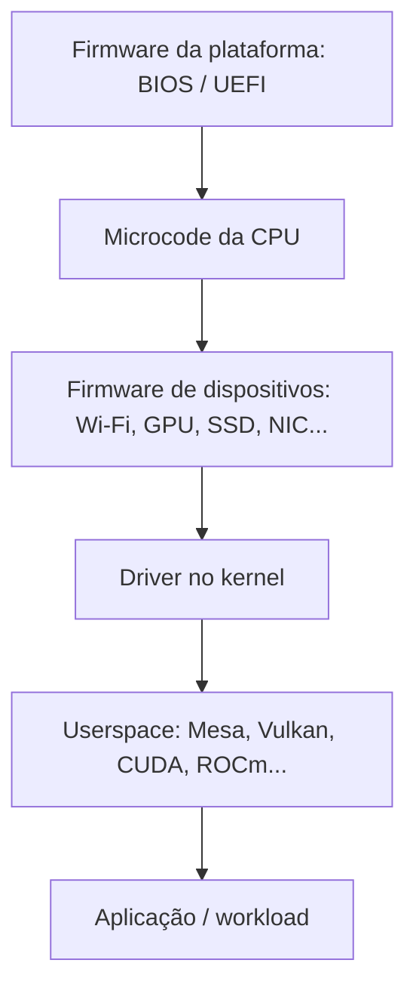

- **Microcode** é uma camada de controle interno da CPU que pode receber correções do fabricante. Em x86, o kernel Linux possui suporte para carregar microcode Intel/AMD, frequentemente cedo no boot por meio de initramfs/initrd.
- **Firmware de dispositivo** é código executado ou carregado em componentes como Wi-Fi, GPU, SSD, controladoras e docks. Um driver presente no kernel pode continuar inútil se o firmware necessário estiver ausente.
- **Driver** é o componente do sistema operacional que controla o dispositivo e expõe suas funções ao restante do kernel/userspace.
- **fwupd** é um daemon/framework usado por várias distribuições para descobrir e aplicar firmware de hardware compatível. O **LVFS (*Linux Vendor Firmware Service*)** é um serviço utilizado por fabricantes para publicar metadados e firmwares que clientes como `fwupd` podem consumir.

A atualização do sistema operacional e a atualização de firmware são ciclos diferentes. Um rollback de pacotes, deployment ou snapshot **não deve ser presumido capaz de reverter firmware já gravado no hardware**.

Para workloads de **aprendizado de máquina (ML) / inteligência artificial (IA), renderização ou computação acelerada**, valide também GPU ou outro acelerador, driver, CUDA/ROCm ou runtime equivalente, framework, versão do kernel e suporte de containers. “A distribuição roda Python” não prova compatibilidade com a pilha de aceleração necessária.

No Advisor 0.3.0, “IA/agentes” não é tratada como propriedade de hardware nem como 11ª dimensão. A preferência aparece no contexto de **estação de trabalho de desenvolvimento**, enquanto GPU/CUDA/ROCm continuam sendo requisitos técnicos independentes quando o workload realmente depende deles.

<a id="10-nao-livre-nao-e-um-unico-criterio"></a>

### Não livre não é um único critério

Separe:

- firmware necessário ao dispositivo;
- driver proprietário, como determinadas pilhas NVIDIA;
- codecs sujeitos a licenças e patentes;
- aplicações proprietárias;
- repositórios comunitários com conteúdo restrito.

Uma política pode aceitar firmware e rejeitar aplicações proprietárias. O recomendador trata esses itens de forma independente.

<a id="10-politicas-software-firmware"></a>

### Perfis de política para software e firmware

| Perfil ilustrativo | Firmware não livre | Driver proprietário | Aplicação proprietária | Uso típico |
|---|---:|---:|---:|---|
| **Software estritamente livre** | rejeita quando a política exigir pureza completa | rejeita | rejeita | ambientes orientados por critérios de liberdade/licenciamento específicos |
| **Pragmatismo de hardware** | aceita quando necessário para o dispositivo | avalia caso a caso | pode restringir | organizações que priorizam hardware funcional sem liberar automaticamente qualquer software proprietário |
| **Desktop/workstation pragmático** | aceita conforme necessidade | aceita quando necessário e suportado | aceita conforme requisito | produtividade, gaming, GPU ou compatibilidade comercial |
| **Política corporativa controlada** | somente fontes aprovadas | somente versões homologadas | somente software licenciado/aprovado | ambientes governados por segurança, suporte, compliance e inventário |

> **Não confunda:** “não livre” descreve licenciamento/distribuição. Não é, sozinho, uma medida de segurança, qualidade ou suporte.

<a id="10-checklist-minimo"></a>

### Checklist mínimo

1. Identifique arquitetura de CPU, modelo da placa/equipamento e revisões relevantes. `lscpu`, `lspci`, `lsusb` e, quando disponível, `inxi` ajudam no inventário.
2. Inicialize uma mídia live quando aplicável.
3. Teste rede, áudio, vídeo, armazenamento, suspensão e retomada.
4. Confirme boot com Secure Boot no estado realmente desejado.
5. Teste monitor externo, dock, GPU híbrida, aceleração 3D/compute e periféricos críticos.
6. Verifique firmware da plataforma e atualizações disponíveis. Confirme também se `fwupd`/LVFS cobre o dispositivo quando isso fizer parte da estratégia.
7. Confirme pacotes de microcode da CPU e política da distribuição quando aplicável.
8. Confirme a matriz do fornecedor para workload, release, arquitetura, kernel/driver e hardware exatos.
9. Em notebooks/workstations, valide autonomia, suspensão/retomada, hibernação, USB4/Thunderbolt, biometria e áudio realmente usados.
10. Em ARM/aarch64, valide também boot, firmware e device tree quando a plataforma depender dele.

[Voltar ao índice](#indice)

---

<a id="11-seguranca-hardening-compliance-e-certificacao"></a>

## 11. Segurança, hardening, compliance e certificação

Esses termos descrevem camadas diferentes e não devem ser usados como sinônimos:

> **Essencial:** segurança de plataforma não é um selo único. **Patching corrige falhas conhecidas; hardening reduz superfície/privilégio; compliance demonstra aderência a controles; certificação valida um escopo formal específico.**

| Camada | Objetivo | Evidência típica |
|---|---|---|
| **Patching** | corrigir vulnerabilidades e defeitos conhecidos | advisory, errata, pacote ou imagem corrigida |
| **Hardening** | reduzir superfície de ataque, privilégios e configurações inseguras | configuração, política MAC, benchmark |
| **Compliance** | demonstrar aderência a controles, políticas ou normas aplicáveis | scan, evidência, exceção formalmente aprovada |
| **Certificação** | avaliação formal de produto/configuração dentro de escopo definido | certificado, versão e configuração avaliadas |

Uma distribuição pode possuir bons mecanismos de segurança e ainda não estar conforme a política da organização. Da mesma forma, um produto certificado pode perder o escopo da certificação se kernel, versão, arquitetura ou configuração forem alterados fora das condições avaliadas.

Antes de selecionar controles, registre um **modelo de ameaça**: ativos, adversários/eventos, caminhos de ataque e consequências. Sem esse contexto, “mais hardening” pode aumentar complexidade sem reduzir o risco dominante. Aplique também o **princípio do menor privilégio**.

<a id="11-selinux-e-apparmor"></a>

### SELinux e AppArmor

**MAC (*Mandatory Access Control*, controle de acesso obrigatório)** aplica políticas adicionais às permissões Unix tradicionais.

- **SELinux (*Security-Enhanced Linux*)** usa rótulos e políticas para controlar quais ações processos e objetos podem executar.
- **AppArmor** aplica perfis de segurança principalmente por caminhos/recursos associados a aplicações.

Ter o pacote instalado não prova que o controle esteja ativo, em modo de bloqueio (*enforcing*) ou com política adequada ao workload. MAC também não substitui permissões Unix, capabilities, namespaces nem seccomp.

<a id="11-secure-boot-e-measured-boot"></a>

### Secure Boot e measured boot

- **Secure Boot** verifica se componentes cobertos pela política de boot estão assinados/autorizados antes da execução.
- **Measured boot** registra medições criptográficas dos componentes inicializados, normalmente em um TPM, para posterior verificação ou atestação.
- **Criptografia de disco** protege dados em repouso contra leitura não autorizada quando a chave não está disponível.

São controles complementares: verificar assinatura, medir estado e criptografar dados resolvem problemas diferentes.

> **Omarchy 0.3.0:** a documentação oficial consultada nesta edição exige desativar Secure Boot e/ou TPM para instalação. Portanto, **Secure Boot obrigatório é requisito eliminatório para Omarchy no modelo atual**, independentemente da preferência por IA.

<a id="11-fips-cis-stig-e-common-criteria"></a>

### FIPS, CIS, STIG e Common Criteria

- **FIPS 140-3** define requisitos de segurança para módulos criptográficos e serve de base para validação formal de módulos no contexto correspondente.
- **CIS Benchmarks** são recomendações consensuais de configuração segura.
- **STIGs (*Security Technical Implementation Guides*)** são guias técnicos de implementação de segurança do ecossistema do Departamento de Defesa dos Estados Unidos.
- **Common Criteria** é um framework internacional para especificar e avaliar propriedades de segurança de produtos de TI dentro de escopo/configuração definidos.

Ressalvas:

- ativar “modo FIPS” não prova que todo o ambiente esteja coberto por módulo formalmente validado;
- validação FIPS possui módulo, versão, binário, plataforma e configuração específicos;
- existir benchmark CIS ou STIG não significa que o host já esteja conforme;
- derivado ou clone não herda automaticamente certificação do fornecedor de origem;
- Common Criteria certifica produto/configuração/escopo avaliado, não “qualquer Linux parecido”.

Para software e imagens, avalie também cadeia de fornecimento: origem, assinatura, atestações, SBOM/VEX quando disponíveis, proteção de chaves/repositórios e política para módulos externos.

<a id="11-live-patching"></a>

### Live patching

**Live kernel patching** permite aplicar determinadas correções ao kernel em execução sem reboot imediato. Ele reduz a urgência de alguns reinícios, mas não cobre toda atualização de kernel, microcode de CPU, firmware, bootloader nem mudanças de userspace.

Alta disponibilidade depende da arquitetura do serviço, não apenas do kernel: redundância, failover, banco de dados, storage e dependências externas continuam relevantes.

[Voltar ao índice](#indice)

---

<a id="12-storage-criptografia-recuperacao-e-backup"></a>

## 12. Storage, criptografia, recuperação e backup

**Filesystem** é a estrutura que organiza arquivos, diretórios, metadados e alocação de blocos em um dispositivo ou volume. O nome do filesystem, sozinho, não determina o resultado operacional: integridade, redundância, criptografia, snapshot, replicação, backup e recuperação são capacidades diferentes.

> **Essencial:** pense em storage como **camadas**. Uma decisão em uma camada não substitui controles das outras.

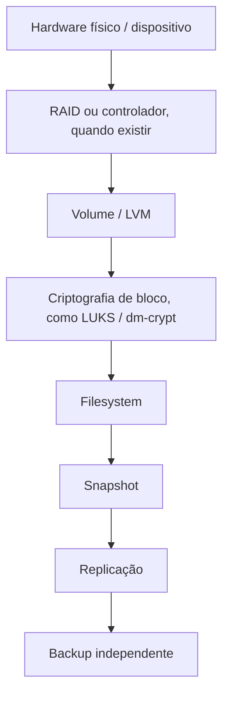

Termos essenciais:

- **checksum**: valor calculado para detectar alteração/corrupção de dados ou metadados;
- **RAID**: combina discos para desempenho e/ou tolerância a determinadas falhas; não cria automaticamente uma cópia histórica independente;
- **LVM**: camada de gerenciamento de volumes lógicos; facilita certos desenhos, mas não substitui filesystem, RAID ou backup;
- **LUKS/dm-crypt**: formato/camada comum de criptografia de blocos em Linux;
- **snapshot**: captura estado de volume/dataset/filesystem em um ponto no tempo; escopo e consistência dependem da implementação e da aplicação;
- **copy-on-write (CoW)**: grava mudanças em novos blocos antes de atualizar referências;
- **scrub**: verificação sistemática de integridade; a capacidade de reparar depende do mecanismo e de cópia redundante válida;
- **NFS/SMB/iSCSI**: formas diferentes de oferecer armazenamento em rede; NFS/SMB normalmente expõem arquivos e iSCSI expõe blocos.

| Necessidade | Perguntas de validação |
|---|---|
| Integridade | há checksums? scrub? detecção e reparo com redundância? saúde do dispositivo é monitorada? |
| Snapshot | é consistente com a aplicação? replica? possui retenção? cobre os dados necessários? |
| RAID | quais falhas tolera? como ocorre rebuild? o estado degradado é monitorado? |
| Volumes | LVM ou outra camada é necessária? expansão/redução é suportada pelo conjunto completo? |
| Criptografia | cobre raiz, dados, swap/hibernação quando necessário? onde ficam chaves? há recuperação do cabeçalho/chaves? |
| SSD/NVMe | TRIM/discard é compatível? endurance e indicadores SMART/NVMe são monitorados? |
| Compartilhamento | NFS/SMB/iSCSI são parte suportada do produto ou configuração manual? |
| Backup | existe cópia independente e fora do mesmo domínio de falha? restauração foi realmente executada? |

Regras essenciais:

- RAID não é backup;
- snapshot não é backup por definição;
- **backup concluído não prova restauração possível**;
- criptografia sem recuperação de chaves pode converter falha operacional em perda definitiva;
- rollback do sistema não garante consistência de banco de dados;
- para workloads stateful, valide snapshot/backup **application-consistent** quando necessário;
- deduplicação, compressão, CoW, TRIM e snapshots possuem benefícios e custos que precisam ser medidos no workload real;
- estratégias como 3-2-1-1-0 podem orientar desenho, mas RPO/RTO, ameaças, retenção, cópias imutáveis/offline e testes de recuperação determinam a política real.

Appliances como TrueNAS e Unraid podem ser mais adequados que um Linux generalista quando **storage é o produto principal**. Em outros casos, um servidor generalista com equipe capaz de operar a pilha pode ser mais adequado.

[Voltar ao índice](#indice)

---

<a id="13-virtualizacao-containers-e-cloud-native"></a>

## 13. Virtualização, containers e cloud-native

> **Essencial:** container, máquina virtual e sistema operacional especializado para nó Kubernetes resolvem problemas diferentes. Escolha pelo papel do workload, isolamento necessário e modelo operacional — não apenas porque todos “rodam Linux”.

**Cloud-native** descreve aplicações e plataformas desenhadas para automação, APIs, infraestrutura dinâmica e operação distribuída, frequentemente usando containers e orquestração. **Kubernetes** é uma plataforma de orquestração que agenda, mantém e atualiza workloads containerizados em um conjunto de nós.

Separe:

- **Máquina virtual (VM)** virtualiza recursos de hardware e normalmente executa um sistema operacional convidado com **kernel próprio**.
- **Container de aplicação** isola processos por mecanismos do kernel do host, como namespaces e cgroups, e normalmente **compartilha o kernel do host**.
- **OCI (*Open Container Initiative*)** define especificações abertas usadas amplamente para imagens e runtimes de containers.
- **Rootless container** executa runtime/container sem privilégios de root no host sempre que possível; reduz impacto de determinadas falhas, mas não significa risco zero.
- **System container** oferece userspace mais parecido com sistema completo, mas continua normalmente compartilhando o kernel do host; LXC/Incus são exemplos comuns.

| Papel | Exemplos de requisitos |
|---|---|
| **Application container host** | Docker/Podman, containerd, rootless, SELinux/AppArmor, cgroups |
| **System containers** | LXC/LXD/Incus, nesting, rede, storage e limites de kernel compartilhado |
| **Hypervisor** | KVM/QEMU, interface de gestão, live migration, HA, passthrough |
| **HCI** | compute, storage e rede integrados em cluster, com quorum/fencing e lifecycle coordenado |
| **Kubernetes node OS** | kernel suportado, cgroup v2, CRI, CNI, CSI, kubelet, upgrade coordenado e drivers/accelerators |
| **Desktop de desenvolvimento** | engine local, toolboxes/containers, devcontainers, integração com IDE e arquivos do usuário |

Proxmox VE, Harvester, Talos, Fedora CoreOS, Flatcar, Bottlerocket, Google Container-Optimized OS e Azure Container Linux não são substitutos diretos de uma estação Linux generalista. Eles concorrem quando o **papel operacional correspondente** é selecionado.

> **Kubernetes:** “executa containers” é um critério insuficiente. Valide a combinação exata de kernel, cgroup v2, runtime compatível com CRI, cgroup driver, CNI, CSI, kubelet, políticas de segurança e versão do Kubernetes.

Para containers em produção, valide também a proveniência das imagens OCI: registry, digest, assinatura/attestation, SBOM/VEX, identidade do publicador e lifecycle da imagem-base.

<a id="13-desenvolvimento-ia"></a>

### Desenvolvimento moderno, containers e IA/agentes

Esta capacidade é **contextual** e não forma uma nova dimensão do modelo. O Advisor 0.3.0 pode valorizar uma estação de trabalho que já integre ferramentas de desenvolvimento, containers/devcontainers, runtimes e agentes de IA quando o usuário declarar essa preferência.

- **Bluefin** oferece Developer Mode, ambientes de desenvolvimento separados do host, integração com containers/VMs e, nas variantes/caminhos documentados, recursos de IA; Bluefin LTS usa base **CentOS Stream 10**, enquanto a linha Stable segue base Fedora. O perfil **GDX** acrescenta foco em NVIDIA/CUDA sobre a linha LTS.
- **Omarchy** integra ferramentas de desenvolvimento, `mise`, Docker/Compose e agentes de código na proposta da estação Arch/Hyprland. **IA é diferencial adicional, não requisito de elegibilidade**: Omarchy continua podendo ser recomendado por Arch/pacman, rolling, Hyprland + Omarchy Shell (construído com Quickshell), Wayland, terminal/teclado e perfil técnico mesmo quando IA não é prioridade.

Para IA/ML acelerada, continue avaliando separadamente GPU, driver, CUDA/ROCm/runtime, framework e imagem/container. “Pronto para agentes” e “workstation para treinamento em GPU” são requisitos diferentes.

**Edge:** em hosts próximos da origem dos dados ou usuários, arquitetura de CPU, recursos limitados, conectividade intermitente, atualização remota segura, rollback e capacidade de reconstrução podem pesar mais que variedade de pacotes desktop.

[Voltar ao índice](#indice)

---

<a id="14-rede-identidade-frota-observabilidade-e-continuidade"></a>

## 14. Rede, identidade, frota, observabilidade e continuidade

Um Linux pode executar inúmeras funções de infraestrutura, mas “é possível instalar o pacote” não significa que o sistema tenha o mesmo modelo operacional, suporte ou integração de um appliance/produto desenhado para aquela função.

<a id="14-rede-e-dataplane"></a>

### Rede e dataplane

Em redes, **control plane** decide/aprende como o tráfego deve ser tratado; **dataplane** (ou *forwarding plane*) executa o encaminhamento efetivo dos pacotes conforme essas regras.

Separe as capacidades:

- **NetworkManager** e **systemd-networkd**: componentes de gestão de interfaces e perfis;
- **configuração de interfaces**: endereços, rotas, MTU, DNS e parâmetros do link;
- **firewall/NAT**: filtragem de tráfego e tradução de endereços/portas; nftables é um framework moderno do kernel Linux;
- **bridge**: comutação lógica de camada 2 entre interfaces;
- **bond**: agregação de interfaces físicas para redundância e/ou distribuição de tráfego;
- **VLAN**: segmentação lógica de camada 2 identificada por tags 802.1Q;
- **VRF**: múltiplos contextos/tabelas de roteamento isolados no mesmo sistema;
- **VPN**: túnel/overlay que protege ou interliga tráfego sobre outra rede;
- **serviços fundamentais**: IPv4/IPv6, DNS, DHCP e sincronização de horário;
- **roteamento dinâmico**: BGP e OSPF aprendem/anunciam informações de roteamento;
- **EVPN**: control plane, normalmente baseado em BGP, para distribuir informações MAC/IP em redes de overlay;
- **VXLAN**: encapsulamento de camada 2 sobre rede IP de camada 3;
- **SR-IOV**: permite que dispositivo PCIe exponha funções virtuais atribuíveis diretamente a VMs/consumidores;
- **DPDK**: bibliotecas/drivers para processamento de pacotes de alto desempenho em userspace;
- **XDP/eBPF**: processamento programável muito cedo no caminho de recepção de pacotes;
- **switch NOS**: sistema operacional voltado a switches, validado junto ao ASIC e à plataforma de hardware.

**FRR (*FRRouting*)** fornece protocolos de roteamento em Linux. Instalar FRR num servidor não transforma automaticamente esse host em appliance equivalente a VyOS nem em switch NOS equivalente a SONiC/Cumulus: hardware, integração, dataplane, gestão, lifecycle e suporte permanecem diferentes.

<a id="14-identidade"></a>

### Identidade

- **AD (*Active Directory*)**: serviço de diretório/domínio da Microsoft;
- **LDAP**: protocolo para consultar/modificar diretórios; não é, por si só, todo um sistema de autenticação/domínio;
- **Kerberos**: protocolo de autenticação baseado em tickets;
- **SSSD**: integra identidades/autenticação de fontes remotas, cache e políticas no cliente Linux;
- **PAM**: framework que encadeia módulos de autenticação, conta, sessão e credenciais;
- **FreeIPA/IdM**: plataforma de identidade e políticas para ambientes Linux;
- **DNS**: parte crítica de AD, Kerberos e trusts;
- **GPO**: objeto de política do Active Directory; ingressar Linux no domínio não significa implementar toda a semântica de GPO do Windows.

Um trust AD–IdM exige desenho de DNS, Kerberos, nomes, ranges de IDs, sincronização temporal e políticas. **“Entrar no domínio” prova apenas parte da integração**, não gestão completa de frota.

<a id="14-provisionamento-e-frota"></a>

### Provisionamento e frota

Automatizar um host não equivale a governar centenas ou milhares.

- **PXE**: boot/provisionamento pela rede antes de existir um SO local completo;
- **cloud-init**: inicialização/configuração de instâncias a partir de metadados;
- **zero-touch**: provisionar sem intervenção manual local depois que o equipamento é conectado/iniciado;
- **Ansible/Salt**: automação e gerenciamento de configuração;
- **GitOps**: estado desejado versionado em Git e reconciliado por automação;
- **mirror**: cópia local/controlada de conteúdo/repositórios upstream;
- **inventário/compliance**: saber o que existe e verificar aderência à política;
- **rollout gradual**: distribuir mudança em ondas/grupos antes de toda a frota;
- **air gap**: ambiente sem conectividade direta externa, com processo explícito de importação de conteúdo/chaves;
- **console central**: inventário, política, atualização, evidência e suporte em escala.

Avalie também instalação desassistida, imagens, proxies, repositórios internos, rollback, segregação de ambientes e suporte multi-distribuição.

<a id="14-observabilidade"></a>

### Observabilidade

- **logs** registram eventos discretos e contexto;
- **métricas** representam valores numéricos ao longo do tempo;
- **traces** acompanham o caminho de uma transação/requisição;
- **profiling** mede onde CPU, memória ou outros recursos são consumidos;
- **telemetria de segurança/rede** adiciona sinais específicos desses domínios.

Uma pilha portátil baseada em OpenTelemetry ou Prometheus pode facilitar padronização entre distribuições, mas não possui necessariamente o mesmo grau de integração de uma plataforma nativa ou do fornecedor.

Observabilidade não é apenas coletar sinais. Defina também **SLI**, **SLO**, alertas acionáveis, retenção, cardinalidade aceitável e custo da telemetria.

<a id="14-continuidade"></a>

### Continuidade

Não confunda mecanismos de manutenção com disponibilidade do serviço:

- **live kernel patching**: aplica correções elegíveis ao kernel sem reboot imediato;
- **atualização de userspace sem reinício**: troca componentes fora do kernel, mas processos podem precisar ser reiniciados;
- **reboot coordenado**: reinicia nós em ordem controlada para preservar capacidade;
- **HA/failover**: mantém/restaura serviço transferindo função para outro nó/componente;
- **quorum**: determina se há membros/votos suficientes para uma decisão segura no cluster;
- **fencing**: isola/desliga nó defeituoso para impedir escrita concorrente ou split-brain;
- **rolling maintenance**: manutenção em lotes preservando parte do serviço disponível;
- **live migration**: move VM em execução entre hosts compatíveis com interrupção mínima quando suportado.

Disponibilidade é propriedade da arquitetura completa. Live patch não corrige banco single-node, storage sem redundância, quorum mal desenhado ou dependência externa única.

Também diferencie:

- **alta disponibilidade (HA)**: manter/restaurar serviço localmente diante de falhas;
- **tolerância a falhas**: continuar operando apesar de falhas previstas;
- **resiliência**: absorver falhas, degradar de forma controlada e recuperar-se;
- **recuperação de desastre (DR)**: restaurar serviço/dados após evento severo que excede a operação normal de HA;
- **continuidade de negócio**: manter funções críticas, incluindo pessoas, processos, dependências e tecnologia.

[Voltar ao índice](#indice)

---

<a id="15-metodo-de-decisao-auditavel"></a>

## 15. Método de decisão auditável

> **Decisão prática:** primeiro elimine candidatos que violam requisitos obrigatórios; só depois pontue preferências. Uma pontuação alta nunca deve “compensar” um requisito eliminatório não atendido.

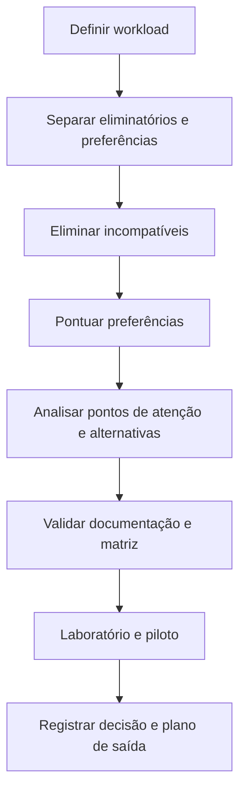

<a id="15-etapa-1-descreva-o-workload"></a>

### Etapa 1 — descreva o workload

Registre:

- função principal e funções secundárias;
- ambiente: laptop, workstation, bare metal, VM, cloud, edge ou appliance;
- criticidade, **RTO (*Recovery Time Objective*)** e **RPO (*Recovery Point Objective*)**;
- escala e horizonte de uso;
- responsáveis por operação e suporte;
- dependências externas relevantes: identidade, storage, rede, GPU, drivers, aplicações, containers e serviços de terceiros.

“Desktop”, “servidor” ou “Kubernetes” são classes amplas; uma decisão auditável precisa transformar a classe em requisitos verificáveis.

<a id="15-etapa-2-separe-requisitos"></a>

### Etapa 2 — separe requisitos

| Classe | Significado | Exemplo |
|---|---|---|
| **Eliminatório** | sem isso, o candidato não é aceitável | aplicação certificada na versão; Secure Boot obrigatório |
| **Preferência** | melhora a adequação, mas admite ponto de atenção | desktop mais recente; integração com agentes de IA |
| **Desconhecido** | precisa de investigação | dock USB-C específico |
| **Fora de escopo** | não influencia esta decisão | preferência estética sem impacto operacional |

Não transforme preferência em requisito obrigatório para “fazer o favorito ganhar”.

> **Regra para desconhecidos:** um requisito **eliminatório** sem evidência suficiente **não é considerado atendido**. O candidato fica pendente de validação e não deve ser aprovado para produção até que a evidência seja obtida. Para preferências desconhecidas, registre a incerteza e evite pontuar como se o resultado fosse conhecido.

<a id="15-etapa-3-elimine-incompativeis"></a>

### Etapa 3 — elimine incompatíveis

Exemplos legítimos:

- arquitetura de CPU sem suporte;
- lifecycle menor que o período de uso;
- certificação obrigatória ausente;
- contrato/SLA obrigatório ausente;
- driver ou aplicação crítica incompatível;
- modelo de atualização proibido pela política;
- Secure Boot obrigatório para um produto que exige sua desativação;
- appliance especializado fora do workload.

No Advisor, requisitos eliminatórios prevalecem sobre preferências. Isso vale inclusive para IA/agentes: uma preferência forte por IA não deve manter Omarchy elegível diante de um requisito obrigatório incompatível.

<a id="15-etapa-4-pontue-preferencias"></a>

### Etapa 4 — pontue preferências

Use pesos documentados. Uma escala conceitual simples:

| Peso | Interpretação |
|---:|---|
| 0 | indiferente |
| 1 | desejável |
| 2 | importante |
| 3 | muito importante |

O número final **ordena aderência dentro daquele caso**. Não é benchmark universal, probabilidade de sucesso nem nota absoluta de qualidade.

A edição 0.3.0 reforça essa regra de forma prática: características já modeladas — experiência, manutenção, hardware, modelo de release, interface, contexto especializado e outras — contribuem para todos os candidatos de forma mais uniforme. Isso reduz candidatos “presentes no catálogo, mas estruturalmente incapazes de vencer” sem criar bônus artificiais para passar em testes.

<a id="15-etapa-5-leia-trade-offs-e-alternativas"></a>

### Etapa 5 — leia pontos de atenção e alternativas

Uma recomendação madura apresenta:

1. candidato principal;
2. versão ou canal;
3. motivos de aderência;
4. limitações/pontos de atenção;
5. alternativas próximas;
6. hipótese que faria a decisão mudar.

Uma lista curta é mais útil do que um único nome quando os primeiros candidatos estão próximos ou quando algum requisito ainda precisa de laboratório.

<a id="15-etapa-6-valide-em-camadas"></a>

### Etapa 6 — valide em camadas

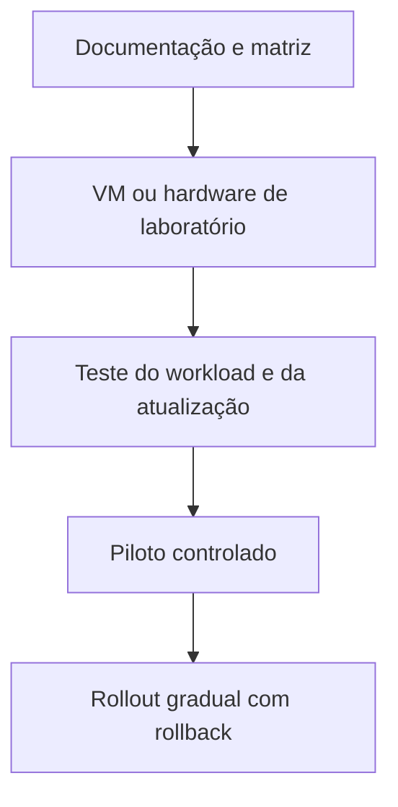

Valide também o **caminho de falha**: atualização interrompida, rollback, perda de rede, falha de storage, indisponibilidade de repositório, rotação de chave, alteração de driver/kernel e recuperação de dados quando aplicável.

<a id="15-etapa-7-produza-um-registro-de-decisao"></a>

### Etapa 7 — produza um registro de decisão

Antes de registrar a conclusão, diferencie **tipo de evidência**:

| Tipo | Exemplo | Como interpretar |
|---|---|---|
| **Fato declarado** | lifecycle oficial publicado pelo projeto | afirmação documental da fonte |
| **Contrato formal** | certificação, SLA ou matriz ISV | obrigação/escopo formal conforme documento |
| **Comportamento observado** | teste no hardware/laboratório | evidência empírica válida para o cenário testado |
| **Inferência editorial** | “adequado como lista curta de workstation” | interpretação do guia; deve ser sustentada por critérios explícitos |

Uma inferência editorial não deve ser apresentada como declaração do fornecedor.

Inclua data, responsáveis, requisitos, candidatos eliminados, evidências, riscos aceitos, plano de saída e data de revisão. Para cada evidência relevante, registre também **fonte**, **data de verificação**, **prazo/data de revisão**, **nível de confiança** e **responsável pela validação**.

Exemplo simplificado:

| Campo | Exemplo |
|---|---|
| **Decisão** | Fedora KDE como workstation de desenvolvimento |
| **Data / revisão** | 2026-09-11 / revisar após mudança relevante de release/driver |
| **Horizonte** | 3 anos, com upgrades planejados entre releases Fedora |
| **Eliminatórios** | GPU suportada; VPN corporativa; Secure Boot; IDE e toolchain exigidos |
| **Preferências** | KDE Plasma, pacotes recentes, containers, documentação ampla |
| **Candidatos analisados** | Fedora KDE, Ubuntu LTS + KDE, openSUSE Tumbleweed |
| **Evidências** | matriz da GPU, release notes, teste de suspensão/monitores, build do projeto, VPN, container e update em hardware real |
| **Riscos aceitos** | lifecycle curto exige upgrade periódico; kernel/driver precisa de validação após mudanças relevantes |
| **Alternativa** | Ubuntu LTS se o custo de upgrades frequentes superar o benefício de pacotes mais atuais |
| **Plano de saída** | backup independente, dados desacoplados do host quando possível, automação de provisionamento e procedimento testado de reinstalação/migração |

Modelo mínimo para uma evidência/requisito crítico:

| Campo | Exemplo |
|---|---|
| ID | `HW-GPU-001` |
| Requisito | GPU oficialmente suportada no workload |
| Classe | eliminatório |
| Resultado | pendente / atendido / não atendido |
| Evidência | matriz do fornecedor + teste em hardware |
| Fonte | documento/URL oficial correspondente |
| Verificado em | 2026-09-11 |
| Revisar até | data definida ou antes de mudança de release/driver |
| Confiança | alta / média / baixa, com justificativa |
| Escopo | produto/release/arquitetura/canal/componente aplicáveis |
| Responsável | pessoa/equipe que validou |

[Voltar ao índice](#indice)

---

<a id="16-perfis-de-referencia"></a>

## 16. Perfis de referência

Esta tabela orienta a triagem; não substitui os requisitos. **SLA** é o acordo de níveis de serviço aplicável ao suporte; **ISV (*Independent Software Vendor*)** é o fornecedor independente de software cuja matriz pode certificar uma aplicação para combinações específicas de distribuição, release e arquitetura.

| Cenário dominante | Exemplos que merecem investigação inicial | O que pode mudar a decisão | Não use esta linha como atalho quando... |
|---|---|---|---|
| Desktop simples, familiar ou migração do Windows | Linux Mint, Zorin OS, Ubuntu LTS | hardware, preferência de DE, formatos de aplicativos e lifecycle | houver aplicativo, periférico, política ou hardware obrigatório não homologado |
| Workstation moderna e produtividade | Fedora Workstation, Pop!_OS, Ubuntu, openSUSE Tumbleweed | GPU, toolchain, GNOME/KDE/COSMIC e mudança tolerada | o workload exigir lifecycle/certificação diferente ou estabilidade de plataforma mais longa |
| Workstation Arch/rolling orientada a terminal e tiling | Arch Linux, EndeavourOS, CachyOS, **Omarchy** | autonomia técnica, pacman/AUR, Hyprland/Quickshell, Wayland, tolerância ao rolling | a política exigir Secure Boot no Omarchy, DE tradicional obrigatório ou operação de baixa intervenção |
| Workstation image-based de desenvolvimento | **Bluefin**, Fedora Atomic Desktops, Aurora | base Stable/LTS, containers/devcontainers, NVIDIA/CUDA, GNOME/KDE e modelo de host | ferramentas críticas dependerem de mutações do host incompatíveis com o modelo ou houver matriz formal ausente |
| Gaming em desktop ou handheld | Bazzite, Nobara, Pop!_OS | GPU, Steam Gaming Mode, anti-cheat, dependência de X11 e modelo de atualização | jogo/anti-cheat ou hardware crítico não tiver compatibilidade comprovada |
| Servidor comunitário conservador | Debian Stable, Ubuntu LTS | suporte comercial, certificação, stack | houver SLA, certificação ou suporte de ISV obrigatório ausente |
| Enterprise com suporte do fabricante e certificações formais | RHEL, SLES, Ubuntu Pro, Oracle Linux com suporte comercial | SLA, ISV, cloud, matriz de certificação, compliance e contrato | produto/release/arquitetura/kernel/contrato exatos não estiverem no escopo exigido |
| Ecossistema RHEL sem contrato obrigatório | AlmaLinux, Rocky Linux, Oracle Linux sem suporte contratado | compatibilidade exigida, kernel, governança, suporte opcional, certificações e lifecycle | a organização depender de certificação ou obrigação contratual específica do fornecedor |
| Rolling com snapshots integrados | openSUSE Tumbleweed | hardware e tolerância operacional | a política proibir fluxo rolling ou a equipe não puder acompanhar manutenção contínua |
| Rolling derivada do Arch com instalação guiada | EndeavourOS, Manjaro | proximidade do Arch, curadoria de repositórios, AUR e responsabilidade de manutenção | lifecycle/risco operacional exigido for incompatível com rolling |
| Controle manual e aprendizado profundo | Arch Linux | tempo disponível e responsabilidade de manutenção | objetivo principal for reduzir intervenção, padronizar frota ou obter suporte formal |
| Desktop atômico | Fedora Atomic Desktops, Bazzite, Bluefin, Aurora | workload, compatibilidade com apps e fluxo de customização | ferramentas críticas dependerem de mutações do host incompatíveis com o modelo |
| Estado declarativo/reproduzível | NixOS | curva de aprendizado e ecossistema | equipe/automação não puder absorver o modelo declarativo e sua operação |
| Pentest autorizado | Kali, Parrot, BlackArch, Pentoo | escopo legal e especialidade | workload real for desktop/servidor generalista sem necessidade das ferramentas especializadas |
| DFIR / análise forense | CAINE, Tsurugi, REMnux | tipo de aquisição/análise, live environment e ferramentas exigidas | necessidade principal não for forense/análise de malware |
| Hypervisor dedicado | Proxmox VE, Harvester | arquitetura de cluster, storage, suporte | máquina precisar atuar como host Linux generalista em vez de appliance de virtualização |
| Kubernetes OS | Talos, Fedora CoreOS, Flatcar, Bottlerocket | provedor, API, lifecycle e operação | host precisar de administração tradicional/interativa incompatível com o desenho do produto |
| NAS / appliance de storage | TrueNAS, Unraid | ZFS, apps, suporte, HA e escala | storage não for o papel principal ou integrações obrigatórias ficarem fora do produto |
| Router/firewall | VyOS, IPFire, OpenWrt | throughput, hardware, protocolos, suporte | hardware, aceleração, protocolos ou suporte não atenderem ao papel de rede |
| Switch fabric | SONiC, NVIDIA Cumulus Linux | ASIC e matriz de hardware suportado | ASIC/plataforma não estiver explicitamente suportado pelo NOS escolhido |

<a id="16-como-interpretar-as-distribuicoes-desktop-destacadas"></a>

### Como interpretar as distribuições desktop destacadas

- **Linux Mint, Zorin OS e Pop!_OS** compartilham herança Ubuntu, mas variam em desktop, integração, calendário próprio, formatos habilitados, suporte de hardware e política de atualização.
- **EndeavourOS e Manjaro** são rolling e derivadas do ecossistema Arch, porém seguem políticas diferentes. EndeavourOS permanece mais próximo dos repositórios Arch; Manjaro mantém branches e curadoria próprias.
- **Bazzite** é uma imagem customizada baseada em Fedora Atomic, orientada especialmente a gaming, handhelds e HTPCs. Não deve ser descrita como “Arch rolling” nem operada como Fedora tradicional baseado em DNF.
- **Omarchy** não deve ser reduzido a “distro para IA”. É uma estação Arch/rolling opinativa para desenvolvimento, com pacman, Hyprland + Omarchy Shell (construído com Quickshell), Wayland e fluxo keyboard-first/terminal; agentes de IA são um diferencial adicional.
- **Bluefin** não deve ser reduzido a “Fedora imutável”. A linha Stable segue base Fedora; a linha LTS usa CentOS Stream 10; Developer Mode e variantes/caminhos como GDX adicionam capacidades de desenvolvimento e NVIDIA/CUDA conforme documentação aplicável.
- A presença nesta tabela significa **exemplo plausível para investigação inicial**, não recomendação universal, ranking de qualidade nem prêmio de popularidade.

<a id="16-gratuito-nao-significa-rhel-identico-e-com-o-mesmo-servico"></a>

### “Gratuito” não significa “RHEL idêntico e com o mesmo serviço”

- **AlmaLinux** é livre e mantido por fundação sem fins lucrativos; busca compatibilidade binária/ABI com o ecossistema RHEL, mas diferenças deliberadas devem ser verificadas nas release notes.
- **Rocky Linux** ocupa o mesmo espaço decisório de Enterprise Linux comunitário; governança, processo de build, fornecedores de suporte e certificações continuam independentes.
- **Oracle Linux** é gratuito para baixar/usar/redistribuir; suporte comercial é opcional. Em x86_64 pode oferecer RHCK e UEK, e a escolha do kernel pode alterar hardware, recursos, operação e matriz de certificação.
- **RHEL** não é apenas “Linux pago”: existem modalidades oficiais sem custo/autossuportadas sujeitas a termos e limites. Uma assinatura empresarial agrega suporte, SLA, gestão de ciclo e acesso ao ecossistema certificado conforme contrato.

Quando certificação de aplicação ou hardware for requisito, valide **produto, major/minor release, arquitetura, kernel, ambiente de virtualização/cloud e modalidade de suporte**. Compatibilidade de ABI não transfere automaticamente certificação emitida para outro produto.

<a id="16-casos-que-nao-devem-ser-generalizados"></a>

### Casos que não devem ser generalizados

- Kali não é escolha padrão para aprender Linux ou operar servidor comum.
- Arch ISO possui data, mas o sistema é rolling.
- Um appliance pode liderar quando o workload é especializado e deve ser excluído fora dele.
- Uma distribuição empresarial sem contrato não oferece automaticamente o mesmo resultado operacional que uma assinatura ativa.
- IA forte não deve, isoladamente, fazer Omarchy vencer uma incompatibilidade de Secure Boot, DE obrigatório ou outro eliminatório.
- Derivação de uma família não garante o mesmo lifecycle, instalador, suporte ou política da distribuição-base.

[Voltar ao índice](#indice)

---

<a id="17-recorte-temporal-e-versionamento"></a>

## 17. Recorte temporal e versionamento

Esta edição adota **duas camadas de data** para preservar auditabilidade sem fingir uma revalidação integral do catálogo:

| Campo | Valor | Significado |
|---|---|---|
| **Snapshot factual-base** | **2026-08-15** | fotografia ampla usada como base histórica para o catálogo e informações gerais desta série |
| **Atualizações pontuais verificadas** | **2026-09-11** | revalidação material restrita a Omarchy, Hyprland/Quickshell, Bluefin e às pilhas de interface atuais de Nitrux/KaOS, além de ajustes diretamente decorrentes dessa revisão |
| **Edição do guia/quiz** | **0.3.0** | versão funcional/editorial que generaliza stacks sem DE e corrige scoring/UX para Hyprland sem alterar as dez dimensões |
| **Última revisão estrutural/semântica desta edição** | **2026-09-11** | conferência de âncoras, Mermaid, tabelas, coerência entre superfícies e conteúdo alterado |

> **Verifique sempre na fonte primária:** o snapshot-base preserva o que o projeto afirmava em 15/08/2026. Uma instalação futura deve usar a documentação vigente do canal/release exatos. Uma atualização pontual em 11/09/2026 **não significa que os 96 candidatos foram revalidados integralmente nessa data**.

<a id="17-politica-de-versionamento-da-serie-0"></a>

### Política de versionamento da série 0

A edição **0.1.0** é a linha de base da primeira publicação pública. Versões internas anteriores não integram o histórico público.

A numeração adapta a convenção do Semantic Versioning:

- patches (`0.1.1`, `0.1.2` etc.): correções factuais, editoriais ou de implementação que não alterem intencionalmente o contrato decisório;
- minors (`0.2.0`, `0.3.0` etc.): novas perguntas, candidatos, capacidades ou mudanças de peso/lógica que possam alterar recomendações;
- `1.0.0`: primeira edição considerada estável quanto ao contrato editorial, rastreabilidade dos dados e testes de regressão do recomendador.

A **0.2.1** é um patch funcional sobre a 0.2.0 porque corrige a modelagem recém-introduzida sem adicionar um 97º candidato: IA deixa de funcionar como barreira de elegibilidade do Omarchy e a pontuação passa a aproveitar características existentes de forma mais uniforme.

A **0.3.0** é uma minor porque a correção de Hyprland não é apenas editorial: ela amplia a capacidade do motor de representar pilhas `compositor + shell` e acrescenta uma opção explícita de preferência `tiling / keyboard-first`, o que pode alterar recomendações de forma intencional. O catálogo continua com 96 candidatos e as dez dimensões conceituais permanecem inalteradas.

<a id="17-snapshot-base"></a>

### Snapshot factual-base preservado

A tabela abaixo permanece como registro histórico do snapshot-base e não deve ser lida como “versão mais recente hoje”:

| Projeto | Estado considerado no snapshot-base | Leitura |
|---|---|---|
| Debian | família 13 “trixie” | Fixed Release / Stable |
| Ubuntu | 26.04 LTS | Fixed + LTS |
| Linux Mint | série 22 | Fixed / Ubuntu LTS-derived |
| Zorin OS | série 18 | Fixed / Ubuntu LTS-derived |
| Pop!_OS | 24.04 LTS | Fixed-base / COSMIC |
| Fedora | 44 | Fixed, ciclo rápido |
| RHEL | 10.2 | Enterprise Fixed |
| AlmaLinux | 10.2 | Enterprise Linux comunitário |
| Rocky Linux | 10.2 | Enterprise Linux comunitário |
| Oracle Linux | 10.2 | Enterprise Fixed |
| openSUSE Leap | 16.0 | Fixed |
| NixOS | 26.05 “Yarara” | release semestral + canais |
| Kali | 2026.2 | rolling especializado |
| Arch | ISO 2026.08.01 como mídia; instalação rolling | Rolling |
| EndeavourOS | rolling; ISO é snapshot de instalação | Rolling |
| Manjaro | mídia 26.1; sistema rolling | Rolling curada |
| Proxmox VE | 9.2 | appliance versionado |
| TrueNAS | linha 25.10 | appliance de storage |
| OpenWrt | 25.12.x | release estável + snapshots |
| Talos Linux | 1.13 | Kubernetes OS versionado |

<a id="17-duas-correcoes-temporais-importantes"></a>

### Correções temporais e estados de maturidade importantes

- **Omarchy (11/09/2026):** Arch-based, Hyprland + Quickshell, canais stable/RC/edge/dev, desenvolvimento/containers/agentes integrados; Secure Boot/TPM precisam ser considerados conforme documentação de instalação atual.
- **Bluefin (11/09/2026):** Stable Fedora-based; LTS baseada em CentOS Stream 10; Developer Mode separa ambiente de desenvolvimento do host; GDX acrescenta foco NVIDIA/CUDA conforme documentação atual.
- **Nitrux e KaOS (11/09/2026):** a interface atual deve ser descrita pela pilha/compositor realmente documentado, sem forçar um “DE” fictício apenas para caber no modelo.
- **TUXEDO OS:** anúncio/beta de mudança de base não deve reclassificar retroativamente a release estável preservada no snapshot-base.
- **openSUSE:** estados de maturidade de Slowroll/Aeon precisam ser rechecados na fonte vigente antes de produção.

<a id="17-politica-de-leitura"></a>

### Política de leitura

- Uma data de ISO não é automaticamente a versão de uma rolling.
- “Current”, “stable”, “LTS”, `edge` e `dev` precisam ser lidos no canal correto.
- O snapshot-base preserva auditabilidade histórica; a página oficial decide uma instalação futura.
- Versões no quiz devem ser atualizadas junto com fontes, testes e changelog.
- Atualizações pontuais devem declarar **o que foi revalidado** e não sugerir atualização integral do catálogo sem evidência.

[Voltar ao índice](#indice)

---

<a id="18-operacoes-basicas-de-atualizacao"></a>

## 18. Operações básicas de atualização

> **Exemplos educacionais.** Execute somente comandos correspondentes à distribuição/release instalada. Antes de atualizar, confirme suporte da release, origem dos repositórios, energia estável, espaço livre e um método testado de recuperação. Leia release notes e avisos do projeto antes de upgrades de geração.

Uma inspeção simples de espaço pode começar por:

~~~bash
df -h
~~~

Isso **não é suficiente sozinho**: em layouts separados, verifique também `/boot`, `/var`, volumes de snapshots/deployments e requisitos específicos do gerenciador.

<a id="18-debian-ubuntu-e-derivados"></a>

### Debian, Ubuntu e derivados

Atualize os metadados, revise o que está disponível e só então aplique a atualização:

~~~bash
sudo apt update
apt list --upgradable
sudo apt upgrade
~~~

`apt` é apropriado para uso interativo; automações devem avaliar interfaces e códigos de saída próprios para scripting, frequentemente usando `apt-get` conforme a documentação aplicável. `apt list --upgradable` é uma consulta informativa e sua apresentação não deve ser tratada como interface estável de máquina.

`apt full-upgrade` pode remover ou substituir pacotes para resolver dependências. Use quando a documentação do projeto indicar e revise o plano antes de confirmar. Upgrade entre releases possui procedimento próprio; não é sinônimo de executar esse comando às cegas.

<a id="18-fedora-e-rhel"></a>

### Fedora e RHEL

~~~bash
dnf check-update
sudo dnf upgrade
~~~

`dnf check-update` retorna **código de saída 100** quando existem atualizações disponíveis; isso é comportamento normal, não erro. Em scripts que abortam em qualquer retorno não zero, esse comportamento precisa ser tratado explicitamente. Mudança de major release ou operação offline deve seguir a documentação da versão e do produto.

<a id="18-opensuse"></a>

### openSUSE

Leap:

~~~bash
zypper list-updates
sudo zypper update
~~~

Tumbleweed:

~~~bash
zypper list-updates
sudo zypper dup
~~~

`zypper dup` sincroniza a distribuição com o snapshot atual do Tumbleweed; não deve ser generalizado para qualquer linha openSUSE sem verificar a documentação correspondente.

<a id="18-arch-linux"></a>

### Arch Linux

Para apenas listar atualizações com segurança, use `checkupdates`, fornecido pelo pacote `pacman-contrib`, quando instalado:

~~~bash
checkupdates
sudo pacman -Syu
~~~

Arch não suporta *partial upgrades*. **Não use `pacman -Sy` isoladamente para “ver se há updates”**: sincronizar a base sem concluir uma atualização completa pode criar um estado de partial upgrade.

<a id="18-omarchy"></a>

### Omarchy

~~~bash
omarchy update
~~~

O Omarchy mantém um fluxo próprio que envolve snapshot, migrations e atualização de configuração conforme a versão/canal. **Não substitua rotineiramente esse fluxo por `pacman -Syu`** sem compreender o efeito sobre a camada Omarchy; consulte o manual oficial antes de alterar a rotina de update.

<a id="18-fedora-atomic-desktops"></a>

### Fedora Atomic Desktops e derivados

~~~bash
rpm-ostree status
rpm-ostree upgrade
rpm-ostree rollback
~~~

Em sistemas rpm-ostree, `upgrade` normalmente prepara um **novo deployment**; o sistema em execução pode continuar no deployment atual até o próximo reboot. `rollback` seleciona deployment anterior quando disponível; dados mutáveis permanecem fora dessa garantia.

> **Universal Blue/bootc:** Bluefin, Bazzite e Aurora usam uma arquitetura de imagem/bootable container que não deve ser administrada como Fedora tradicional apenas porque compartilham base Fedora. Use os comandos/documentação do projeto para update, rebase e rollback.

<a id="18-suse-linux-micro-opensuse-microos"></a>

### SUSE Linux Micro e openSUSE MicroOS

~~~bash
sudo transactional-update
sudo reboot
~~~

O mecanismo cria um snapshot separado, aplica nele as mudanças e, se a transação concluir, marca o novo snapshot como padrão para o próximo boot. `/var` não faz parte desse snapshot; rollback do root filesystem **não equivale a restaurar todos os dados mutáveis**.

> **Aeon:** embora compartilhe tecnologias transacionais do ecossistema MicroOS, o desktop Aeon é orientado a manutenção automatizada. Não generalize um procedimento manual de MicroOS/SUSE Linux Micro como rotina recomendada para Aeon sem consultar a documentação específica da edição.

<a id="18-nixos-com-channels"></a>

### NixOS com channels

~~~bash
sudo nixos-rebuild switch --upgrade
~~~

`--upgrade` atualiza o channel de sistema chamado `nixos` antes do rebuild. Se houver outros channels com aliases diferentes, eles exigem tratamento explícito.

<a id="18-nixos-com-flakes"></a>

### NixOS com flakes

~~~bash
nix flake update
nix flake check
sudo nixos-rebuild switch --flake ".#meu-host"
~~~

Substitua `meu-host` pelo nome realmente definido em `nixosConfigurations`. `nixos-rebuild switch` sozinho reconstrói a partir das entradas já fixadas; não atualiza automaticamente todas as origens de um flake.

[Voltar ao índice](#indice)

---

<a id="19-metodologia-do-linux-distro-advisor"></a>

## 19. Metodologia do Linux Distro Advisor

> **Essencial:** o quiz é uma ferramenta de **triagem e ordenação de aderência**. O índice de aderência não é probabilidade, benchmark, certificação nem prova de que a primeira colocada é adequada para produção.

> **Transparência documental:** o Advisor deve ser descrito como **heurística documentada e versionada**. O README explica pipeline, categorias, limites e critérios editoriais, mas não substitui a implementação real do `quiz.html`. Auditabilidade integral com fonte única de dados e reprodução externa de cada ponto permanece um objetivo arquitetural futuro.

<a id="19-o-que-o-catalogo-contem"></a>

### O que o catálogo contém

A edição **0.3.0** mantém **96 candidatos**, não “96 distribuições puras”. O conjunto inclui distribuições, edições, canais, sistemas image-based, network operating systems e appliances Linux.

Categorias de elegibilidade:

- **Elegível geral:** participa quando cumpre os requisitos.
- **Elegível por contexto:** só concorre no workload, hardware, provedor ou especialização associado.
- **Somente catálogo:** categoria técnica preservada na infraestrutura para uso futuro; **nenhum dos 96 candidatos da 0.3.0 permanece preso nela**.

A suíte de cobertura 0.3.0 confirma que **cada um dos 96 candidatos pode aparecer como recomendação principal, sem empate, em pelo menos um cenário válido e sem requisito eliminatório ativo**. Isso é um teste de alcançabilidade do modelo, não afirmação de que todos são igualmente adequados em qualquer perfil.

<a id="19-modos"></a>

### Modos

- **Triagem:** percorre subconjunto adaptativo dos critérios. Serve para estudo, desktop pessoal e formação de lista curta.
- **Análise especialista:** permite **até 73 critérios condicionais** para ambientes complexos.

Perguntas ocultas não contam como respondidas. Ao voltar e mudar uma decisão, respostas que deixam de ser válidas precisam ser removidas antes da pontuação.

<a id="19-ia-agentes"></a>

### IA/agentes na 0.3.0

A preferência por uma estação de trabalho pronta para **agentes de programação/IA** aparece somente quando o contexto de desenvolvimento é pertinente. Ela possui gradação neutra, incluindo “Sem prioridade”, não elimina candidatos sozinha e nunca supera requisitos eliminatórios.

Comportamentos deliberados:

- Dev + Arch/pacman + rolling + terminal/tiling + **IA sem prioridade** → Omarchy pode chegar ao 1º lugar quando o restante do perfil se alinha;
- o mesmo perfil + IA forte → Omarchy recebe bônus adicional, não uma autorização especial para concorrer;
- Dev + Fedora + atomic + GNOME + containers + IA → Bluefin pode ser altamente competitivo;
- Desenvolvimento + IA sem ecossistema definido → Omarchy, Bluefin e outros candidatos capazes podem competir; não existe vencedor fixado no código;
- IA forte + requisito eliminatório incompatível → o eliminatório prevalece.

<a id="19-pipeline"></a>

### Pipeline

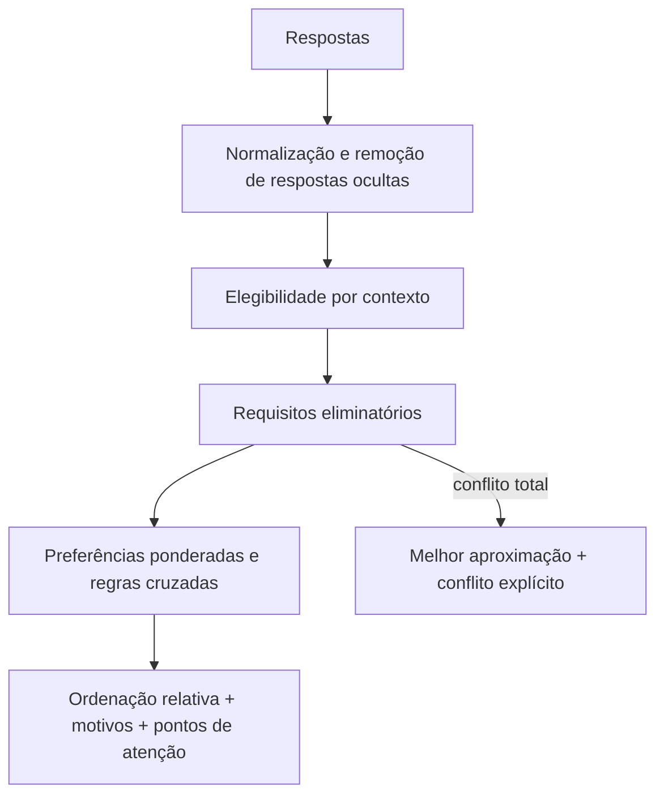

Se nenhum candidato atender todos os requisitos eliminatórios, o quiz declara conflito e mostra a melhor aproximação entre os candidatos que continuam pertinentes ao contexto. Um candidato com hard-exclusion **não conta como cenário de vitória válido** na suíte 96/96.

<a id="19-interpretacao-do-resultado"></a>

### Interpretação do resultado

O índice de aderência:

- mede aderência relativa às respostas;
- não é probabilidade;
- não mede qualidade absoluta;
- não compara desempenho;
- não substitui benchmark;
- pode mudar quando requisito, peso, candidato ou snapshot muda.

A interface deve distinguir recomendação principal, alternativas, motivos de aderência, pontos de atenção, candidatos excluídos por contexto e candidatos eliminados por requisito quando aplicável.

<a id="19-privacidade-e-execucao"></a>

### Privacidade e execução

O arquivo é standalone:

~~~text
quiz.html
├── HTML
├── CSS
└── JavaScript
~~~

Não requer backend, cadastro, npm ou framework. A release 0.3.0 não introduz telemetria nem chamadas externas para processar respostas. **Essa propriedade depende da implementação exata do HTML/JavaScript e deve ser revalidada sempre que o arquivo ou dependências forem modificados.** O README, isoladamente, não prova ausência de chamadas de rede.

Preferência de tema pode ser armazenada localmente quando o navegador permite; o quiz deve continuar funcional se o armazenamento estiver bloqueado.

<a id="19-limitacoes-conhecidas"></a>

### Limitações conhecidas

- o catálogo é curado, não exaustivo;
- pesos são heurísticos e versionados;
- suporte real varia por arquitetura, região, contrato e hardware;
- o quiz não executa detecção de hardware;
- certificações precisam ser verificadas no documento formal;
- uma pilha específica de WM/compositor só é modelada quando faz parte relevante do produto/candidato, não como catálogo universal de WMs;
- um candidato pode mudar de tier/eligibilidade em edição futura;
- fontes e versões envelhecem após o snapshot;
- cobertura 96/96 prova alcançabilidade do modelo, não igualdade de qualidade ou adequação universal.

[Voltar ao índice](#indice)

---

<a id="20-checklist-de-homologacao"></a>

## 20. Checklist de homologação

<a id="20-antes-do-laboratorio"></a>

### Antes do laboratório

- [ ] workload e proprietário definidos;
- [ ] requisitos eliminatórios separados de preferências;
- [ ] arquitetura de CPU, firmware e boot confirmados;
- [ ] lifecycle e EOL documentados;
- [ ] repositórios e escopo de segurança confirmados;
- [ ] matriz de hardware, software e ISV verificada quando aplicável;
- [ ] suporte comercial/SLA e certificação tratados como requisitos separados;
- [ ] termos de licença e suporte avaliados;
- [ ] arquitetura de backup e recuperação desenhada.

<a id="20-no-laboratorio"></a>

### No laboratório

- [ ] instalação ou provisionamento reproduzível;
- [ ] boot, Secure Boot/TPM no estado desejado, rede, storage, GPU e periféricos testados;
- [ ] aplicação crítica e integrações validadas;
- [ ] política MAC em modo efetivo quando aplicável;
- [ ] patching e reboot ensaiados;
- [ ] upgrade de release, rebase ou snapshot simulado conforme o modelo;
- [ ] rollback **e restore** executados de verdade;
- [ ] logs, métricas e alertas integrados;
- [ ] containers, VMs, toolchains e agentes de desenvolvimento testados quando forem requisito;
- [ ] desempenho e capacidade medidos com carga representativa.

<a id="20-antes-de-producao"></a>

### Antes de produção

- [ ] riscos e exceções aprovados;
- [ ] runbook e ownership definidos;
- [ ] rollout gradual e critérios de interrupção;
- [ ] canal de segurança monitorado;
- [ ] capacidade de reconstrução confirmada;
- [ ] plano de saída e próxima revisão agendados.

[Voltar ao índice](#indice)

---

<a id="21-erros-conceituais-comuns"></a>

## 21. Erros conceituais comuns

| Afirmação | Correção |
|---|---|
| Rolling é instável | Rolling descreve entrega contínua; qualidade depende do processo e da operação. |
| LTS é o oposto de rolling | LTS é lifecycle; rolling é release. |
| Stable significa sem bugs | Stable é contextual e não elimina defeitos. |
| Versão antiga é vulnerável | Verifique advisory e patch downstream, não apenas número upstream. |
| Imutável significa inalterável | O conteúdo protegido do SO muda por caminhos controlados; dados e áreas persistentes continuam mutáveis. |
| Atômico e imutável são iguais | Atomicidade descreve como mudança é ativada; imutabilidade/read-only descreve o que pode ser modificado diretamente. |
| Container é uma VM leve | Container normalmente compartilha o kernel do host; VM normalmente executa kernel próprio. |
| Funcionar na mídia live garante que funcionará instalado | Live é teste útil, mas instalação, kernel/driver, Secure Boot, persistência, suspensão e updates podem mudar o comportamento. |
| Imagem assinada significa imagem segura | Assinatura valida integridade/autenticidade conforme chave/política; não prova ausência de vulnerabilidades ou adequação. |
| Ter SBOM significa ausência de vulnerabilidades | SBOM inventaria componentes; não demonstra sozinho impacto, explorabilidade, correção ou suporte. |
| Rootless significa sem risco | Reduz privilégios, mas kernel, runtime, imagem, configuração e dados continuam formando superfície de ataque. |
| Criptografia substitui controle de acesso | Criptografia protege dados/chaves em condições específicas; permissões, autenticação e MAC continuam necessários. |
| Backup concluído significa restauração garantida | Só teste de restauração comprova que dados, chaves, dependências e procedimentos recuperam o estado necessário. |
| Snapshot é backup | Pode compartilhar o mesmo domínio de falha e não ser consistente com a aplicação. |
| RAID é backup | RAID melhora disponibilidade diante de algumas falhas; não substitui cópia independente. |
| Secure Boot criptografa o disco | Ele verifica a cadeia de boot; criptografia é outro controle. |
| FIPS mode significa certificado | Certificação tem escopo formal e específico. |
| SELinux instalado significa protegido | Modo, política e cobertura precisam ser confirmados. |
| APT é o formato do pacote | APT resolve/gerencia; `deb` é o formato; `dpkg` é a camada de baixo nível. |
| Flatpak sempre é mais seguro | Sandbox e permissões ajudam, mas origem, runtime e manutenção continuam relevantes. |
| Atomic significa Rolling Release | Atomic descreve ativação da atualização; Rolling descreve evolução ao longo do tempo. |
| Entrar no AD significa aplicar toda GPO | Autenticação e gestão de políticas são capacidades diferentes. |
| Live patch elimina reboots | Apenas mudanças elegíveis são cobertas. |
| LTS significa kernel antigo | LTS descreve manutenção de objeto específico; identifique release, kernel, componente ou serviço. |
| Imagem OCI assinada é segura | Assinatura/digest verificam identidade/integridade segundo política; não provam ausência de vulnerabilidades. |
| Declarativo significa reproduzível | Declaratividade descreve o estado desejado; reprodutibilidade exige controlar entradas e artefatos. |
| RPM = família Red Hat | Formato/gerenciador não define sozinho genealogia. |
| Hyprland é um DE | Hyprland é um **compositor Wayland dinâmico/tiling**; não é um Desktop Environment completo. |
| IA é uma nova dimensão Linux | Na 0.3.0 é preferência contextual de desenvolvimento; não é 11ª dimensão nem requisito para Omarchy. |
| Mais atual = mais seguro | Segurança depende de patching, advisories, exposição e suporte, não só da versão upstream. |
| O maior índice é a melhor distro | O índice só ordena aderência ao perfil informado dentro desta edição. |

[Voltar ao índice](#indice)

---

<a id="22-governanca-editorial-publicacao-e-licenciamento"></a>

## 22. Governança editorial, publicação e licenciamento

<a id="22-estrutura-canonica"></a>

### Estrutura canônica

~~~text
Linux_Distro_Advisor/
├── README.md      # fonte canônica dos conceitos, critérios e limites
├── index.html     # página pública/indexável derivada do README
├── quiz.html      # questionário interativo standalone e catálogo operacional
├── sitemap.xml    # URLs canônicas públicas
└── LICENSE
~~~

O **README.md** permanece a fonte canônica dos conceitos, critérios e limites. O **index.html** é a camada pública de descoberta e leitura para GitHub Pages/SEO, derivada editorialmente do README. O **quiz.html** implementa o questionário e carrega o catálogo operacional/pontuação. Mudanças que alterem conceitos ou decisões precisam preservar coerência entre as três superfícies.

<a id="22-publicacao"></a>

### Publicação

O `index.html` é o ponto de entrada do GitHub Pages: contém texto HTML semântico e indexável, metadados de SEO, links para o guia/quiz e diagramas Mermaid que complementam — sem substituir — o conteúdo textual. O `quiz.html` continua sendo a aplicação interativa. O README é lido diretamente no repositório e continua sendo a referência editorial canônica.

<a id="22-seo"></a>

#### SEO técnico do GitHub Pages

- `index.html` declara como URL canônica `https://diego-ch4m4x.github.io/Linux_Distro_Advisor/`;
- `quiz.html` declara sua própria URL canônica em `https://diego-ch4m4x.github.io/Linux_Distro_Advisor/quiz.html`;
- `sitemap.xml` lista apenas URLs públicas canônicas;
- `<lastmod>` deve avançar somente quando houver atualização significativa da página correspondente;
- `priority` e `changefreq` não são usados como sinal útil ao Google;
- um `robots.txt` válido para rastreadores precisa estar na raiz do hostname; um arquivo no subdiretório do Project Site não equivale à raiz de `github.io`;
- canonical e sitemap são sinais de descoberta/preferência, não garantia de indexação ou posicionamento.

<a id="22-mermaid"></a>

#### Política de Mermaid no README

O GitHub renderiza blocos `mermaid` diretamente em Markdown. Como a versão efetiva do renderer é controlada pelo GitHub, o README adota política conservadora:

- usar principalmente `flowchart`, `subgraph`, rótulos e arestas amplamente suportados;
- não fixar tema, cores ou CSS no diagrama do README, permitindo contraste adequado nos modos claro/escuro;
- evitar sintaxe experimental/beta quando não for essencial;
- manter toda informação crítica também em texto, tabela ou lista;
- validar a renderização no GitHub antes de publicar.

Os diagramas do `index.html` usam Mermaid via CDN e são re-renderizados ao trocar tema para evitar retenção das cores do tema anterior. Se a dependência externa estiver indisponível, o conteúdo textual e os links devem permanecer utilizáveis por fallback/progressive enhancement. Essa dependência **não altera a propriedade standalone do `quiz.html`**.

<a id="22-checklist-release"></a>

#### Checklist de release

> **Invariantes:** número de candidatos documentados deve coincidir com o catálogo; cada candidato deve possuir ID único; classificações compartilhadas não devem divergir; links/âncoras e Mermaid precisam ser válidos; mudanças factuais devem registrar fonte/data; testes de regressão devem abranger cenários antigos e candidatos novos.

1. atualizar snapshot/fontes quando a edição alterar dados factuais;
2. executar **auditoria estrutural**: âncoras, links internos, fences, tabelas, Mermaid e invariantes de contagem/schema;
3. executar **auditoria semântica**: cada linha/termo deve pertencer à seção correta e preservar o significado canônico;
4. rodar cenários determinísticos do recomendador, incluindo cobertura de todos os candidatos quando o catálogo mudar;
5. testar teclado, mobile, tema, storage indisponível e tela final;
6. revisar links internos/externos, `canonical`, metadados indexáveis e coerência entre `index.html`, `quiz.html` e `sitemap.xml`;
7. atualizar `<lastmod>` apenas quando houver mudança significativa na página;
8. registrar mudanças de pesos, candidatos, fatos voláteis e comportamento;
9. criar tag/registro da edição quando aplicável.

> **Lição recorrente:** sintaxe válida não garante conteúdo correto. Auditoria estrutural e auditoria semântica são gates diferentes. A regressão detectada na evolução 0.2.x reforça também um terceiro gate: **comparação anti-regressão contra a última versão publicada**, para impedir que uma “revisão” reduza silenciosamente profundidade, exemplos ou referências úteis.

<a id="idioma-e-convencoes"></a>

### Idioma e convenções

- idioma editorial: português do Brasil;
- nomes oficiais de produtos são preservados;
- termos técnicos em inglês recebem definição funcional no primeiro uso quando necessários à compreensão;
- siglas são expandidas no primeiro uso no corpo pedagógico;
- texto ao leitor prefere **índice de aderência**, **requisito eliminatório**, **suporte comercial do fornecedor** e **inteligência artificial (IA)**;
- `score`, `hardExclude`, `gate`, IDs e outros termos podem permanecer em código/nomes internos;
- categorias editoriais devem declarar a dimensão a que pertencem;
- datas usam ISO 8601 em metadados;
- comandos e nomes de arquivo permanecem no formato original.

<a id="22-licenciamento"></a>

### Licenciamento

O projeto adota licenciamento duplo para separar documentação e software:

| Escopo | Licença | Efeito principal |
|---|---|---|
| README, explicações, tabelas, descrições autorais e conteúdo educacional | CC BY 4.0 | permite compartilhar/adaptar com atribuição, licença e indicação de alterações |
| Código HTML, CSS e JavaScript | MIT | permite usar, copiar, modificar, distribuir e incorporar preservando aviso/licença |

Nos arquivos mistos, MIT cobre implementação de software; CC BY 4.0 cobre texto editorial/descrições autorais. Marcas, logotipos e conteúdos de terceiros continuam sujeitos aos respectivos titulares/licenças.

<a id="22-contribuicoes"></a>

### Contribuições

Uma alteração factual deve informar:

- fonte primária;
- data de acesso;
- versão/canal/arquitetura;
- impacto no catálogo ou no índice de aderência;
- cenário de teste;
- distinção entre fato e inferência.

Preferências pessoais sem requisito verificável não são critério de ordenação.

[Voltar ao índice](#indice)

---

<a id="23-glossario"></a>

## 23. Glossário

O glossário reúne conceitos recorrentes necessários para interpretar mais de uma seção. Tecnologias pontuais são definidas no primeiro uso quando isso for pedagogicamente suficiente.

| Termo | Definição |
|---|---|
| A/B update | modelo de atualização que mantém dois slots/estados; o sistema executa um enquanto prepara o outro, alternando o estado de boot após a atualização. Escopo e rollback variam por produto. |
| aarch64 | arquitetura ARM de 64 bits, também chamada ARM64. Suporte real depende de SoC, boot, firmware, kernel, drivers e software publicado. |
| ABI | *Application Binary Interface*: contrato binário entre componentes já compilados. |
| AD | *Active Directory*: serviço de diretório/domínio da Microsoft que integra identidade, autenticação, computadores e políticas. |
| Agentic / coding agent | fluxo em que um agente de IA pode planejar e executar ações usando ferramentas, arquivos, terminal, APIs ou ambiente de desenvolvimento dentro das permissões concedidas. |
| Air gap | isolamento de uma rede/ambiente sem conectividade direta com redes externas; atualizações, chaves e artefatos precisam entrar por processo controlado. |
| API | *Application Programming Interface*: contrato/interface por meio do qual um componente expõe funcionalidades ou dados para outro. Compatibilidade de API não garante ABI. |
| Application-consistent | estado de snapshot/backup capturado em coordenação com a aplicação para preservar consistência lógica suficiente para recuperação. |
| ASIC | *Application-Specific Integrated Circuit*: circuito especializado; em switches, costuma executar encaminhamento em hardware. |
| Atomic update | atualização cuja ativação ocorre como uma unidade no ponto de compromisso. Rollback durável e recuperação são capacidades adicionais. |
| Atualidade dos componentes | proximidade das versões empacotadas em relação aos projetos upstream; pode variar por componente e não é medida isolada de segurança. |
| Backport | adaptação de uma correção/funcionalidade mais nova para versão anterior ainda mantida. |
| Backup | cópia de dados/estado mantida com independência suficiente para recuperação; só é confiável quando a restauração é testada. |
| Bare metal | host físico executando o sistema operacional diretamente, sem hipervisor abaixo dele. |
| Bleeding edge | rótulo informal para software extremamente próximo do upstream/desenvolvimento, com maior novidade e exposição a regressões. |
| Bootloader | componente que localiza e inicia o kernel ou deployment, como GRUB ou systemd-boot. |
| Branch | linha nomeada de desenvolvimento, manutenção ou promoção. Nomes como `stable`, `testing`, `Rawhide`, `edge` e `-current` têm semântica específica por projeto. |
| Cadência | frequência com que releases, pacotes, snapshots ou imagens são publicados/promovidos. |
| Certificação | avaliação formal de produto, versão, configuração e escopo contra programa/padrão definido. |
| Channel / canal | linha nomeada de entrega consumida pelo usuário, como `stable`, `testing`, `rc`, `edge` ou `dev`. |
| CIS Benchmarks | recomendações consensuais de configuração segura publicadas pelo Center for Internet Security. |
| Cloud-native | abordagem de aplicação/plataforma orientada a automação, APIs, infraestrutura dinâmica, containers e operação distribuída. |
| Compliance | conformidade demonstrável com controles, políticas ou normas; depende de configuração, evidências e operação. |
| Compositor | componente que combina superfícies de aplicações e produz a imagem final; em Wayland, normalmente também exerce funções de display server. |
| Container | isolamento de processos usando recursos do kernel do host; normalmente compartilha o kernel do host e não é simplesmente uma “VM menor”. |
| Control plane | funções que calculam/decidem como recursos devem operar; em redes, programa o dataplane. |
| Copy-on-write (CoW) | estratégia em que alterações são gravadas em novos blocos antes de atualizar referências, facilitando snapshots e compartilhamento. |
| CNI | *Container Network Interface*: especificação/ecossistema de integração de rede de containers/pods. |
| CRI | *Container Runtime Interface*: API usada pelo kubelet para interoperar com runtimes compatíveis. |
| CSI | *Container Storage Interface*: especificação de integração de storage com orquestradores como Kubernetes. |
| Curated Rolling | Rolling Release em que o projeto intercala testes, retenção ou promoção antes da entrega ao usuário final. |
| CVE | identificador público para vulnerabilidade conhecida; não informa sozinho impacto, explorabilidade nem estado downstream. |
| CVSS | sistema padronizado de pontuação de severidade técnica; não substitui contexto de exposição, KEV ou advisory do fornecedor. |
| Dataplane | caminho que processa/encaminha pacotes ou dados conforme regras do control plane. |
| Declarativo | modelo em que o operador descreve estado desejado em vez de apenas uma sequência de ações; não é sinônimo automático de reproduzível. |
| Deployment | estado instalável/bootável do conteúdo de SO controlado pelo mecanismo correspondente. |
| Digest | identificador criptográfico do conteúdo de um artefato; comprova identidade do conteúdo referenciado, não segurança. |
| Desktop Environment (DE) | conjunto integrado de sessão, shell/painel, configurações e aplicações, como GNOME, KDE Plasma, Cinnamon ou COSMIC. |
| Display manager | serviço de login gráfico que autentica usuário e inicia sessão, como GDM/SDDM/LightDM. |
| Display server | componente que coordena apresentação gráfica/entrada. No X11, o X.Org Server é implementação comum; em Wayland, o compositor exerce esse papel. |
| Distribuição Linux | projeto/produto que integra kernel Linux, userspace, repositórios/imagens, políticas de atualização e documentação. |
| Domínio de falha | conjunto de componentes afetáveis pelo mesmo evento. Duas cópias no mesmo domínio não têm a mesma independência de uma cópia externa. |
| Downstream | projeto/fornecedor que integra, empacota, corrige e mantém software recebido de upstream. |
| DR | *Disaster Recovery*: processo/arquitetura para restaurar serviços e dados após evento severo além da operação normal de HA. |
| Edge | processamento próximo da origem dos dados/usuários, frequentemente com recursos e conectividade mais restritos. |
| Edição | variante de um produto/projeto destinada a uso, desktop ou fluxo específico. |
| ELF | *Executable and Linkable Format*: formato comum de executáveis, objetos e bibliotecas compartilhadas em Linux. |
| Enterprise | produto/ecossistema orientado à operação empresarial, podendo envolver lifecycle, suporte, SLA, compatibilidade formal, certificações e gestão. |
| EOL | *End of Life*: fim do período de manutenção ou suporte declarado. |
| ESM | *Expanded Security Maintenance*: serviço do Ubuntu Pro que amplia cobertura/período de manutenção conforme política do produto. |
| FIPS 140-3 | padrão de requisitos de segurança para módulos criptográficos no programa correspondente. |
| Firmware | software de baixo nível executado ou carregado em dispositivos; sua disponibilidade pode determinar suporte de hardware. |
| Fixed Release | modelo com gerações/releases identificáveis e transição explícita entre elas. |
| Flatpak | modelo de distribuição de aplicações com runtimes e sandbox/permissões, frequentemente desacoplado do host. |
| fwupd | framework/daemon de atualização de firmware em Linux. |
| Generation | estado versionado usado em sistemas como NixOS; pode permitir seleção/rollback conforme o mecanismo. |
| GitOps | prática em que estado desejado é versionado em Git e automação/reconciliação aplica ou verifica esse estado. |
| GPO | *Group Policy Object*: objeto de política do Active Directory; ingressar Linux no domínio não implica implementar toda a semântica de GPO. |
| HA | *High Availability*: desenho para manter/restaurar serviço apesar de falhas por redundância, failover e coordenação. |
| Hardening | redução deliberada da superfície de ataque por configuração, remoção, restrição e controles; não substitui patching. |
| HCI | *Hyper-Converged Infrastructure*: arquitetura que integra compute, storage e rede/virtualização em plataforma de cluster. |
| Host | máquina/instância que executa o sistema operacional analisado; pode ser física, virtual ou cloud. |
| Hyprland | compositor Wayland dinâmico/tiling. Não é Desktop Environment completo; em Wayland o compositor também gerencia as superfícies/janelas da sessão. |
| IA | inteligência artificial. No Advisor 0.3.0, preferência por IA/agentes é contextual ao desenvolvimento e não é uma dimensão estrutural do Linux. |
| Idempotência | propriedade de operação repetível que converge para o mesmo estado desejado sem acumular efeitos indevidos. |
| Image-based | modelo em que conteúdo do SO é construído/distribuído/atualizado predominantemente como imagem, árvore ou deployment coerente. |
| Imagem ISO | mídia inicializável/instalação; em uma rolling, data/número da ISO normalmente identifica a mídia, não uma geração fixa instalada. |
| Immutable / imutável | termo operacional para base protegida contra alterações ad hoc e modificada por caminhos controlados; não significa que nada possa mudar. |
| init system | primeiro sistema de userspace responsável por iniciar/supervisionar serviços, como systemd, OpenRC, runit, s6 ou Dinit. |
| initramfs / initrd | imagem usada no boot inicial para disponibilizar drivers, módulos e ferramentas antes do filesystem raiz definitivo. |
| ISV | *Independent Software Vendor*: fornecedor independente de software; suas matrizes podem certificar combinações específicas de sistema/release/arquitetura. |
| kABI | *kernel Application Binary Interface*: contratos binários do kernel relevantes a módulos/drivers externos; políticas são específicas de fornecedor/release/arquitetura. |
| Kernel | núcleo que gerencia CPU, memória, dispositivos, processos, isolamento e interfaces fundamentais. |
| Kernel module | componente carregável que estende o kernel, como drivers/filesystems; módulos externos podem depender de kABI e assinatura/Secure Boot. |
| Lifecycle | sequência de fases de uma versão/produto: lançamento, manutenção, possíveis extensões e EOL. |
| LTS | *Long-Term Support*: política de manutenção prolongada aplicada a objeto específico; identifique sempre **LTS de quê**. |
| LVFS | *Linux Vendor Firmware Service*: serviço usado por fabricantes para publicar firmware/metadados consumíveis por `fwupd`. |
| MAC | *Mandatory Access Control*: controle obrigatório por política, como SELinux/AppArmor; aqui não significa endereço de rede. |
| Major release | geração principal de produto associada a mudanças maiores de plataforma/lifecycle conforme fornecedor. |
| Measured boot | processo que registra medições criptográficas dos componentes de inicialização para posterior verificação/atestação. |
| Microcode | camada interna da CPU que pode receber correções do fabricante e ser carregada no boot. |
| Minor release | revisão identificada dentro da mesma major release, como RHEL 10.1/10.2; preserve o vocabulário do fornecedor. |
| Niri | compositor Wayland em mosaico/scrolling, usado em determinadas pilhas atuais; não é DE tradicional. |
| NOS | *Network Operating System*: sistema voltado à operação de equipamentos de rede, especialmente switches/roteadores. |
| OCI | *Open Container Initiative*: especificações abertas de imagens e runtimes; compatibilidade OCI não prova segurança/suporte. |
| OVAL | linguagem estruturada para representar estado/configuração e condições de vulnerabilidade/patch. |
| Package manager | ferramenta que resolve, instala, atualiza e remove pacotes/dependências, como APT, DNF, Zypper ou pacman. |
| Package pinning | política de prioridade/preferência que controla origem/versão escolhida quando múltiplos repositórios oferecem pacote. |
| Patching | aplicação de correções de segurança, defeitos ou manutenção por pacote, backport, live patch, imagem etc. |
| Point release | revisão/consolidação dentro de família de versão; não implica nova major release. |
| Proveniência | origem, autoria, processo de build, assinatura e cadeia de manutenção de artefato. |
| Quickshell | toolkit/framework para construir componentes de shell em Qt/QML/Wayland. No Omarchy é a base do Omarchy Shell; não é DE nem compositor. |
| RAID | combinação de discos para desempenho/tolerância a determinadas falhas; não substitui backup independente. |
| Rebase | troca da referência/base do conteúdo do SO para outra versão/imagem/branch conforme mecanismo do produto. |
| Release | estado publicado e identificável de um projeto; pode ser versão fixa, mídia ou snapshot, conforme modelo. |
| Repositório | origem organizada de pacotes, metadados ou imagens consumida pelas ferramentas de atualização. |
| Reprodutibilidade | capacidade de reconstruir resultado suficientemente equivalente a partir do mesmo conjunto controlado de entradas. |
| Requisito eliminatório | condição obrigatória; se não atendida, o candidato é incompatível independentemente de preferências/pontuação. |
| Resiliência | capacidade de absorver falhas, degradar de forma controlada e recuperar-se preservando funções críticas. |
| riscv64 | arquitetura RISC-V de 64 bits; suporte de imagens/drivers/firmware/software deve ser confirmado por projeto/hardware. |
| Rollback | retorno a deployment, snapshot, generation ou versão anterior; reverte apenas estado coberto pelo mecanismo. |
| Rolling | adjetivo de evolução contínua; deve ser qualificado para evitar confundir rolling release com rolling update. |
| Rolling Development | branch de desenvolvimento contínuo que alimenta futuras releases, como Debian Sid/Fedora Rawhide; não equivale automaticamente a rolling para uso final. |
| Rolling Release | modelo no qual sistema instalado evolui continuamente sem upgrade periódico obrigatório N→N+1 da release completa. |
| Rolling update / deployment | estratégia operacional que substitui/reinicia instâncias em lotes; é diferente de Rolling Release. |
| Root filesystem | filesystem raiz montado em `/`; pode estar sobre volumes, criptografia e storage distintos. |
| Rootless container | container/runtime executado sem privilégios de root no host quando possível; reduz risco de algumas falhas, não elimina superfície de ataque. |
| RPO | *Recovery Point Objective*: perda máxima de dados tolerada após incidente. |
| RTO | *Recovery Time Objective*: tempo-alvo máximo para restaurar serviço. |
| Runtime de container | software responsável por executar containers; kernel/configuração influenciam o isolamento real. |
| SBC | *Single-Board Computer*: computador de placa única; suporte depende de SoC, boot, firmware e periféricos. |
| SBOM | *Software Bill of Materials*: inventário estruturado de componentes/dependências de um artefato. |
| Secure Boot | mecanismo de boot que verifica assinaturas/autorização na cadeia coberta pela política. Não criptografa o disco. |
| Scrub | verificação sistemática de integridade conforme storage; reparação depende de mecanismo, checksums e cópia redundante válida. |
| Semi-Rolling | rótulo editorial/contextual para combinação de base versionada e fluxo contínuo; não possui definição universal. |
| SLA | *Service Level Agreement*: acordo de níveis de serviço/atendimento/disponibilidade entre partes. |
| Slow Rolling | rolling que atrasa deliberadamente mudanças maiores ou agrega etapas de teste, mantendo fluxo contínuo. |
| Snapshot | estado capturado em ponto no tempo. **Snapshot factual**, neste guia, é fotografia histórica das informações verificadas em uma data. |
| SONAME | identificador/versionamento de biblioteca compartilhada ELF; mudança costuma sinalizar fronteira de ABI, mas não prova completa de compatibilidade. |
| STIG | *Security Technical Implementation Guide*: guia técnico de implementação de segurança do ecossistema DoD dos EUA. |
| Stream | linha contínua de integração/entrega organizada por canal/geração quando Fixed/Rolling descreve mal o produto. |
| Taint do kernel | marcação do kernel indicando determinadas condições, como módulos proprietários/out-of-tree ou eventos específicos. |
| TPM | *Trusted Platform Module*: componente de segurança para chaves, medições e atestação. |
| Transactional update | atualização preparada em estado/snapshot separado e ativada como unidade quando conclui. |
| Upstream | projeto original/anterior na cadeia que desenvolve/publica software consumido por downstreams. |
| Userspace | processos, bibliotecas e aplicações fora do kernel. Atualizar userspace não significa atualizar kernel. |
| VEX | *Vulnerability Exploitability eXchange*: comunicação do estado de vulnerabilidades conhecidas em relação a produto; complementa SBOM. |
| VM | *Virtual Machine*: ambiente que virtualiza hardware e normalmente executa SO convidado com kernel próprio. |
| Wayland | protocolo/arquitetura para comunicação entre aplicações e compositor; não é DE nem um único servidor universal. |
| Window manager | componente que gerencia posicionamento/comportamento de janelas; o termo é especialmente direto em X11. Em Wayland, essa função faz parte do compositor. |
| Workload | conjunto de aplicações, serviços, processos, dados e padrões de uso que cumpre função e impõe requisitos mensuráveis. |
| X.Org Server | implementação amplamente usada do servidor X11; não é sinônimo perfeito de todo o protocolo X11. |
| X11 | versão 11 do protocolo X Window System; X.Org Server é sua implementação mais comum em Linux. |
| x86_64 | arquitetura x86 de 64 bits, também chamada AMD64/x64. |
| XWayland | servidor X11 que executa como cliente de um compositor Wayland para compatibilidade com aplicações X11; não equivale a uma sessão X11 nativa. |

[Voltar ao índice](#indice)

---

<a id="24-referencias-primarias"></a>

## 24. Referências primárias e complementares

Esta referência adota uma hierarquia de evidências:

1. documentação de release, lifecycle, segurança e compatibilidade publicada pelo próprio projeto ou fornecedor;
2. especificações, padrões e documentação dos componentes upstream;
3. catálogos, artigos, blogs, vídeos e avaliações comunitárias para descoberta, contexto e pontos de teste;
4. opinião, popularidade e page views nunca são usados isoladamente para eliminar, pontuar ou recomendar uma distribuição.

<a id="24-omarchy"></a>

### Omarchy — atualização pontual 0.3.0

- [Omarchy — manual oficial](https://omarchy.org/manual/)
- [Omarchy — AI / coding agents](https://omarchy.org/manual/ai/)
- [Omarchy — Development Tools](https://omarchy.org/manual/development-tools/)
- [Omarchy — Updates e canais](https://omarchy.org/manual/updates/)
- [Omarchy — Getting Started / requisitos de instalação](https://omarchy.org/manual/getting-started/)
- [Omarchy — Security](https://omarchy.org/manual/security/)
- [Omarchy — System snapshots](https://omarchy.org/manual/system-snapshots/)
- [Omarchy — Navigation / keyboard-first](https://omarchy.org/manual/navigation/)
- [Omarchy — Dotfiles](https://omarchy.org/manual/dotfiles/)
- [Omarchy — Shell Plugins / `omarchy-shell`](https://omarchy.org/manual/shell-plugins/)
- [Omarchy — The Top Bar / Omarchy Shell](https://omarchy.org/manual/the-top-bar/)

<a id="24-bluefin"></a>

### Bluefin — atualização pontual 0.3.0

- [Bluefin — documentação oficial](https://docs.projectbluefin.io/)
- [Bluefin — Developer Mode](https://docs.projectbluefin.io/bluefin-dx/)
- [Bluefin — IA](https://docs.projectbluefin.io/ai/)
- [Bluefin LTS](https://docs.projectbluefin.io/lts/)
- [Bluefin GDX](https://docs.projectbluefin.io/gdx/)

<a id="24-nitrux-kaos"></a>

### Nitrux e KaOS — pilhas de interface revalidadas em 0.3.0

- [Nitrux — Desktop and UX: Hyprland, Waybar e Crystal Dock](https://nxos.org/documentation/desktop-user-experience/)
- [Nitrux — Hyprland](https://nxos.org/documentation/desktop-user-experience/desktop/hyprland/)
- [KaOS — ciclo 2026.03: migração Plasma → Niri/Noctalia](https://forum.kaosx.us/d/3321-test-cycle-202603-iso)
- [KaOS — ciclo 2026.09: Niri/Noctalia no ISO de teste atual](https://forum.kaosx.us/d/3393-test-cycle-202609-iso)

<a id="24-hyprland"></a>

### Hyprland — compositor, compatibilidade e suporte

- [Hyprland — site oficial](https://hypr.land/)
- [Hyprland Wiki — Getting Started](https://wiki.hypr.land/Getting-Started/)
- [Hyprland Wiki — Installation](https://wiki.hypr.land/Getting-Started/Installation/)
- [Hyprland Wiki — XWayland](https://wiki.hypr.land/Configuring/Advanced-and-Cool/XWayland/)
- [Hyprland Wiki — Monitors / scaling](https://wiki.hypr.land/configuring/core/monitors/)
- [Hyprland Wiki — Performance / fractional scaling](https://wiki.hypr.land/configuring/extra/performance/)

<a id="24-release-e-lifecycle"></a>

### Release e lifecycle

- [TUXEDO OS — anúncio da futura base Debian Testing / Continuous Debian](https://www.tuxedocomputers.com/en/A-new-foundation-for-TUXEDO-OS-Switching-to-Debian.tuxedo)
- [openSUSE — portal de distribuições e estados de maturidade](https://en.opensuse.org/Portal:Distribution)
- [Debian releases](https://www.debian.org/releases/)
- [Debian Security Tracker](https://security-tracker.debian.org/tracker/)
- [Ubuntu release cycle](https://ubuntu.com/about/release-cycle)
- [Ubuntu Security Notices](https://ubuntu.com/security/notices)
- [Fedora lifecycle](https://docs.fedoraproject.org/en-US/releases/lifecycle/)
- [Fedora Atomic Desktops](https://fedoraproject.org/atomic-desktops/)
- [RHEL lifecycle](https://access.redhat.com/support/policy/updates/errata)
- [Red Hat Security Advisories](https://access.redhat.com/security/security-updates/security-advisories)
- [RHEL sem custo — modalidades e limites do programa Developer](https://developers.redhat.com/articles/faqs-no-cost-red-hat-enterprise-linux)
- [AlmaLinux — releases e lifecycle](https://wiki.almalinux.org/release-notes/)
- [AlmaLinux — política de compatibilidade binária/ABI com RHEL](https://almalinux.org/blog/future-of-almalinux/)
- [Rocky Linux — releases e lifecycle](https://docs.rockylinux.org/10/releases/)
- [Oracle Linux 10 — documentação e release information](https://docs.oracle.com/en/operating-systems/oracle-linux/10/)
- [Oracle Linux 10 — compatibilidade de espaço de usuário com RHEL](https://docs.oracle.com/en/operating-systems/oracle-linux/10/relnotes10.2/ol-Compatibility.html)
- [Oracle Linux 10 — kernels fornecidos e diferenças por arquitetura](https://docs.oracle.com/en/operating-systems/oracle-linux/10/relnotes10.0/ol10.0-ShippedKernels.html)
- [Oracle Linux — download, uso e redistribuição gratuitos](https://www.oracle.com/linux/technologies/oracle-linux-downloads.html)
- [Oracle Linux — Lifetime Support Policy](https://www.oracle.com/a/ocom/docs/elsp-lifetime-069338.pdf)
- [openSUSE roadmap](https://en.opensuse.org/openSUSE:Roadmap)
- [openSUSE Leap 16 — modelo fixed e lifecycle](https://en.opensuse.org/Portal:Leap)
- [openSUSE Tumbleweed — rolling release](https://en.opensuse.org/Portal:Tumbleweed)
- [openSUSE Slowroll](https://en.opensuse.org/Portal:Slowroll)
- [Arch system maintenance — rolling release e upgrades completos](https://wiki.archlinux.org/title/System_maintenance)
- [Kali branches — `kali-rolling`, `kali-last-snapshot` e canais de desenvolvimento](https://www.kali.org/docs/general-use/kali-branches/)
- [Manjaro — modelo de desenvolvimento Rolling Release](https://wiki.manjaro.org/index.php?title=The_Rolling_Release_Development_Model)
- [Manjaro — Stable, Testing e Unstable branches](https://wiki.manjaro.org/index.php?title=Switching_Branches)
- [NixOS release notes](https://nixos.org/manual/nixos/stable/release-notes)
- [Linux Mint — versões suportadas](https://linuxmint.com/download_all.php)
- [Zorin OS — versões e suporte](https://zorin.com/os/details/)
- [Pop!_OS 24.04 LTS — anúncio oficial](https://blog.system76.com/post/pop-os-letter-from-our-founder)
- [EndeavourOS — notícias e snapshots de instalação](https://endeavouros.com/news/)
- [Manjaro — anúncios de releases e stable updates](https://forum.manjaro.org/c/announcements/11)
- [Bazzite — atualizações, rollbacks e rebases](https://docs.bazzite.gg/Installing_and_Managing_Software/Updates_Rollbacks_and_Rebasing/)
- [Debian Testing — funcionamento, aliases e codename](https://wiki.debian.org/DebianTesting)
- [Debian Unstable/Sid — Rolling Development, não Rolling Release](https://wiki.debian.org/DebianUnstable)
- [Debian Developer’s Reference — fluxo unstable → testing → freeze → stable](https://www.debian.org/doc/manuals/developers-reference/developers-reference.html)
- [Fedora Rawhide — desenvolvimento em constante evolução](https://fedoraproject.org/wiki/Releases/Rawhide)
- [Nobara — semi-rolling desde a versão 41](https://wiki.nobaraproject.org/general-usage/troubleshooting/upgrade-nobara)
- [CachyOS — rolling-release](https://wiki.cachyos.org/cachyos_basic/why_cachyos/)
- [Parrot OS — base Debian Stable e repositório com modelo rolling](https://parrotsec.org/docs/introduction/what-is-parrot/)
- [ChimeraOS — FAQ e mecanismo de atualização por imagem `frzr`](https://github.com/ChimeraOS/chimeraos/wiki/FAQ)

<a id="24-arquitetura-e-operacao"></a>

### Arquitetura e operação

- [GitHub Docs — criação de diagramas Mermaid em Markdown](https://docs.github.com/pt/get-started/writing-on-github/working-with-advanced-formatting/creating-diagrams)
- [GitHub Docs — renderização e troubleshooting de arquivos Mermaid](https://docs.github.com/pt/repositories/working-with-files/using-files/working-with-non-code-files)
- [Fedora Atomic updates, upgrades and rollbacks](https://docs.fedoraproject.org/en-US/atomic-desktops/updates-upgrades-rollbacks/)
- [rpm-ostree — filesystem, `/usr`, `/etc`, `/var` e deployments](https://coreos.github.io/rpm-ostree/administrator-handbook/)
- [Fedora Silverblue — Atomic Desktop](https://fedoraproject.org/atomic-desktops/silverblue/)
- [Bazzite FAQ — Fedora Atomic, update cycle e rollback](https://docs.bazzite.gg/General/FAQ/)
- [SUSE Linux Micro — transactional updates e snapshots Btrfs](https://documentation.suse.com/sle-micro/6.2/html/Micro-transactional-updates/index.html)
- [Nix reference manual](https://nixos.org/manual/nix/stable/)
- [Ubuntu AppArmor](https://documentation.ubuntu.com/security/apparmor/)
- [RHEL Security hardening](https://docs.redhat.com/en/documentation/red_hat_enterprise_linux/10/html/security_hardening/)
- [SUSE security certifications](https://www.suse.com/support/security/certifications/)
- [Google Container-Optimized OS release notes](https://docs.cloud.google.com/container-optimized-os/docs/release-notes)
- [Azure Container Linux overview](https://learn.microsoft.com/en-us/azure/azure-linux/azure-container-linux-overview)
- [Amazon Linux 2023 release notes](https://docs.aws.amazon.com/linux/al2023/release-notes/)
- [fwupd — documentação oficial](https://fwupd.github.io/)
- [Linux Vendor Firmware Service (LVFS) — visão geral](https://lvfs.readthedocs.io/en/latest/intro.html)
- [Linux kernel — microcode loader x86](https://www.kernel.org/doc/html/latest/arch/x86/microcode.html)
- [Kubernetes — Container Runtime Interface (CRI)](https://kubernetes.io/docs/concepts/containers/cri/)
- [Kubernetes — cgroup v2](https://kubernetes.io/docs/concepts/architecture/cgroups/)
- [NixOS Manual — atualização por channels e `nixos-rebuild --upgrade`](https://nixos.org/manual/nixos/stable/)
- [Open Container Initiative — specifications](https://opencontainers.org/)

<a id="24-seguranca-e-conformidade"></a>

### Segurança e conformidade

- [NIST — FIPS 140-3: Security Requirements for Cryptographic Modules](https://csrc.nist.gov/pubs/fips/140-3/final)
- [NIST — OVAL, Open Vulnerability and Assessment Language](https://csrc.nist.gov/glossary/term/open_vulnerability_and_assessment_language)
- [NIST — SCAP 1.4 e linguagens de checklist/avaliação](https://csrc.nist.gov/projects/security-content-automation-protocol/scap-releases/scap-1-4)
- [Center for Internet Security — CIS Benchmarks](https://www.cisecurity.org/cis-benchmarks-overview)
- [DoD Cyber Exchange — Security Technical Implementation Guides (STIGs)](https://public.cyber.mil/stigs/)
- [Common Criteria Portal — visão geral e certificação de produtos](https://www.commoncriteriaportal.org/)
- [Common Criteria — CC:2022 / documentos oficiais](https://www.commoncriteriaportal.org/cc/index.cfm)
- [CISA — Vulnerability Exploitability eXchange (VEX), materiais e requisitos](https://www.cisa.gov/sites/default/files/2024-03/VEX_feb2024.pdf)
- [CISA — Known Exploited Vulnerabilities (KEV) Catalog](https://www.cisa.gov/known-exploited-vulnerabilities-catalog)

<a id="24-graficos-rede-e-terminologia"></a>

### Gráficos, rede e terminologia

- [Wayland — visão geral oficial](https://wayland.freedesktop.org/)
- [Wayland — arquitetura comparada ao X](https://wayland.freedesktop.org/architecture.html)
- [XWayland — suporte a aplicações X11](https://wayland.freedesktop.org/docs/book/Xwayland.html)
- [X11 Protocol — especificação do X.Org](https://xorg.freedesktop.org/releases/X11R7.7/doc/xproto/x11protocol.html)
- [RFC 7426 — control plane e forwarding/data plane](https://datatracker.ietf.org/doc/html/rfc7426)

<a id="24-catalogos-mapas-e-comparadores"></a>

### Catálogos, mapas e comparadores

- [DistroWatch](https://distrowatch.com/): útil para descobrir projetos, releases, notícias, versões de pacotes e páginas históricas. Seus dados devem ser confirmados na fonte oficial antes de alterar o catálogo.
- [FAQ do DistroWatch](https://distrowatch.com/dwres.php?resource=faq): explica o escopo e o Page Hit Ranking. O ranking mede acessos às páginas do site entre seus visitantes; **não mede instalações, participação de mercado, qualidade, segurança nem aderência ao workload**.
- [Distrochooser em português](https://distrochooser.de/pt-br): questionário independente voltado à orientação inicial. É uma referência comparativa de UX e metodologia, não fonte factual do lifecycle das distribuições.
- [Código e limitações declaradas do Distrochooser](https://github.com/distrochooser/distrochooser): o próprio projeto descreve os resultados como sugestões, não como cálculo infalível.

<a id="24-linha-do-tempo-das-distribuicoes-linux"></a>

### Linha do tempo das distribuições Linux

<p align="center">
  <a href="https://upload.wikimedia.org/wikipedia/commons/1/1b/Linux_Distribution_Timeline.svg">
    
  </a>
</p>

- [Abrir a linha do tempo em SVG e alta resolução](https://upload.wikimedia.org/wikipedia/commons/1/1b/Linux_Distribution_Timeline.svg)
- [Página do arquivo, histórico, autoria e licença](https://commons.wikimedia.org/wiki/File:Linux_Distribution_Timeline.svg)
- [Código-fonte que mantém a linha do tempo](https://github.com/FabioLolix/LinuxTimeline)

> **Nota editorial:** esta é uma visualização comunitária, não uma imagem oficial conjunta de todas as distribuições. A revisão atualmente servida no Wikimedia foi gerada a partir da linha do tempo 24.10 e publicada em fevereiro de 2025. Ela é útil para genealogia e contexto histórico, mas não comprova atividade atual, versão, suporte ou compatibilidade. O arquivo é disponibilizado sob GFDL 1.3 ou posterior e contém marcas sujeitas aos respectivos titulares.

<a id="24-artigos-blogs-e-videos-para-leitura-complementar"></a>

### Artigos, blogs e vídeos para leitura complementar

- [Red Hat — What’s the best Linux distro for you?](https://www.redhat.com/en/topics/linux/whats-the-best-linux-distro-for-you): visão orientada a workload, comunidade e suporte enterprise; deve ser lida como perspectiva de fornecedor.
- [LWN.net](https://lwn.net/): jornalismo técnico sobre kernel, distribuições e ecossistema; útil para contexto, sem substituir advisories e documentação de release.
- [Linux Foundation no YouTube](https://www.youtube.com/user/TheLinuxFoundation): palestras e fundamentos do ecossistema Linux e open source.
- [Learn Linux TV no YouTube](https://www.youtube.com/learnlinuxtv): tutoriais, administração e avaliações de distribuições; conteúdo comunitário que deve ser confrontado com documentação oficial.
- [The Linux Experiment no YouTube](https://www.youtube.com/c/TheLinuxExperiment): notícias, testes e opiniões sobre desktop Linux; útil para observar experiência de uso, não para certificar compatibilidade.
- **Diolinux e Diocast — conteúdo em português:**
  - [O que você PRECISA saber sobre Rolling Release e Point Release](https://www.youtube.com/watch?v=_KBsY1okvCM): introdução audiovisual aos modelos discutidos na seção 2; use a terminologia canônica deste guia para distinguir modelo de distribuição, mídia de instalação e estratégia de rollout.
  - [Qual o tipo de Linux certo pra você? — Diocast](https://www.youtube.com/watch?v=S0ArPaTYaGI): conversa sobre perfis, necessidades e escolha de distribuição; útil como contraponto comunitário ao método auditável da seção 15.
  - [O que é Linux? Explicação COMPLETA 2026](https://www.youtube.com/watch?v=CT6BZBzbpWA): visão introdutória sobre kernel, sistema operacional, distribuições e presença do Linux no ecossistema tecnológico.
  - [As melhores (e piores) distros para começar no Linux em 2026](https://www.youtube.com/watch?v=dLTmYcAM7mA): avaliação editorial orientada à experiência de iniciantes. Use-a para identificar critérios e pontos de teste, não como ranking universal nem fonte de lifecycle, segurança ou compatibilidade.

Links comerciais, comunitários, artigos, vídeos e rankings não substituem a matriz formal do fornecedor nem os testes no hardware e workload reais.

[Voltar ao índice](#indice)

---

<a id="historico-desta-edicao"></a>

## Histórico desta edição

<a id="historico-0-3-0"></a>

<details open>
<summary><strong>0.3.0 — 2026-09-11</strong></summary>

Revisão funcional e conceitual da pilha gráfica para representar Hyprland corretamente no conteúdo e no motor de recomendação.

- classificado **Hyprland** como compositor Wayland dinâmico/tiling, sem equivalência artificial com Desktop Environment;
- separado no modelo **Desktop Environment, window manager X11, compositor Wayland, shell e toolkit/framework de shell**;
- representado Omarchy como **Arch + Wayland + Hyprland + Omarchy Shell**, com **Quickshell** identificado como toolkit/framework usado para construir o shell;
- enriquecido `interfaceStack` com protocolo, modelo de janelas, interação, configuração, customização, curva de aprendizado e capacidades gráficas verificadas;
- ausência de DE tradicional deixa de ser qualquer sinal implícito de deficiência;
- adicionada ao quiz a opção **“Tiling / keyboard-first e altamente configurável”**, separando esse perfil de “moderno/adaptativo”;
- scoring de stacks especializados passa a considerar keyboard-first/tiling, familiaridade, curva de aprendizado, tolerância a configuração, Wayland e XWayland;
- calibrado o scoring para que experiência avançada ou manutenção hands-on **não gerem bônus autônomo** a stacks tiling: esses reforços positivos só entram quando o usuário escolhe explicitamente o perfil `tiling / keyboard-first`, evitando alteração lateral de rankings sem preferência de interface;
- requisito explícito de sessão X11 nativa continua eliminando stacks Wayland-only; **XWayland não é tratado como equivalência de X11 nativo**;
- modelada ressalva de **XWayland + HiDPI** sem bloqueio universal;
- modelada **NVIDIA como cautela/configuração adicional**, não incompatibilidade absoluta;
- adicionadas fontes primárias do Hyprland e referências atuais do Omarchy Shell;
- preservados os **96 candidatos**, as **dez dimensões**, IDs existentes, design e arquitetura geral do Advisor.

</details>

<a id="historico-0-2-1"></a>

<details>
<summary><strong>0.2.1 — 2026-09-11</strong></summary>

Revisão funcional e editorial da série 0.2, com foco em elegibilidade justa, cobertura completa dos 96 candidatos e restauração da profundidade documental consolidada nas versões anteriores.

- removida a preferência por IA/agentes como pré-requisito de elegibilidade do **Omarchy**; IA passa a ser somente bônus contextual;
- reforçada a aderência do Omarchy por **desenvolvimento + Arch/pacman + rolling + Hyprland/Wayland + fluxo de trabalho centrado em teclado/terminal + perfil técnico**, permitindo recomendação principal mesmo com IA marcada como “Sem prioridade”;
- ativada camada genérica de pontuação que aproveita características já modeladas de todos os candidatos, reduzindo dominância artificial dos candidatos centrais;
- **Nitrux** e **KaOS** passam a competir no contexto adequado, com suas pilhas atuais de interface modeladas sem equivalência artificial com GNOME/KDE;
- adicionada opção de ecossistema da linhagem **Mandriva** para distinguir Mageia/OpenMandriva/PCLinuxOS quando essa preferência é real;
- adicionada pergunta condicional de padronização do ecossistema **Enterprise Linux** para diferenciar RHEL/Rocky/Alma/Oracle/CentOS Stream sem inventar diferenças técnicas inexistentes;
- ampliada a análise especialista para **até 73 critérios condicionais**;
- executada suíte de cobertura com **96/96 candidatos capazes de ser a recomendação principal sem empate**, cada um em cenário válido e sem requisito eliminatório ativo;
- preservados os requisitos eliminatórios: uma preferência, inclusive IA, nunca compensa incompatibilidade obrigatória;
- corrigida falha de JavaScript na renderização de determinados resultados de gestão de frota (`d.name` → `distro.name`);
- restaurada no README a profundidade técnica/didática da linha publicada 0.1.7, mantendo as evoluções de 0.1.8/0.2.x;
- instituído gate anti-regressão explícito: versões futuras devem comparar cobertura estrutural e editorial com a última versão publicada antes de remover ou condensar conteúdo.

</details>

<a id="historico-0-2-0"></a>

<details>
<summary><strong>0.2.0 — 2026-09-11</strong></summary>

- adicionado **Omarchy** como candidato 96;
- atualizado **Bluefin** sem criar candidato duplicado;
- adicionada preferência contextual de desenvolvimento com IA/agentes, sem criar workload universal de IA nem 11ª dimensão;
- modelada a pilha **Hyprland + Quickshell** como interface especializada, não como Desktop Environment;
- separado conceitualmente suporte comercial/SLA de certificação/homologação;
- preservados os 95 IDs anteriores do quiz;
- mantido o snapshot global de 15/08/2026 e declaradas atualizações pontuais de 11/09/2026;
- sincronizados Guia 0.2.0, Quiz 0.2.0, página pública e sitemap;
- aplicadas correções editoriais/pedagógicas da auditoria pré-0.2.0.

</details>

<a id="historico-0-1-8"></a>

<details>
<summary><strong>0.1.8 — 2026-09-10</strong></summary>

Revisão editorial/técnica pré-0.2.0, sem alteração do catálogo de 95 candidatos nem do algoritmo do quiz 0.1.0.

- ampliada a clareza sobre **genealogia e famílias** de distribuições;
- adicionada comparação entre raízes/famílias e seus derivados sem inferir que ancestralidade determina comportamento atual;
- documentadas políticas oficiais de release/canais e compromissos de manutenção onde aplicável;
- separadas **facilidade de instalação** e **liberdade/controle de instalação**, evitando tratá-las como a mesma propriedade;
- preservadas as dez dimensões do modelo mental e a distinção entre release, lifecycle, atualidade, mutabilidade e mecanismo de atualização;
- reorganizado o histórico com `details/summary`, mantendo a versão corrente aberta e versões antigas recolhidas;
- polida a página pública sem alterar sua função de resumo do README;
- mantido o snapshot factual-base de 15/08/2026.

</details>

<a id="historico-0-1-7"></a>

<details>
<summary><strong>0.1.7 — 2026-08-22</strong></summary>

Revisão de UX documental, consistência semântica e publicação GitHub, sem alteração intencional dos pesos, perguntas, elegibilidade, catálogo ou algoritmo do Linux Distro Advisor.

- adotados diagramas **Mermaid nativos do GitHub** nos fluxos em que a visualização reduz carga cognitiva, preservando texto/tabelas como fonte semântica;
- estabelecida política conservadora de compatibilidade Mermaid: sintaxe madura, sem temas fixos e sem dependência de recursos beta;
- adicionados atalhos no topo para a página pública, quiz, navegação do guia e método de decisão;
- corrigido o link de triagem no README para abrir a aplicação publicada no GitHub Pages, em vez de apenas o arquivo `quiz.html` no repositório;
- refinada a regra de primeira ocorrência para distinguir corpo editorial de índice, histórico, nomes oficiais e referências;
- corrigidas primeiras ocorrências de **SLA**, **ESM**, **NOS**, **ASIC**, **RPO**, **RTO** e **ISV**, além de ajustes pontuais de API/ABI/kABI, APT, AUR e GPU;
- consolidada a definição duplicada de **scrub** na seção de storage;
- convertidos para Mermaid, entre outros, os mapas de arquitetura da distribuição, Fixed/Rolling, promoção Manjaro, fluxo Debian, atomicidade, pilha de hardware, storage, validação e pipeline do Advisor;
- adicionadas referências oficiais do GitHub para Mermaid e validação explícita de diagramas ao checklist de release;
- sincronizados `index.html` e `quiz.html` com o Guia **0.1.7**, incluindo `canonical`, metadados de indexação e metadados sociais coerentes com a função de cada página;
- simplificados os dados estruturados do `index.html` para `WebSite` + `WebPage`;
- adicionado `sitemap.xml` com apenas as duas URLs públicas canônicas e documentada a limitação de `robots.txt` em Project Sites hospedados sob subdiretório do hostname `github.io`;
- mantido o snapshot factual de **2026-08-15** e preservado o contrato funcional do quiz.

</details>

<a id="historico-0-1-6"></a>

<details>
<summary><strong>0.1.6 — 2026-08-21</strong></summary>

Revisão de precisão terminológica e auditabilidade documental, sem alteração intencional dos pesos, perguntas, elegibilidade ou algoritmo do Linux Distro Advisor.

- separadas explicitamente as noções de **LTS**, **enterprise** e lifecycle, com regra “LTS de quê?”;
- declarada a taxonomia multidimensional/modelos híbridos como **taxonomia editorial deste guia**, não classificação normativa universal;
- refinadas as descrições de KDE neon, Parrot OS e Nobara para reduzir falsa precisão no rótulo Semi-Rolling;
- ampliado o mapa mental inicial e consolidado o quadro operacional `update`/`upgrade`/`rebase`/`deployment`/`rollback`/`restore`/`rebuild`;
- refinadas API, SONAME e kABI, incluindo a ausência de ABI interna estável universal no kernel Linux upstream;
- adicionada priorização de vulnerabilidades além de CVE/CVSS, com contexto operacional e KEV;
- ampliada a proveniência de **imagens OCI** com registry, digest, assinatura/attestation, SBOM/VEX e lifecycle de base;
- acrescentada comparação equilibrada de Snap/Flatpak e distinção entre assinatura, integridade e segurança;
- corrigida a definição de **scrub** e explicitado que a pilha de storage mostrada é apenas um exemplo de camadas possíveis;
- adicionada a distinção **declarativo ≠ reproduzível**;
- modernizados critérios de Kubernetes com cgroup v2, CRI, CNI, CSI, kubelet e matriz de compatibilidade;
- simplificado o fluxo NixOS com channels para `nixos-rebuild switch --upgrade` e adicionado `nix flake check` no fluxo com flakes;
- reformulada a declaração de privacidade para depender de auditoria da implementação real do HTML, não do README isoladamente;
- substituída a expressão **heurística transparente** por **heurística documentada e versionada**, declarando os limites atuais de reprodutibilidade do índice de aderência;
- introduzida distinção formal entre **fato declarado**, **contrato formal**, **comportamento observado** e **inferência editorial**;
- ampliados glossário, referências e erros conceituais comuns com os conceitos desta revisão;
- mantido o snapshot factual de **2026-08-15** e preservado o contrato funcional do quiz;
- reorganizada a publicação web sem alterar a heurística: o antigo `index.html` do quiz foi renomeado para `quiz.html`, e um novo `index.html` passou a funcionar como página pública/indexável derivada do README.

</details>

<a id="historico-0-1-5"></a>

<details>
<summary><strong>0.1.5 — 2026-08-21</strong></summary>

Revisão corretiva, didática e de governança, sem alteração intencional do algoritmo, pesos, perguntas ou elegibilidade do Linux Distro Advisor.

- corrigido erro editorial da 0.1.4 que havia inserido indevidamente `SONAME` e `SoC` na tabela de storage;
- acrescentada auditoria **semântica** separada da auditoria estrutural;
- atualizado o estado editorial/badge para **pré-1.0**;
- criada a seção **0. Conceitos fundamentais antes da escolha**;
- explicitada a unidade real da decisão: produto/distribuição + edição + release/branch/canal + arquitetura + origem + suporte + workload;
- refinada a definição de atualização atômica para separar atomicidade de rollback, recuperação e consistência de dados/aplicações;
- ampliada a seção de proveniência com metadados assinados, assinatura de artefatos, rotação de chaves, pinning/prioridades, scripts de instalação e runtimes/base images;
- adicionado VEX como complemento de SBOM para comunicação do estado de vulnerabilidades;
- ampliadas, de forma controlada, as validações de desktop, hardware, containers e rede;
- reestruturada a seção de storage em camadas e adicionados LVM, LUKS/dm-crypt, recuperação, SSD/NVMe, application-consistent e teste real de restore;
- definida regra explícita: requisito eliminatório desconhecido permanece pendente e não pode ser considerado atendido sem evidência;
- adicionados data, validade/revisão, confiança e responsável à governança das evidências do método de decisão;
- alterada a seção de perfis para **exemplos que merecem investigação inicial**;
- separadas data do snapshot factual, data da edição, validação estrutural e revisão semântica;
- adicionados pré-requisitos de segurança operacional à seção de comandos e refinamentos específicos para APT, DNF, rpm-ostree e NixOS flakes;
- ampliado o glossário com conceitos fundamentais e operacionais recorrentes;
- mantido o snapshot factual de **2026-08-15** e preservado o contrato decisório do quiz.

</details>

<a id="historico-0-1-4"></a>

<details>
<summary><strong>0.1.4 — 2026-08-21</strong></summary>

Revisão de progressão didática e completude operacional, sem alteração intencional do algoritmo, pesos, perguntas ou elegibilidade do Linux Distro Advisor.

- adicionadas trilhas de leitura específicas para iniciante, profissional técnico, homologação/segurança e auditoria do recomendador;
- adicionado aviso global de snapshot factual logo no início do guia;
- adicionada matriz didática com 12 casos representativos antes da tabela-mestre de 95 candidatos;
- introduzidos quadros seletivos **Essencial**, **Não confunda** e **Decisão prática**;
- ampliada a seção de compatibilidade com exemplos concretos de quebra de ABI/SONAME e de impacto de kABI em módulos externos;
- reforçado que imutabilidade/read-only não substitui segurança em tempo de execução;
- adicionada nota sobre window managers independentes e motivo de exclusão do ranking padrão daquela edição;
- ampliada a seção de hardware com x86_64, aarch64 e riscv64, impactos de arquitetura e matriz de suporte;
- diferenciados BIOS/UEFI, microcode, firmware de dispositivos, drivers e userspace; adicionados `fwupd` e LVFS;
- adicionada nota operacional sobre pilhas de IA/ML/aceleradores sem transformar o guia em curso especializado;
- adicionados perfis ilustrativos de política para firmware, drivers e aplicações não livres;
- adicionado conceito de GitOps à gestão de frota e uma nota concisa sobre critérios de edge;
- adicionado exemplo preenchido de registro de decisão auditável na etapa 7;
- ampliada a seção 18 com comandos seguros de inspeção antes de atualizar;
- ampliado o glossário com x86_64, aarch64, riscv64, microcode, fwupd, LVFS, SONAME e GitOps;
- adicionadas fontes primárias para fwupd/LVFS, microcode do kernel, DNF check-update e Arch checkupdates;
- mantido o snapshot factual de 15/08/2026 e preservado integralmente o contrato decisório do quiz.

</details>

<a id="historico-0-1-3"></a>

<details>
<summary><strong>0.1.3 — 2026-08-21</strong></summary>

Revisão técnica e didática integral, sem alteração intencional do algoritmo de recomendação do quiz.

- reconciliado explicitamente o modelo completo de 10 dimensões da seção 1 com o subconjunto de 6 dimensões aprofundado na seção 2;
- normalizada a tabela-mestre dos 95 candidatos para uma taxonomia canônica pequena;
- declarado por que lifecycle e atualidade não são comprimidos em uma única coluna da tabela-mestre;
- reforçadas as explicações de Debian Testing/Sid, Fedora Rawhide e distinção entre branch, codename, canal e release;
- adicionadas definições no primeiro uso para CVE/OVAL, API/ABI/kABI, fontes suplementares de pacotes, desktop/gráficos, segurança, storage, virtualização, rede, identidade, frota e continuidade;
- ampliada a seção de segurança com definições de FIPS 140-3, CIS Benchmarks, STIG e Common Criteria;
- reescrita a seção de rede com definições precisas de VRF, EVPN, VXLAN, SR-IOV, DPDK, XDP, NOS, ASIC e FRR;
- adicionada distinção fundamental entre VM, container de aplicação e system container;
- adicionados RTO, RPO, SLA e ISV no primeiro uso e no glossário;
- adicionada operação de `transactional-update` para SUSE Linux Micro/openSUSE MicroOS;
- documentados Slowroll e Aeon como projetos em estado beta segundo o portal openSUSE consultado;
- ampliado o glossário com termos estruturais de release, operação, segurança, storage e infraestrutura;
- adicionada seção de referências primárias para FIPS, OVAL/SCAP, CIS Benchmarks, STIG e Common Criteria;
- removida a regra editorial de MUST/SHOULD/MAY enquanto esses termos não fossem usados normativamente;
- preservado o snapshot factual de 2026-08-15.

</details>

<a id="historico-0-1-2"></a>

<details>
<summary><strong>0.1.2 — 2026-08-21</strong></summary>

Revisão conceitual aprofundada da seção 2, sem alteração do snapshot factual, dos 95 candidatos, dos pesos ou da lógica de pontuação do quiz.

- reorganizada a seção 2 para começar por seis dimensões independentes;
- adicionada tabela-mestre cobrindo os 95 candidatos do Linux Distro Advisor;
- ampliada a explicação de Fixed Release, Rolling Release, Semi-Rolling, Curated/Slow Rolling, streams e modelos híbridos;
- detalhada a distinção entre point release e minor release;
- adicionada explicação aprofundada de Debian Testing, Debian Unstable/Sid, alias `testing`, codename e processo `unstable → testing → freeze → stable`;
- adicionada a distinção entre Fedora estável e Fedora Rawhide;
- detalhada a classificação de Bazzite, Nobara, CachyOS, Parrot OS, CentOS Stream, NixOS, OpenMandriva e outros casos híbridos;
- criada seção específica para demonstrar que Fixed/Rolling e Atomic/Transactional pertencem a eixos independentes;
- explicitada a separação entre `/usr`, `/etc` e `/var` no rpm-ostree;
- adicionados exemplos de atomicidade/transacionalidade fora do Fedora;
- adicionados ao glossário Branch, Cadência e Atualidade dos componentes;
- ampliadas as referências primárias para Debian Testing/Sid, Fedora Rawhide, rpm-ostree, Nobara, CachyOS, Parrot OS, Bazzite e SUSE transactional updates.

</details>

<a id="historico-0-1-1"></a>

<details>
<summary><strong>0.1.1 — 2026-08-21</strong></summary>

Revisão de correção conceitual e editorial, sem alteração do snapshot factual de versões nem da lógica de pontuação do quiz.

- adicionada tabela comparativa no início da seção 2 com distribuições, edições e canais de referência confirmados em fontes primárias;
- explicitado que fixed release, rolling release, point release, branches e leading/bleeding edge pertencem a dimensões diferentes e podem coexistir;
- refinada a definição de rolling para não pressupor disponibilidade universal de snapshots ou rollback;
- refinada a seção de Slow/Curated Rolling, registrando o status beta do openSUSE Slowroll no snapshot e distinguindo-o da curadoria por branches do Manjaro;
- corrigida a explicação de point release para separar o comportamento do Debian, Ubuntu LTS e Kali `kali-last-snapshot`;
- ampliada a seção de branches com Manjaro e Kali;
- adicionadas referências primárias específicas para openSUSE Leap/Tumbleweed, Kali e Manjaro;
- registrada a divergência entre páginas oficiais da Canonical sobre abril/maio de 2031 no suporte padrão do Ubuntu 26.04 LTS;
- preservado explicitamente o snapshot factual de 2026-08-15.

</details>

<a id="historico-0-1-0"></a>

<details>
<summary><strong>0.1.0 — 2026-08-15</strong></summary>

Primeira publicação pública e linha de base da série 0.

- README estabelecido como fonte canônica conceitual do projeto;
- 24 tópicos técnicos, índice navegável hierárquico com subtópicos e retorno ao índice ao final de cada tópico;
- modelo multidimensional de distribuição, release, lifecycle, segurança, proveniência, desktop e operação;
- separação entre pacote, formato, gerenciador, repositório e origem;
- separação entre patching, hardening, compliance e certificação;
- cobertura de desktop, hardware, storage, infraestrutura, rede, identidade, frota e continuidade;
- catálogo inicial com 95 candidatos e dois modos de análise;
- respostas condicionais normalizadas e fallback explícito para conflito de requisitos;
- snapshot factual identificado em 2026-08-15;
- perfis e snapshot com Linux Mint, Zorin OS, Pop!_OS, EndeavourOS, Manjaro, Bazzite, AlmaLinux, Rocky Linux e Oracle Linux;
- glossário ampliado com workload, lifecycle, rolling, Wayland, XWayland, X11, dataplane e conceitos correlatos;
- fontes complementares classificadas por nível de autoridade, incluindo DistroWatch, Distrochooser, linha do tempo, Diolinux/Diocast e outros canais técnicos;
- licenciamento CC BY 4.0 para o conteúdo e MIT para o código.

</details>

---

> **Regra de ouro:** escolha por workload, manutenção, lifecycle, ecossistema, suporte, arquitetura e capacidade operacional. Registre evidências, teste o caminho de atualização e prove a recuperação antes de chamar uma plataforma de pronta para produção.

[Voltar ao índice](#indice)
